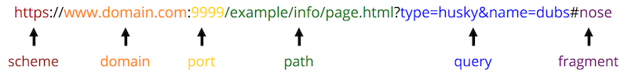

# Client-Side Development

Web development is the process of implementing (programming) web sites and applications that users can access over the internet. However, the internet is a network involving _many_ different computers all communicating with one another. These computers can be divided into two different groups: **servers** store ("host") content and provide ("serve") it to other computers, while **clients** request that content and then present it to the human users.

Consider the process of viewing a basic web page, such as [the Wikipedia entry on Informatics](https://en.wikipedia.org/wiki/Informatics). In order to visit this page, the user types the web address (`https://en.wikipedia.org/wiki/Informatics`) into the URL bar, or clicks on a link to go to the page. In either case, the user's computer is the **client**, and their browser takes that address or link and uses it to create an **HTTP Request**&mdash;a _request_ for data sent following the _**H**yper**T**ext **T**ransfer **P**rotocol_. This request is like a letter asking for information, and is sent to a different computer: the **web server** that contains that information.

The web server will receive this request, and based on its content (e.g., the parameters of the URL) will decide what information to send as a **response** to the client. In general, this response will be made up of lots of different files: the text content of the web page, styling information (font, color) for how it should look, instructions for responding to user interaction (button clicks), images or other assets to show, and so forth.

The client's web browser will then take all of these different files in the response and use them to _render_ the web page for the user to see: it will determine what text to show, what font and color to make that text, where to put the images, and is ready to do something else when the user clicks on one of those images. Indeed, a web browser is just a computer program that is able to send HTTP requests on behalf of the user, and then render the resulting response.

Given this interaction, **client-side web development** involves implementing programs (writing code) that are interpreted by the _browser_, and are executed by the _client_. It is authoring the code that is sent in the server's response. This code specifies how websites should appear and how the user should interact with them. On the other hand, **server-side web development** involves implementing programs that the _server_ uses to determine which client-side code is delivered. As an example, a server-side program contains the logic to determine which cat picture should be sent along with the request, while a client-side program contains the logic about where and how that picture should appear on the page.

This course focuses on _client-side web development_, or developing programs that are executed by the browser (generally as a response to a web server request). While we will cover how client-side programs can interact with a server, many of the concepts discussed here can also be run inside a browser without relying on an external server (called "running locally", since the code is run on the local machine).

## Client-Side File Types
It is the web browser's job to interpret and render the source code files sent by a server as part of an HTTP response. As a client-side web programmer, your task is to write this source code for the browser to interpret. There are multiple different types of source code files, including:

- **`.html`** files containing code written in HTML (HyperText Markup Language). This code will specify the textual and _semantic_ content of the web page. See the chapter [HTML Fundamentals](#html-fundamentals) for details on HTML.

- **`.css`** files containing code written in CSS (Cascading Style Sheets). This code is used to specify styling and _visual appearance_ properties (e.g., color and font) for the HTML content. See the chapter [CSS Fundamentals](#css-fundamentals) for details on CSS.

- **`.js`** files containing code written in JavaScript. This code is used to specify _interactive behaviors_ that the website will perform&mdash;for example, what should change when the user clicks a button. Note that JavaScript code are "programs" that sent over by the web server as part of the response, but are _executed_ on the client's computer. See the chapter [JavaScript Fundamentals](#javascript-fundamentals) for details on JavaScript.

HTTP responses may also include additional **asset** files, such as images (`.png`, `.jpg`, `.gif`, etc), fonts, video or music files, etc.

## HTTP Requests and Servers
Modern web browsers are able to _render_ (interpret and display) all of these types of files, combining them together into the modern, interactive web pages you use every day. In fact, you can open up almost any file inside a web browser, such as by right-clicking on the file and selecting "Open With", or dragging the file into the browser program. HTML files act as the basis for web pages, so you can open a `.html` file inside your web browser by double-clicking on it (the same way you would open a `.docx` file in MS Word):

<!-- this is borrowed from the 201 book; keep in sync with that -->

Consider the URL bar in the above browser. The URL (Uniform Resource Locator) is actually a specialized version of a **URI (Uniform Resource Identifier)**. URIs act a lot like the _address_ on a postal letter sent within a large organization such as a university: you indicate the business address as well as the department and the person, and will get a different response (and different data) from Alice in Accounting than from Sally in Sales.

- Note that the URI is the **identifier** (think: variable name) for the resource, while the **resource** is the actual _data_ value (the file) that you want to access.

Like postal letter addresses, URIs have a very specific format used to direct the request to the right resource.

The parts of this URI format include:

- **`scheme`** (also **`protocol`**): the "language" that the computer will use to send the request for the resource (file).

	In the example browser window above, the protocol is `file`, meaning that the computer is accessing the resource from the file system. When sending requests to web servers, you would use `https` (**s**ecure HTTP). _Don't use insecure `http`!_

	Web page _hyperlinks_ often include URIs with the [`mailto`](https://css-tricks.com/snippets/html/mailto-links/) protocol for email links, or the [`tel`](https://developers.google.com/web/fundamentals/device-access/click-to-call/click-to-call) protocol for phone numbers.

- **`domain`**: the address of the web server to request information from. You can think of this as the recipient of the request letter.

	In the browser window example, there is no domain because the `file` protocol doesn't require it, but for most web URIs this would be the address (e.g., `google.com` or `ischool.uw.edu`).

- **`port`** (_optional_): used to determine where to connect to the web server. By default, web requests use port `80`, but some web servers accept connections on other ports&mdash;e.g., `8080`, `8000` and `3000` are all common on development servers, described below.

- **`path`**: which resource on that web server you wish to access. For the `file` protocol, this is the _absolute path_ to the file on your computer. But even when using `https`, for many web servers, this will be the _relative path_ to the file, starting from the "root" folder of that server (which may not be the computer's root folder). For example, if a server used `/Users/joelross/` as its root, then the _path_ to the above HTML file would be `Desktop/index.html` (e.g., `https://domain/Desktop/index.html`).

	**Important!** If you specify a path to a folder rather than a file (including `/` as the "root" folder), most web servers will serve the file named `index.html` from that folder (i.e., the path "defaults" to `index.html`). As such, this is the traditional name for the HTML file containing a website's home page.

	
As in any program, you should always use **relative** paths in web programming, and these paths are frequently (but not always!) relative to the web server's _root folder_.

- **`query`** (_optional_): extra **parameters** (arguments) included in the request about what resource to access. The leading `?` is part of the query.
- **`fragment`** (_optional_): indicates which part ("fragment") of the resource to access. This is used for example to let the user "jump" to the middle of a web page. The leading `#` is part of the fragment.

### Development Servers {-}
As noted above, it is possible to request a `.html` file (open a web page) using the `file` protocol by simply opening that file directly in the browser. This works fine for testing many client-side programs. However, there are a few client-side interactions that for [security reasons](https://en.wikipedia.org/wiki/Cross-origin_resource_sharing) only work if a web page is requested from a web server (e.g., via the `http` or `https` protocol).

For this reason, it is recommended that you develop client-side web applications using a **local development web server**. This is a web server that you run from your own computer&mdash;your machine acts as a web server, and you use the browser to have your computer send a request _to itself_ for the webpage. Think of it as mailing yourself a letter. Development web servers can help get around cross-origin request restrictions, as well as offer additional benefits to speed development&mdash;such as _automatically reloading the web browser when the source code changes_.

There are many different ways to run a simple development server from the command line (such as using the Python `http.server` module). These servers, when started, will "serve" files using the current directory as the "root" folder. So again, if you start a server from `/Users/joelross`, you will be able to access the `Desktop/index.html` file at `http://127.0.0.1:port/Desktop/index.html` (which port will depend on which development server you use).

- The address `127.0.0.1` is the IP address for `localhost` which is the domain of your local machine (the "local host"). Most development servers, when started, will tell you the URL for the server's root directory.

- Most commonly, you will want to start the web server from the root directory of your _project_, so that the relative path `index.html` finds the file you expect.

- You can usually stop a command line development server with the universal `ctrl + c` cancel command. Otherwise, you'll want to leave the server running in a background terminal as long as you are working on your project.

If you use the recommended [**`live-server`**](https://github.com/tapio/live-server) utility, it will open a web browser to the root folder and _automatically reload the page_ whenever you **save** changes to a file in that folder. This will make your life much, much better.

