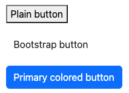
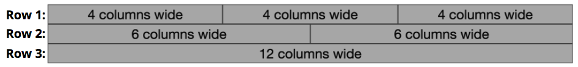

# CSS Frameworks
The previous chapters have covered how to use CSS to make your page both stylish and responsive. While it is certainly possible to implement an entire site by creating your own CSS rules, that can quickly get tedious: often you'd like a page to have a "standard" set of rules (due to the browser's style-less appearance) and then customize those rules to your liking.

For this reason, most professional web developers utilize an existing **CSS Framework** instead. A CSS Framework is a stylesheet (a `.css` file!) that contains a large list of pre-defined rules that you can apply to your page. CSS frameworks provide a number of benefits:

- _Applies attractive default styling to all HTML elements_: CSS frameworks make your pages instantly look better through a bunch of element selector rules. Frameworks provide pleasant default fonts, line spacing, spacing, and link styling without any extra effort on your part.
- _Provides style classes for common UI components_: framework stylesheets will also include CSS classes you can add to your markup to easily include badges, in-page tabs, drop-down buttons, multi-column layouts, and more. Frameworks enable you to style your page by specifying CSS classes, rather than needing to define multiple CSS rules for a single effect.

CSS frameworks are thus designed to make your life easier and your development more efficient&mdash;while still enabling you to provide your own customizations and styling with all of the power of CSS.

<!-- ### Popular Frameworks {-} -->
There are many different CSS frameworks to choose from. Some popular ones include:

- [**Bootstrap**](http://getbootstrap.com/) is the most commonly used CSS framework on the web. Sometimes called "Twitter Bootstrap", it was originally created at Twitter to enforce some consistency among their internal tools, but was released as an open-source project in 2011. Its popularity has benefits and drawbacks: it's very well tested, documented, and supported, but it's also so prevalent that it's default look has become cliché.

    As of this writing, the latest major version of Bootstrap is **v5**, released in May 2021. This is a major update of v4 (released in 2017). Note that Bootstrap 4 introduced Flexbox as a foundation for its grid system, offering better performance. For this and other reasons, Bootstrap 4+ does **not support** IE 9 or earlier browsers. For older browsers, you'd need to use an even earlier version&mdash;or probably just skip the framework entirely at that point.

    <div class="alert alert-warning">This text discusses Bootstrap 5 as an example. It is recommended to always use the latest version of a library or framework. Be careful that you are looking at information about the right version if you seek out documentation or help online!</div>

- [**Foundation**](http://foundation.zurb.com/) has a reputation for being more ahead-of-the-curve than Bootstrap (introducing new features sooner). For example, it was the first framework to use a responsive mobile-first design, and provided a Flexbox-based grid long before Bootstrap. Foundation has most of the same UI elements as Bootstrap, but with a different look and feel (that can be [customized](http://foundation.zurb.com/sites/download.html/#customizeFoundation) through a web-based tool).

- [**Material Components for the Web (MCW)**](https://material.io/components/web/) is an official implementation of Google's [Material Design](https://material.google.com/) visual language. This is the look-and-feel found in most Google products and Android applications. Material Design is very opinionated so MCW is very difficult to customize. The MCW style class names are also very verbose, as they follow the [Block, Element, Modifier (BEM)](https://en.bem.info/methodology/) naming scheme.

- [**Materialize**](http://materializecss.com/) is the other popular Material Design implementation. This is an open-source project, so it is not provided nor supported by Google. However, it is structurally similar to Bootstrap, making it easy to learn and popular among people who know that framework.

- [**normalize.css**](http://necolas.github.io/normalize.css/) is not so much a full framework as a small utility that performs browser normalization (also called a "reset"). `normalize.css` standardizes the quirks across browsers and making it so that the same HTML and CSS is displayed more consistently and without errors. Note that most other frameworks include some version of this package (for example, Bootstrap contains a fork called [Reboot](https://medium.com/css-mine/bootstraps-reboot-next-evolutionary-step-for-css-reset-a30f718521b9)).

    If you choose **not** to use a framework, you should still include `normalize` to make your sites consistent across browsers!

Other frameworks exist as well, each with its own benefits and drawbacks (e.g., [Skeleton](http://getskeleton.com/) is designed to be as lightweight as possible, but at the cost of features).

## Using a Framework
The important thing to realize is that a CSS framework is **just a stylesheet with a bunch of rules that someone else wrote for you**. There's nothing magic about them. You can look at the stylesheet and see all the rules that have been defined, and it's all stuff you could have written yourself (though some of it can be quite complex). But those rules have been crafted by professionals and tested on a wide array of browsers to ensure consistent results, so it's a good idea to build on top of them rather than trying to re-invent the wheel.

For example, you can view the `normalize.css` file at https://necolas.github.io/normalize.css/8.0.1/normalize.css and see that it looks exactly like the CSS you might write on your own!

### Including a Framework {-}
Because a CSS framework is _just a CSS file_, you include one in your page using a `<link>` element just like with any other stylesheet:

```html
<head>
  <!--... other elements here...-->

  <link rel="stylesheet"
        href="https://cdn.jsdelivr.net/npm/bootstrap@5.2.3/dist/css/bootstrap.min.css">
  <link rel="stylesheet" href="css/my-style.css">
</head>
```

**Important!** Note that you link the CSS framework _before_ you link your own stylesheet. Remember that CSS is read top-to-bottom, and that the last rule on the page wins. By putting your stylesheet second, any rules you define will _override_ the rules specified in the framework, thereby allowing you to continue to customize the appearance.

<!-- replace with Bootstrap example?? -->
- For example, `bootstrap.css` gives the `<body>` a font-family of `"Segoe UI"` (a sans-serif font); you may instead want to have a different default typeface:

    ```css
    /* my-style.css */
    body {
      font-family: 'Comic Sans';
    }
    ```

    If you included your stylesheet _first_ in the `<head>`, then your rule would be applied initially but would be overridden by the `bootstrap.css` file, causing your rule to seem to have no effect! Thus you should **always** put your own custom CSS as the _last_ `<link>` in the page, after any CSS frameworks.

It is most common to include the **minified** versions of CSS frameworks: these are usually named as **`.min.css`** files (e.g., `bootstrap.min.css`). A minified file is one that has extra comments and white space removed, creating a file with a much smaller size (remember that each space and line break is a character so takes up a byte! Bootstrap goes from 160 kilobytes to about 127 kilobytes when minimized). Because web pages have to be downloaded, smaller pages will be downloaded faster, and thus will be "quicker" for the user. While an unminimized CSS file won't "break the bank", the extra white space doesn't provide anything that you need.

- You can almost always switch between the minimized and non-minimized file just by changing the file name between `file.css` and `file.min.css` (when using a CDN).

There are a few different ways of accessing a CSS framework's stylesheet in order to link it into your page:

#### Linking to a CDN {-}
The easiest option is usually to link to a [Content Delivery Network (CDN)](https://en.wikipedia.org/wiki/Content_delivery_network), which is a web service intended to quickly serve files commonly used by multiple websites. To do this, you simply provide the URL for the file on the CDN's servers as the `href` of your link (as in the example above).

<p class="alert alert-info">[CDNJS](https://cdnjs.com/) is a CDN for packages and libraries operated by [Cloudflare](https://en.wikipedia.org/wiki/Cloudflare), and is a good place to start if you're unsure of the CDN link for a packages. Other packages may have different CDN hosting (e.g., Bootstrap recommends a link from [jsdeliver.net](https://cdn.jsdelivr.net)).</p>

In addition to being simple, CDNs also provide a distinct speed benefit: CDNs replicate their content to machines in several regions of the world, and use dynamic Domain Name Service (DNS) resolution to steer users to the machine nearest them. So a user in Australia might download the Bootstrap CSS from a server located in Singapore, while a user in France might get the same CSS file from a server located in Ireland. This helps increase the speed that the files are downloaded.

Additionally, CDNs allow a site to take advantage of **browser caching**: browsers will save previously downloaded versions of a file to avoid downloading it again. If multiple sites all use the CDN version of Bootstrap, then the browser only has to download that file the first time you visit one of those sites. With popular frameworks like Bootstrap, it's highly likely that your user has already visited a site that links to Bootstrap's CDN version, and thus the Bootstrap files are already in the user's browser cache.

Finally, CDNs allow the frameworks to be accessed [as a service](https://en.wikipedia.org/wiki/Software_as_a_service), meaning that framework developers may be able to quickly patch bugs (if the fix doesn't break existing code) without the web developer (*i.e.*, the user of the framework) having to do anything. (This feature can also be seen as a drawback, as you need to trust the library developer not to break anything or accidentally include malicious code).

The only real disadvantage to linking to a CDN is that it won't work when you are offline. If you commonly do your development offline, or if you are building a web application that is meant to run offline, you'll need to utilize a different method.

#### Downloading the Source {-}
If you can't link to a CDN, you'll need to download the source file directly to your computer and saving it as a source code file in your project (often in a `lib/` folder). These files can be found on the framework's website, or often in their GitHub repo (look for the `.css` file, or for a `dist/` distribution folder).

In addition to being available offline, downloading CSS files directly provides a few other advantages:

- Frameworks may allow you to customize their content even before you include the file: selecting only the components you need, and adjusting base styling properties before downloading your customized source file.
- If you use a CSS pre-compiler such as [SASS](http://sass-lang.com/), you can often modify the source-code mix-ins to more easily provide your own customizations and override the default fonts, colors, sizes, etc. simply by changing some variables.
- If you use a build system such as [webpack](https://webpack.js.org/), then you can often combine _all_ of your CSS files into a single file. This reduces the total number of files that need to be downloaded, which can increase the page load speed&mdash;especially on slower mobile networks.

Note that it is also possible to utilize a **package manager** such as `npm` to download and manage the source for frameworks. This has the advantage of enabling you to avoid adding large extraneous source files to your code repo, as well as managing any dependencies for those libraries.

Recall that you can install a package using `npm`, saving the dependency into your project's `package.json` file:

```bash
# install bootstrap (latest version)
npm install bootstrap
```

This will install the library's source code into your project's `node_modules/` folder. Because you've saved the dependency in your `package.json` file, you can use the `.gitignore` file to exclude the `node_modules/` folder from your code repo, having new developers install the required framework via `npm install`. You can also use `npm` to easily upgrade the packages (such as when a new version of Bootstrap comes out.

Note that in order to then include the framework in your page, you would need to link in the actual `.css` file which would be found somewhere in the `node_modules` folder. You'll need to dig around for it; the location is in no way consistent across all frameworks or even all versions of a framework:

```html
<!-- notice the RELATIVE path to the file -->
<link rel="stylesheet" href="node_modules/bootstrap/dist/css/bootstrap.min.css">
```

<div class="alert alert-warning">**Importantly**, this relative `<link>` will only work if the `node_modules` folder is available at at the expected path&mdash;and since you never want to commit the `node_modules` folder to git (because of its size), this is not a viable solution for anything that will be published e.g., to Github Pages. For this reason, you should almost always use a CDN when importing a CSS framwork. The only exception will be when using a build system (such as React's use of Webpack) which will automatically build the module file into your source code.</div>


## Bootstrap
This section discusses _some_ of the features and uses of the Bootstrap CSS framework. Note that many other frameworks are used in a similar fashion (though the specific classes and components may be different).

You include the Bootstrap framework by linking its `.css` file to your page (whether from a CDN or a local file). You can get the link for the latest version from the [Bootstrap Home Page](https://getbootstrap.com/).

```html
<link rel="stylesheet"
      href="https://cdn.jsdelivr.net/npm/bootstrap@5.2.3/dist/css/bootstrap.min.css"
      integrity="sha384-rbsA2VBKQhggwzxH7pPCaAqO46MgnOM80zW1RWuH61DGLwZJEdK2Kadq2F9CUG65"
      crossorigin="anonymous">
```

(This `<link>` example has 2 additional (optional) attributes: `integrity` gives a [cryptographic hash](https://en.wikipedia.org/wiki/Cryptographic_hash_function) of the source code so the browser can make sure you didn't download a malicious file by mistake, and `crossorigin` which says that no credentials are sent to the remote server&mdash;see the [AJAX](#ajax) chapter for a more detailed discussion).

When you first include the Bootstrap framework, you'll immediately see the effects (usually for the better!): the default font has changed, margins are different, and so forth. The Bootstrap CSS file contains a number of rules that apply to elements without an extra work, including the `<body>` and headers. See [the documentation](https://getbootstrap.com/docs/5.2/content/reboot/) for details about the default styling (as well as the entire "Content" section of the documentation).

### Utility Classes {-}
In addition to the base styling rules, Bootstrap also includes a huge number of rules that can be applied to elements by giving them a particular CSS **class**. These [utility classes](https://getbootstrap.com/docs/5.2/utilities) are what gives Bootstrap its power and flexibility.

For example, Bootstrap provides [text utilities](https://getbootstrap.com/docs/5.2/utilities/text/) that allow you to style text just by giving it a CSS class, rather than needing to write a new rule for that element. For example, you can make text center-aligned by using the `text-center` utility:

```html
<p class="text-center">This text will be centered on all viewport sizes.</p>
```

Note that all you have done is add a class to the HTML, exactly like you would for any CSS rule. Bootstrap just happens to contain a rule which will apply to elements that have that class:

```css
/* from bootstrap.css */
.text-center {
  text-align: center !important;
}
```

While it would be entirely possible for you to write such a rule yourself, Bootstrap provides these classes as "built-in", so you can focus on the semantics of the content rather than the CSS.

(You might notice that the `bootstrap.css` file gives a lot of properties the `!important` flag. This is used to override other rules no matter how specific, allowing the Bootstrap rule to take effect no matter what. If you find yourself wanting to override this rule&mdash;e.g., you didn't want the text to be centered&mdash;don't try to write one that is more specific by using the `!important` flag yourself. Instead, _just remove the Bootstrap class_. If you don't want the text to be centered, don't give it the `text-centered` class! Don't include Bootstap classes if you don't want their effects, and _never_ use the `!important` flag).


Many elements need to be given an additional utility class to indicate that they should use Bootstrap styling. For example, in order to give a `<button>` a Bootstrap style, it needs to have the class `btn`. This allows you to utilize Bootstrap's styling, but to not be forced to "override" that look and feel if you want to do something different.

```html
<button>Plain button</button>
<button class="btn">Bootstrap button</button>
<button class="btn btn-primary">Primary colored button</button>
```



The last button in this example has an additional utility class `btn-primary` that specifies which [color style](https://getbootstrap.com/docs/5.2/utilities/colors/) it should use. Bootstrap provides a number of pre-defined color styles, named after semantic meaning (e.g., `primary` or `warning`):


These same color classes can be applied to text elements (e.g., `text-primary`), element backgrounds (e.g., `bg-primary`), [alert blocks](https://getbootstrap.com/docs/5.2/components/alerts/) (e.g., `alert-warning`), and more. Modifying the SASS source code for Bootstrap will allow you to easily customize these colors while keeping the theme consistent.

Note that you can even use the `btn` class to style other elements (e.g., `<a>` links) so that they _look_ like buttons!

<div class="row">
<div class="column col2">
```html
<a class="btn btn-primary" href="#">A link</a>
```
</div>
<div class="column">

</div>
</div>

This allows you to keep the _semantic meaning_ of the HTML even if the styling changes. Something that the user clicks to navigate to a different location is a hyperlink (an `<a>`), even if you want it to look like a button.

"Stacking" utility classes like this is quite common in Bootstrap; it is not unusual for an element to have 4 or 5 different utility classes to fully specify its appearance. For example, you could use the [spacing utilities](https://getbootstrap.com/docs/5.2/utilities/spacing/) to specify the spacing around an element:

```html
<div class="p-3 pt-1 mx-2 mb-2">An element with padding and spacing</div>
```

This element has the `p-3` class, which gives it "3 spacers" worth of **p**adding on all sides. But `pt-1` causes it to only have 1 spacer worth of **p**adding on the **t**op. The `mx-2` class gives it 2 spacers of **m**argin on the __x__ axis (th left and right), and the `mb-2` class gives it 2 spacers of margin on the **b**ottom.

Bootstrap is filled with utility classes, both for generic styling (e.g., [borders](https://getbootstrap.com/docs/5.2/utilities/borders/) or [position](https://getbootstrap.com/docs/5.2/utilities/position/)), and for specific types of content (e.g., [lists](https://getbootstrap.com/docs/5.2/content/typography/#lists), [tables](https://getbootstrap.com/docs/5.2/content/tables/), [forms](https://getbootstrap.com/docs/5.2/forms/overview/)). It even provides classes for specifying and managng [flexboxes](https://getbootstrap.com/docs/5.2/utilities/flex/). Explore the documentation and examples for details on how to style particular elements and achieve specific effects.

<p class="alert alert-info">Bootstrap also includes guidance and classes that can [specifically support screen readers](https://getbootstrap.com/docs/5.2/getting-started/accessibility/). For example, the `.visually-hidden` class can be used to style an element so it is only perceivable to screen readers.</p>

<p class="alert alert-warning">Utility classes do **not** mean you never have to write any CSS rules! While Bootstrap provides classes to handle lots of "common" styling, you'll almost always need to add your own customizations on top of it to produce the appearance you want. At the very least, writing CSS rules that apply to lots of elements can help make your styling more readable and consistent.</p>


### Responsive Design {-}
A major feature of Bootstrap (and other CSS frameworks) is the ability to support **mobile-first, responsive webpages**. Many Bootstrap utility classes use _media queries_ to cause them to respond to the device's screen size.

Bootstrap's responsive utilities utilize a predefined set of [responsive breakpoints](https://getbootstrap.com/docs/5.2/layout/breakpoints/): screen widths that mark the "boundaries" between different size devices.

| Screen Width | Abbreviation | Approximate Device Size |
| :----- | :--- | :--------------------------------|
| &lt; 576px | (default) | Extra-small devices (e.g., portrait phones) |
| &ge; 576px | `sm` | Small devices (e.g., landscape phones) |
| &ge; 768px | `md` | Medium devices (e.g., tablets) |
| &ge; 992px | `lg` | Large devices (e.g., laptops) |
| &ge; 1200px | `xl` | Extra-large devices (e.g., desktops) |
| &ge; 1400px | `xxl` | Extra-large devices (e.g., big desktops) |

All of these size specifications are "greater than or equal", following a mobile first approach. Thus a responsive utility that applies to a medium (`md`) screen will also apply to large (`lg`) and extra-large (`xl`) screens.

Responsive utilities are named with the size's abbreviation to specify what screen size that utility should apply on. For example, the `float-left` class will cause an element to float to the left on _any_ sized screen (it has no size specification). On the other hand, the `float-md-left` class will cause the element to float **only on medium _or larger_ screens**. Similarly, the `float-lg-left` class would cause the element to float only on _large or larger_ screens. This would allow you to have an image that floats to the side on a bigger screen, but is flowed with the rest of the content when there isn't enough room. (Don't use `float`; use a flexbox instead!)

- The breakpoint abbreviations are consistent across Bootstrap (and even shared by other frameworks such as Materialize), and usually comes after the name of property to change but before the value to give it. For example, the `d-none` class gives an element a `display:none` on all devices, while `d-sm-none` would apply on small or larger screens.

Many (but not all!) Bootstrap classes support responsive breakpoints. The most common class to do this is the [`container`](https://getbootstrap.com/docs/5.2/layout/containers/) class. Containers are the most basic layout element in Bootstrap, and are required for doing more complex layouts (such as Grids, below). The `container` class gives the element a fixed width that includes some padding on the sides, so that the content isn't right up against the edge of the window. If the size of the window shrinks to the point where the padding would disappear, the `container` responsively changes size so that there remains padding even on the smaller screen!

- See [this Code Pen](https://codepen.io/drstearns/pen/brKKBK) for an example. If you slowly resize the browser, you'll see the text "jump" to a smaller width as you pass each responsive breakpoint.

- `.container` elements are often direct children of the `<body>` (e.g., `<header>`, `<main>`). However, if you want a background color or image to "full bleed" to the edges of the viewport, you can put the `.container` inside the another element that is styled with the background, as in the CodePen example.

- Do not put one `.container` inside of another! This will add multiple layers of padding that are almost certainly not what you expect. Similarly, because the class name `.container` is fairly generic, be careful when naming your own classes so they don't overlap&mdash;for example, a flexbox container should probably be called something like `.flexbox-container`.

- Bootstrap also provides an alternate `container-fluid` class that always has the same amount of padding around the content, with the content "reflowing" based on the browser size.

In general, every page you style with Bootstrap will have a Container (usually a `.container`) to hold the content.

### The Grid {-}
After Containers, most common use of the responsive utility classes in CSS frameworks such as Bootstrap is to provide a **grid layout**, similar to the multi-column layouts created with Flexbox in the previous chapters. The [Bootstrap Grid system](https://getbootstrap.com/docs/5.2/layout/grid/) allows you to specify these kinds of complex, responsive layouts without needing to implement your own Flexbox containers and items.

<p class="alert alert-info">In Bootstrap 5, the grid is implemented using a flexbox&mdash;so you can think of it as just another way of semantically defining flexbox elements.</p>

You specify that a set of elements should be part of a "grid" by putting them inside a `.row` element (the `row` class ensures that the elements are lined up). A `.row` acts a lot like a "flex-container" (and in fact does have `display:flex`), where each of its children will be "flex items".

```html
<div class="row"> <!-- a row of items -->
    <div class="col-6">Item 1</div>
    <div class="col-4">Item 2</div>
    <div class="col">Item 3</div>
</div>
```

You specify how wide each item in the `.row` is by specifying the number of "columns" it spans. Think of the grid as containing **12** "slots":


Each item in the grid is given a class that indicates how many of these slots it takes up (similar to merging cells in a spreadsheet):



These classes are named in the format `col-#`, where the `#` is how many column slots it should take. For example a `.col-4` will take up 4 columns, while a `.col-6` will take up 6 columns. A class of just `col` will take up an _equal share of the remaining columns_ (similar to what happens with the `flex-grow` property!)

Thus the above HTML will produce elements with the following layout:


- Notice that "Item 1" takes up half (6/12) of the grid, "Item 2" takes up a third (4/12), and "Item 3" takes up the remainder (2/12).

You can also make this grid layout responsive by using responsive utility versions of the `col-#` classes. For example, a `.col-md-4` would take up 4 columns _only on medium or larger_ screens, while a `.col-lg-6` would take up 6 columns _only on large or larger_ screens. Note that a child of the `.row` that doesn't have a column size will effectively act as its own row (on its own line).

Finally, note that you can specify _multiple responsive utilities_ on each grid item! For example, you can specify that items should take up 6 columns on small or larger screens (`col-sm-6`), only but 3 columns on medium or larger screens (`col-md-3`):

```html
<div class="row">
    <div class="col-sm-6 col-md-3">Item 1</div>
    <div class="col-sm-6 col-md-3">Item 2</div>
    <div class="col-sm-6 col-md-3">Item 3</div>
    <div class="col-sm-6 col-md-3">Item 4</div>
</div>
```

(See a [CodePen](https://codepen.io/drstearns/pen/XaYBXp) of this code in action!)

The ordering of Bootstrap's CSS means that the `col-sm-6` class will get overridden by the `col-md-3` class (since `md` is a more specific size than `sm`), so you can specify both classes and the correct one will apply&mdash;the order of the class names in the element doesn't matter. Note that the _"or larger"_ part of the responsive breakpoint definition also means that you don't need to specify a column width for _each_ different breakpoint, only for the smallest level at which the utility should apply (e.g., we don't need `col-lg-` since it isn't different than `col-md-`).

Bootstrap includes a number of utilities that can be used to customize how grids of content are displayed, including all of the features of Flexbox. For more details and options, see the [Grid documentation](https://getbootstrap.com/docs/5.2/layout/grid/).


### Components {-}
In addition to its basic and responsive utilities, Bootstrap provides a number of CSS classes that let you easily create more complex **components** or widgets: alerts, cards, navbars, collapsible boxes, image carousels, pop-up modals, and more. Each of these components is discussed in the [documentation](https://getbootstrap.com/docs/5.2/components), and has its own particular element structure and CSS classes you need to use.

For example, you can create a [card](https://getbootstrap.com/docs/5.2/components/card/) (a styled content container) by creating an element with the `card` class and `card-body` child. You can then include other nested elements with classes such as `card-img-top`, `card-title`, or `card-text` to produce further styled effects:

```html
<div class="card"> <!-- the card -->
    
    <div class="card-body"> <!-- the "body" of the card -->
        <h4 class="card-title">A Card Title</h4>
        <p class="card-text">Some card text that appears below the card title.</p>
        <a href="#" class="card-link">Action Link 1</a>
        <a href="#" class="card-link">Action Link 2</a>
    </div>
</div>
```

(See this code in [CodePen](https://codepen.io/drstearns/pen/yoEqRM)).


Many of these components include some form of **interactivity**: for example, the [navbar](https://getbootstrap.com/docs/5.2/components/navbar/) will "collapse" into a hamburger menu on small devices, while [modals](https://getbootstrap.com/docs/5.2/components/modal/) add in-page pop-up dialogs.

CSS is not capable of adding this level of interactivity&mdash;that requires **JavaScript**. Thus to support these components, you also need to include the Bootstrap JavaScript library:

```html
<!-- the Bootstrap JavaScript library -->
<script src="https://cdn.jsdelivr.net/npm/bootstrap@5.2.3/dist/js/bootstrap.bundle.min.js"></script>
```

See the chapter on [JavaScript](#javascript) for more details on including JavaScript libraries. Note that not all components or utilities require JavaScript.

However, with most Bootstrap components, you don't actually need to write any JavaScript code. Instead, you just need to provide some particular `data-` HTML attributes, and the library will take care of everything else.

- A [data attributes](https://developer.mozilla.org/en-US/docs/Learn/HTML/Howto/Use_data_attributes) is an normal HTML attribute that begins with the text `data-` (e.g., `data-thingamabob` or `data-my-attribute`). The HTML specification explicitly says that attributes that begin with `data-` are legal but not part of the standard, thus enabling them to be used for storing app-specific information. They effectively act as custom "variables" for elements that do not violate the HTML standard.

For example, consider the below code from Bootstap's documentation for defining a [modal](https://getbootstrap.com/docs/5.2/components/modal/) and a button to open it:

```html
<!-- note that the `id` attribute is set to "exampleModal" -->
<div class="modal fade" id="exampleModal" tabindex="-1" aria-labelledby="exampleModalLabel" aria-hidden="true">
  <div class="modal-dialog">
    <div class="modal-content">
      <div class="modal-header">
        <h1 class="modal-title fs-5" id="exampleModalLabel">Modal title</h1>
        <button type="button" class="btn-close" data-bs-dismiss="modal" aria-label="Close"></button>
      </div>
      <div class="modal-body">
        ...
      </div>
      <div class="modal-footer">
        <button type="button" class="btn btn-secondary" data-bs-dismiss="modal">Close</button>
        <button type="button" class="btn btn-primary">Save changes</button>
      </div>
    </div>
  </div>
</div>

<!-- data-toggle must be set to "modal" and data-target must be set to
the value of the `id` attribute on the element that starts your modal markup -->
<button type="button" class="btn btn-primary" data-bs-toggle="modal" data-bs-target="#exampleModal">
  Open the Modal
</button>
```

(Try it out in [CodePen](https://codepen.io/drstearns/pen/dzKqNB)).

There is a lot to unpack in this code, including styling classes and ARIA attributes (e.g., `role`, `aria-labelledby`, and `aria-hidden`). The important part is that the root `.modal` element is _hidden_ (`display:none`) when the page first loads. But when you click on the `<button>`, the included JavaScript library sees that it has a `data-toggle="modal"` attribute, and determines that clicking the button should show the modal. The JavaScript using the `data-target` attribute on that button to determine _which_ modal to open (finding the modal with that `id`), and then shows it. The `data-dismiss` attribute on the first `<button>` inside the modal allows it to be closed.

<p class="alert alert-info">The best way to understand these components is to start from the examples in the documentation, and then consider each element and attribute one at a time. Read the documentation!</p>

<p class="alert alert-warning">The JavaScript included in these CSS frameworks allows you to easily add interactive features, but **they do not mix well with more advanced JavaScript frameworks like React.** To work with React, you'd need to switch instead to a library such as [react-bootstrap](https://react-bootstrap.github.io/), which uses the Bootstrap CSS stylesheet, but re-implement the JavaScript portions to fit into the React framework.</p>

## Resources {-}
<div class="list-condensed">
- [Bootstrap Documentation](https://getbootstrap.com/docs/5.2/getting-started/introduction/)
- [Materialize Documentation](http://materializecss.com/getting-started.html)
- [Foundation Documentation](http://foundation.zurb.com/sites/docs/)
- [Material Components for the Web Documentation](https://material.io/components/web/docs/)
- [`normalize.css` Documentation](http://necolas.github.io/normalize.css/)
</div>

<small>This chapter was borrowed to a large extent from a [tutorial](https://drstearns.github.io/tutorials/cssframeworks/) by [David Stearns](https://ischool.uw.edu/people/faculty/dlsinfo).</small>
