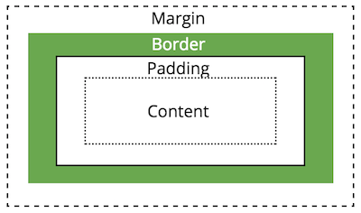

# CSS Layouts

The previous chapters have discussed how to use CSS to specify the appearance of individual html elements (e.g., text size, color, backgrounds, etc). This chapter details how to use CSS to declare where HTML elements should _appear_ on a web page!Placing elements exactly how you want them can be surprisingly difficult. Elements are arranged from the **top left corner** of the page, and are arranged based on three related (but distinct) concepts:

- **Display**: determines how elements share horizontal space
- **Position**: allows you to adjust the location of the natural flow of elements
- **Box-model**: describes the amount of 2D space taken up by an element, and how much space is between elements

## Display
Without any CSS, html elements follow a default **flow** on the page based on the order they appear in the HTML. Layout is based on whether the element is a _block element_ or an _inline element_.

As mentioned in Chapter 3, **inline** elements (e.g., `<em>`, `<a>`, `<span>`) are put next to each other on a single line (left to right, unless you specify a [right-to-left language](https://developer.mozilla.org/en-US/docs/Web/HTML/Global_attributes/dir)). **Block** elements (`<p>`, `<ul>`, `<div>`) are placed on subsequent "lines", from top to bottom.

```html
<div>Block element</div>
<div>Block element</div>
```


```html
<span>Inline element</span>
<span>Other inline element</span>
```


_However_, you can force an element to be either `block` or `inline` by declaring the **`display`** CSS property:

```css
.inlined {
  display: inline;
}
```

```html
<!-- this will produce the same result as using <span> elements -->
<div class="inlined">Inline element</div>
<div class="inlined">Other inline element</div>
```

The `display` property also allows you to remove elements from the page flow entirely:

```css
.hidden {
  /* do not show element at all */
  display: none;
}
```

There are several other more specific settings, the most useful of which is `inline-block`. This lets you treat an element as `inline` (no line break after), but also gives you the ability to specify its `width`, `height`, and other properties only adjustable on `block` elements. This is particularly useful for making things like lists (`<ul>`) appear "inline".


## The Box Model {#box-model}
The [**CSS Box Model**](https://www.w3.org/TR/CSS2/box.html) is one of the core concepts in CSS, and is one of the central frameworks by which elements are visually laid out on the page.

All HTML elements (_including text!_) include an imaginary **box** around their content. Elements are laid out with their boxes next to each other (side by side for `inline`, stacked on top for `block`). These boxes are normally just large enough to contain the content inside the element, but you can use CSS to alter the size of and spacing between these boxes in order to influence the layout.

First off, you can set the **`width`** and **`height`** of elements explicitly, though be careful when you do this. If your `width` and `height` are too small, the element's content will be clipped by default (a behavior controlled by the `overflow` property). It's generally best to set only the width **or** the height, but not both. You can also specify a `min-width` or `min-height` to ensure that the width or height is at least a particular size. Conversely, you can use `max-width` and `max-height` to constrain the size of the element.

In order to adjust the spacing between boxes, you can manipulate one of 3 properties:



### Padding {-}

The **padding** is the space between the content and the border (e.g., the edge of the box).


It is possible to specify the padding of each side of the box individually, or a uniform padding for the entire element:

```css
/* specify each side individually */
div {
  padding-top: 1em;
  padding-bottom: 1em;
  padding-left: 2em;
  padding-right: 0; /* no units needed on 0 */
}

/* specify one value for all sides at once */
div {
  padding: 1.5em;
}

/* specify one value for top/bottom (first)
   and one for left/right (second) */
div {
  padding: 1em 2em;
}
```

### Border {-}
The **border** (edge of the box) can be made visible and styled in terms of its width, color, and "style", listed in that order:

```css
.boxed {
   border: 2px dashed black; /* border on all sides */
}

.underlined {
   border-bottom: 1px solid red; /* border one side */
}

.something { /* control border properties separately */
   border-top-width: 4px;
   border-top-color: blue;
   border-top-style: dotted;
   border-radius: 4px; /* rounded corners! */
}
```

### Margin {-}
Finally, the **margin** specifies the space _between_ this box and other nearby boxes. `margin` is declared in an equivalent manner to `padding`.


Note that browsers typically [collapse](https://developer.mozilla.org/en-US/docs/Web/CSS/CSS_Box_Model/Mastering_margin_collapsing) (overlap) the margins of adjacent elements. For example, if you have two paragraphs on top of one another, and you set `margin-bottom` on the first and `margin-top` on the second, most browsers will overlap those margins and just use the larger of the two values to determine the spacing.

### Box-Sizing {-}
An element's `padding`, `border`, and `margin` can be used to put space between element content on the page. However, when you assign an explicit **`width`** or **`height`** to an element, the dimension you specify **does not include** the padding or border when calculating the size of the element on the page! That is, if you have an element with the properties

```css
.my-box {
    width: 100px;
    padding: 10px; /* includes both left and right */
}
```

Then the element will take up 120px on the screen: the width plus the left and right padding.

However, when specifying more complex or responsive layouts, it's often useful to have `width` represent the entire width of the box, and not need to account for the border and padding separately in calculations. You can do this using the [`box-sizing`](https://css-tricks.com/box-sizing/) property&mdash;a value of `border-box` will indicate that specified _size_ of the box (e.g., the `width`) should include the size of the padding and border when determining the content area.

It's common to want to apply this property to **all** of the elements on the page, which you can do with the **`*`** selector (like a wildcard from the command line!):

```css
* {
    box-sizing: border-box; /* all elements include border and padding in size */
}
```

This is a common enough change that you may wish to include it in _all_ of your `.css` files!


## Position
Specifying the `display` style and **box** properties will adjust the layout of HTML elements, but they are still following the browser's default _flow_. The layout rules will still apply, and elements are influenced by the amount of content and the size of the browser (e.g., for when inline elements "wrap").

However, it is possible to position elements outside of the normal flow by specifying the `position` property. Depending on the `position` property, you can shift the location of elements using the `top`, `bottom`, `left`, and `right` properties.There are four values that the `position` property can be set to:

- **`static`**: By default, elements are positioned statically. This is their natural layout, and elements _will not_ be shifted by the `top`, `bottom`, `left`, or `right` properties.

- **`relative`**: Allows you to shift the element _relative_ to it's natural position on the page. This enables you to move the element using the `top`, `bottom`, `left`, and `right` properties.

- **`fixed`**: The _fixed_ position allows you place an element in a consistent location within a browser window. For example, if you wanted a link to _always_ be 50px from the bottom, you could set the properties: `position:fixed;` and `bottom:50px;`.

 - **`absolute`**: The _absolute_ position allows you to place an element a specific number of pixels from it's (first non-static) parent element. This allows you to specify where _within a parent element_ you want an element to be positioned. 

Note, in order to get `position:absolute;` to work _"as expected"_, you'll need to specify that the _parent element_ is `position:relative;`. See [this post](https://css-tricks.com/absolute-positioning-inside-relative-positioning/) for more information.


As an example, giving an element a **`position:fixed`** property will specify a "fixed" position of the element _relative to the browser window_. It will no move no matter where it appears in the HTML or where the browser scrolls. See [this Code Pen](http://codepen.io/joelross/pen/NRdzLZ?editors=1100#0) for an example.

- In order to specify the location for a **`fixed`** element, use the `top`, `left`, `bottom`, and/or `right` properties to specify distance from the appropriate edge of the browser window:

    ```css
    /* make the <nav> element fixed at the top of the browser window */
    nav {
        position: fixed;
        top: 0;  /* 0px from the top */
        left: 0; /* 0px from the left */
        width: 100%; /* same as parent, useful for spanning the page */
    }
    ```

### Floating {-}


You can also remove an element from it's normal position in the _flow_ by making it **float**. This is commonly done with pictures, but can be done with any element (such as `<div>`). A floated element is shoved over to one side of the screen, with the rest of the content wrapping around it:

<p style="clear:both;">

```css
.floating-image {
  float: right;
  margin: 1em; /* for spacing */
}
```

Content will continue to sit along side a floated element until it "clears" it (gets past it to the next line). You can also force content to "clear" a float by using the `clear` property. An element with this property _cannot_ have other elements floating to the indicated side:

```css
.clear-float {
    clear: both; /* do not allow floating elements on either side */
}
```

The `float` property is good for when you simply want some content to sit off to the side. But you should **not** try to use this property for more complex layouts (e.g., multi-column structures); there are better solutions for that.

<!-- <p class="alert alert-warning">Never use the **`<table>`** tag to structure documents and position content. The `<table>` tag should **only** be used for content that is semantically a table (e.g., a data table). If you want to lay out content in a grid, use a CSS system such as Flexbox (below).</p> -->

## Flexbox
The `position` and `float` properties allow you to have individual elements break out of the normal page flow. While it is possible to combine these to produce complex effects such as **multi-column layouts**, this approach is fraught with peril and bugs due to browser inconsistencies. In response, CSS3 has introduced new standards specifically designed for non-linear layouts called [**Flexbox**](https://css-tricks.com/the-css-box-model/). The Flexbox layout allows you to efficiently lay out elements inside a container (e.g., columns inside a page) so that the space is _flexibly_ distributed. This provides additional advantages such as ensuring that columns have matching heights.

<p class="alert alert-warning">Flexbox is a new standard that is now supported by [most modern browsers](http://caniuse.com/#feat=flexbox); it has a buggy implementation in Microsoft IE, but is supported in the standards-compliant Edge. For older browsers, you can instead rely on a grid system from one of the popular CSS Frameworks such as Bootstrap.</p>

<p class="alert alert-info">Despite it's capabilities, Flexbox still is designed primarily for one-directional flows (e.g., having one row of columns). To handle true grid-like layouts, browsers are adopting _another_ emerging standard called [**Grid**](https://css-tricks.com/snippets/css/complete-guide-grid/). The Grid framework shares some conceptual similarities to Flexbox (configuring child elements inside of a parent container), but utilizes a different set of properties. Learning one should make it easy to pick up the other. Note that the grid framework is [less well supported](http://caniuse.com/#search=CSS%20grid) than even Flexbox (it is not supported by IE, Edge, or common older Android devices), so should be used with caution.</p>

To use a Flexbox layout, you need to style _two_ different classes of elements: a **container** (or **parent**) element that acts as a holder for the **item** (or **child**) elements&mdash;the child elements are _nested_ inside of the parent:

```html
<div class="flex-container"> <!-- Parent -->
  <div class="flex-item">Child 1</div>
  <div class="flex-item">Child 2</div>
  <div class="flex-item">Child 3</div>
</div>
```


Note that the "outer" parent element has one class (e.g., `flex-container`, but you can call it whatever you want), and the "inner" child elements share another (e.g., `flex-item`). Creating an effective Flexbox layout requires you to specify properties for _both_ of these classes. You most often use `<div>` elements for the parent and child elements (and the child of course can have further content, including more divs, nested within it).

In order to use a Flexbox layout, give the _parent_ element the **`display:flex`** property. This will cause the contents of that parent element to be layed out according to a "flex flow":

```css
.flex-container { /* my flexbox container class */
    display: flex;
}
```

A flex flow will lay out items _horizontally_ (even if they are block elements!), though you can adjust this by specifying the _parent's_ [`flex-direction`](https://css-tricks.com/snippets/css/a-guide-to-flexbox/#article-header-id-3) property.

By default, a flex container will fill its parent element (the whole page if the container is in the `<body>`), and the child items will be sized based on their content like normal. While it is possible to then use dimensional properties such as `width` and `height` to size the children within the horizontal layout, Flexbox provides further options that make it more _flexible_.

Any _immediate child_ of the flexbox container can use additional properties to define how that particular item should be layed out within the container. There are three main properties used by flex **items**:

```css
* { box-sizing: border-box; } /* recommended for item sizing */

.flex-item {
    flex-grow: 1; /* get 1 share of extra space */
    flex-shrink: 0; /* do not shrink if items overflow container */
    flex-basis: 33%; /* take up 33% of parent initially */
}
```

- [**`flex-grow`**](https://css-tricks.com/snippets/css/a-guide-to-flexbox/#article-header-id-10) specifies what "share" or ratio of any extra space in the container the item should take up. That is, if the container is `500px` wide, but the items' only takes up `400px` of space, this property determines how much of the remaining `100px` is given to the item.

    The value is a unitless number (e.g., `1` or `2`, defaulting to `0`), and the amount of remaining space is divided up _proportionally_ among the items with a `flex-grow`. So an item with `flex-grow:2` will get twice as much of the remaining space as an item with `flex-grow:1`. If there are 4 items and `100px` of space remaining, giving each item `flex-grow:1` will cause each item to get `25px` (100/4) of the extra space. If one of the items has `flex-grow:2`, then it will get `40px` ($\frac{2}{1+1+1+2}=\frac{2}{5}=40\%$) of the extra space, while the other three will only get `20px`.

    In practice, you can give each item a property `flex-grow:1` to have them take up an equal amount of space in the container.

- [**`flex-shrink`**](https://css-tricks.com/snippets/css/a-guide-to-flexbox/#article-header-id-11) works similar to `flex-grow`, but in reverse. It takes as a value a number (default to `1`), which determine what "share" or ratio it should shrink by in order to accommodate any overflow space. If the specified dimensions of the items exceeds the dimensions of the container (e.g., 4 `100px` items in a `300px` container would have `100px` of "overflow"), the `flex-shrink` factor indicates how much size needs to be "taken off" the item. A higher number indicates a greater amount of shrinkage.

    In practice, you will often leave this property at default (by not specifying it), _except_ when you want to make sure that an item does NOT shrink by giving it `flex-shrink:0`.

- [**`flex-basis`**](https://css-tricks.com/snippets/css/a-guide-to-flexbox/#article-header-id-12) allows you to specify the "initial" dimensions of a particular item. This is similar in concept to the `width` property, except that `flex-basis` is more [flexible](https://stackoverflow.com/questions/34352140/what-are-the-differences-between-flex-basis-and-width) (e.g., if you change the `flex-direction` you don't also have to change from `width` to `height`). Note that this value can be an dimensional measurement (absolute units like `100px`, or a relative unit like `25%`).

    In practice, using percentages for the `flex-basis` will let you easily size the columns of your layout.


There is also a _shortcut property_ `flex` that allows you to specify all three values at once: give the `flex-grow`, `flex-shrink`, and `flex-basis` values separated by spaces (the second two being optional if you want to use the default values). Note that if unspecified, the `flex-basis` property will be set to `0`, rather than the `auto` value it has if unspecified.

The Flexbox framework also provides a number of additional properties that you can specify on the **container** to customize how items of different sizes are organized on the screen:

- [`justify-content`](https://css-tricks.com/snippets/css/a-guide-to-flexbox/#article-header-id-6) specifies how the items should be spread out across the container. Note that items that have `flex-grow:1` will use up the extra space, making this less relevant.
- [`align-items`](https://css-tricks.com/snippets/css/a-guide-to-flexbox/#article-header-id-7) is used to specify "cross-axis" alignment (e.g., the vertical alignment of items for a horizontal row).
- [`flex-wrap`](https://css-tricks.com/snippets/css/a-guide-to-flexbox/#article-header-id-4) is used to have items "wrap around" to the next line when they overflow the container _instead of_ shrinking to fit. You can then use the [`align-content`](https://css-tricks.com/snippets/css/a-guide-to-flexbox/#article-header-id-8) property to specify how these "rows" should be aligned within the container.

While it may seem like a lot of options, Flexbox layouts will allow you to easily create layouts (such as multi-column pages) that are otherwise very difficult with the regular box model. Moreover, these layouts will be flexible, and can easily be made **responsive** for different devices and screen sizes.


## Resources {-}
<div class="list-condensed">
- [The Box Model (MDN)](https://developer.mozilla.org/en-US/docs/Learn/CSS/Introduction_to_CSS/Box_model)
- [The CSS Box Model (CSS-Tricks)](https://css-tricks.com/the-css-box-model/)
- [A Complete Guide to Flexbox](https://css-tricks.com/snippets/css/a-guide-to-flexbox/) The best explanation of Flexbox properties you'll find.
- [A Complete Guide to Grid](https://css-tricks.com/snippets/css/complete-guide-grid/) A similar explanation, but for the Grid framework (not discussed here).
</div>
