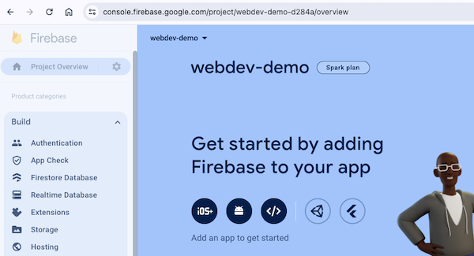
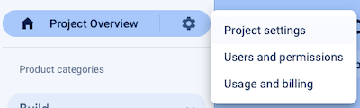
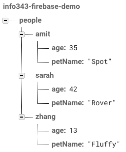
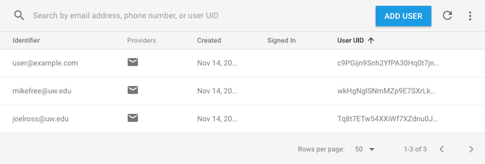

# Firebase
This chapter discusses how to integrate and use the [**Firebase**](https://firebase.google.com/) web service in a client-side application (using React). Firebase is a web service that provides tools and infrastructure for use in creating web and mobile apps that store data online in the cloud (a "web backend solution"). In effect, Firebase acts as a _server_ that can host information for you, so that you can just build client-side applications without needing to program a web server.

- Firebase is owned and maintained by Google, but will still work perfectly fine with Facebook's React framework.

In particular, this chapter will discuss the following features of Firebase:

1. The Firebase service also provide a number of "database" systems. This chapter describes how to use the [**realtime database**](https://firebase.google.com/docs/database/), which provides a simple [NoSql](https://en.wikipedia.org/wiki/NoSQL)-style database: you can think of it as a _single giant JSON object in the Cloud_. Firebase provides methods that can be used to refer to this object and its properties, make changes to the object. Most importantly, it provides the ability to "listen" for changes made by others so that the page can automatically update based on actions taken by other users. In effect you can create a **data binding** between clients and the server, so that if you update data on one machine, that change automatically appears on another.

    Firebase also offers additional database structures. [Firestore](https://firebase.google.com/docs/firestore) is another NoSQL (document-based) database, but focused more on one-time data fetch queries rather than the continuous data binding provided by the realtime database. This chapter focuses on the Realtime Database as an easier-to-learn system and to practice data binding. [Firebase Storage](https://firebase.google.com/docs/storage) is used for storing larger data elements (anything that can't be defined in JSON), such as images or videos, and is described at the end of the chapter.

2. The Firebase service also offers a client-side based system for performing [**user authentication**](https://firebase.google.com/docs/auth/), or allowing users to "sign in" to your application and have particular information associated with them. It's possible to have users sign up with an email and password, or even using an external service (e.g., "sign in with Google"). Firebase also provides a way to manage all those extra interactions associated with accounts, like being able to reset passwords or confirm email addresses. And this is all performed securely from the client-side, without the need to set up an additional server to perform OAuth work.

These features mean that Firebase can be a go-to back-end for producing a client-side app that involves persisted data (like user accounts). And its [free service tier](https://firebase.google.com/pricing/) is well-suited for any development app.

<p class="alert alert-warning">This chapter details how to use **version 9+** of the Firebase library, released in _August 2021_&mdash;and in particular its [_modular API_](https://firebase.google.com/docs/web/modular-upgrade) (which allows for smaller and more efficient bundles when using webpack and React). Note that while this version is conceptually the same as previous versions, the module syntax for calling and importing functions is different. See the upgrade guide for details. Be careful when looking up examples and resources that they're use the same version as you!</p>

Note that Firebase also provides [**Firebase Hosting**](https://firebase.google.com/docs/hosting) for hosting and serving web applications. This is particularly useful for hosting single-page-applications, such as those [built with React Router](#react-router-and-hosting). Hosting does not require any modifications to your source code, so is not discussed here.


## Setting up Firebase
Because Firebase is a cloud service, you will need to set it up externally in order to use it in your web application. Firebase setup and configuration is handled on Firebase's website at <https://firebase.google.com/>, and in particular in the [**Firebase Web Console**](https://console.firebase.google.com) where you can manage individual projects.

<p class="alert alert-success">When developing a Firebase app, keep the Web Console open all the time so you can check on database, user list, etc!</p>

### Creating a Project {-}
In order to use Firebase in your web app, you will need to _sign up for the service_. Visit **<https://firebase.google.com/>** and click the "Get Started" button to do so. You will need to sign in with a Google account (e.g., a UW account if you've set up Google integration). Signing up will direct you to the Firebase Web Console.

In the Web Console, you can manage all of your "projects"&mdash;one per application you've created (think: per repository). Each project will track its own database of information, its own set of users, etc.

You can create a project by clicking the _"Add Project"_ button. On the next screen, you'll need to give the app a _unique_ name. Naming the project after your app is a good idea. This name is used internally by the Firebase syste; it won't necessarily be visible to your users, though if you use [**Firebase Hosting**](https://firebase.google.com/docs/hosting) then the project name will be part of the default URL for the application.

- _Recommendation_: **do not** enable Google Analytics for your projects!

Once you've created the project, you will be taken to the **Web Console** for that project. This is a web page where you will be able to manage the configuration of the project, the users who have signed up, and any data in the database. In particular, note the navigation menu on the left-hand side: you will use this to access different parts of your project (_Realtime Database_ to manage the database, and _Authentication_ to manage users)&mdash;expand the _"Build"_ dropdown to navigate.




### Including Firebase in React {-}
In order to use Firebase in a web app (including a React app), you will need to add the Firebase library to your web page, as well as some specify some configuration data to connect to the correct Firebase project.

From the project's Web Console page, click the button (it look like a `</>` in the above image) to add Firebase to a web app. This will take you to a new page where you'll need to put in a nickname for the app and then present some JavaScript code for loading the Firebase library (make sure that "Use npm" is selected&mdash;you don't want to include a `<script>` element!).

In a React app you you will integrate Firebase directly into your source code by modifying the **`index.js`** file:

1. First, install and [Firebase library](https://www.npmjs.com/package/firebase) using `npm`:

    ```bash
    # Note: do this in your app's repo (the folder with the `package.json` file)

    npm install firebase
    ```

2. Then, copy the provided `import` statement, `firebaseConfig` variable, and `initializeApp()` function call into your **`index.js`** file. This will specify _which_ Firebase project your web app should connect to whenver you call functions to access Firebase.

    Note that you will need to paste this code _before_ the call `ReactDOM.render()`. The `index.js` file will often contain such configuration data that is relevant to the _app_ rather than to a specific component.


### Adding Collaborators to a Project {-}
Referencing the Firebase Web Console is vital for everyone who is working with the Firebase backend on a project. If you're working with a group of developers, you will want to make sure that all team members have access to this console.

You can add additional team members to a Firebase project by selecting "Users and permissions" from the "Project Overview" gear icon:



From there you can click on "Add Member" to add new members to the project.


## Realtime Database
The Firebase web service provides a [**realtime database**](https://firebase.google.com/docs/database) for storing and accessing data in the cloud. You can think of this database as being a _single giant JSON object in the Cloud_ that can be simultaneously accessed and modified by multiple clients&mdash;and since each client reads the same database, changes made by one user will be seen by others as _real-time updates_.

For example, you might have a database that is structured like:

```json
{
  "people" : {
    "amit" : {
      "age" : 35,
      "petName" : "Spot"
    },
    "sarah" : {
      "age" : 42,
      "petName" : "Rover"
    },
    "zhang" : {
      "age" : 13,
      "petName" : "Fluffy"
    }
  }
}
```

This database object has a `people` key that refers to an object, which itself contains keys that refer to individual "person" objects (each of which has an `age` and `petName` property).

In the Firebase Web Console (under the "Database" tab in the navigation menu), this data structure would be presented as:



- Note that in the Firebase Web Console you can edit this database directly: viewing, adding, editing, and deleting elements in the JSON. This is useful for debugging&mdash;both to check that your code is editing the database accurately, and to clean up any mistakes.

<p class="alert alert-warning">Although the JSON database can have many levels of nested objects, best practice is to try and keep the structure as "flat" as possible and avoid nesting too much data. This avoids you needing to download the nested "details" for a value if you only need to know e.g., the key names. See [Structure Your Data](https://firebase.google.com/docs/database/web/structure-data) for more details and examples.</p>

### Setting Up the Database {-}
In order to enable the realtime database for your project, navigate to the console page for the database and click the "Create Database" button.

<p class="alert alert-warning">Make sure you're creating the _Realtime Database_, not the Firestore Database!</p>

After selecting your local region, you'll be prompted to set up the [**Security Rules**](#security-rules). Choose to start in _test mode_ to get started immediately; see the below section for more about security rules.

#### Security Rules {-}
Because the Firebase database is just a giant JSON object in the cloud and is usable from a client-side system, technically _anyone_ can access it. Each element of the JSON object is accessible via AJAX requests (which are sent via `firebase` functions).

In order to restrict what clients can access this information (read or write to values in the JSON), Firebase lets you define [security rules](https://firebase.google.com/docs/database/security/) that specify what users can access which elements. For example, you can make it so that only _authenticated users_ can add new entries the database, or that only specific users can update specific entries (e.g., the comments they wrote on a blog).

- By default, no one can access or modify the data (in _locked mode_). If you choose to start your project in _test mode_, then anyone will be able to access or modify the entire database for a limited amount of time.

In order to modify or configure the security rules, navigate to the "Rules" tab of the Realtime Database's page in the Firebase Web Console. You can modify the rules by editing the presented JSON data; remember to hit "Publish" after you're done editing.

Firebase Security Rules are defined in JSON using a particular (and somewhat awkard) scheme. Basically, inside the `"rules"` property you specify a JSON tree that mirrors the structure of your database. But instead of having a value for the keys in your database, you specify an object with `".read"` and `".write"` properties. The values of these properties are boolean expressions that state whether or not the current user is able to read (access) or write (modify) that value. For more on writing rules, such as how to handle user authorization (only certain users can read/write access) or data validation (making sure all data is written of a certain type), see [the official documentation](https://firebase.google.com/docs/database/security/).


### Data References {-}
To start working with your database, you will need to get a **reference** to that value in the database.

You begin by getting a reference to the database itself, using the **`getDatabase()`** function provided by Firebase's database module `firebase/database`:

```js
//import the function from the realtime database module
import { getDatabase } from 'firebase/database';

//get a reference to the database service
const db = getDatabase();
```

Importantly, the `db` value in the example is **not** a copy of the data or even the database itself! It's instead just a reference pointer to where that database lives&mdash;you can think of it more like a "URL" for the database.

- The `getDatabase()` function is a simple _singleton_ accessor that runs in constant time; it's best practice to call it scoped in whatever functional scope you need to refer to the database. You do not need topass it around as a prop, nor should you try to make a "top level" or global `db` variable. Just call the function again if you need to access the database from a separate scope.

In order to modify any particular values in the database, you will need to get a [**reference**](https://firebase.google.com/docs/reference/js/database.databasereference) to that value. This is done by using the **`ref()`** function, passing in the database reference and the "path" (a string) to the data value in the database's JSON:

```js
import { getDatabase, ref } from 'firebase/database';

//get a reference to the database service
const db = getDatabase();

//get reference to the "people"" property in the database
const peopleRef = ref(db, "people")

//get reference to the "sarah" property inside the "people" property in the database
//similar to `database.people.sarah` using dot notation
const sarahRef = ref(db, "people/sarah");
```

Again, these reference are **not** the data! They are just reference pointers to where the data lives&mdash;like the "URL" for that data value.

The "path" to nested values in the database are written in a URI-style "path notation", where each nested key is indicated by a slash **`/`** (rather than the `.` in dot notation as you'd normally use with JSON format). Thus `"people/sarah"` refers to the `sarah` key inside of the `people` key inside of the database; `"people/sarah/pet"` refers to the `pet` key inside the `sarah` key inside the `people` key&mdash;the spot in the database with the value `"Rover"` in the above example.

Since this path is just a string, you can use string concatenation to construct the path to a particular value you wish to reference (e.g., if you only want to work with the value for a particular person):

```js
//variable name to access
const personName = "Ada";

//access the "Ada" property inside of the "people" property inside the database
const personOfInterestRef = ref(db, "people/"+personName);
```

Alternatively, you can use the **`child()`** function to get a reference to a specific "child" element in the database:

```js
import { ref, child } from 'firebase/database';

//equivalent to the above example

//get reference to the "people" property in the database
const peopleRef = ref(db, "people")

//get reference to the "sarah" property inside of the "people" reference'd value
const sarahRef = child(peopleRef, "sarah")
```

In general, you want to work with a small a subset the data as possible. Thus it's better to get a reference to `"person/sarah"` if you're only going to read or write to that value, rather than get a reference to the whole `"people"` and then just read/write the `sarah` key in that.


### Writing Data {-}
You can modify values in the database by using the **`set()`** function. This function takes two arguments: a _database reference_, and then the new value you want to assign to that location in the database:

```js
//alias the `set` function as `firebaseSet`
import { ref, set as firebaseSet } from 'firebase/database'

//get a reference to where sarah's age is stored in the database
const sarahAgeRef = ref(db, "people/sarah/age");

//change Sarah's age to 43 (happy birthday!)
const newValueForSarahAge = 43;

//assign the new value in the database
firebaseSet(sarahRef, newValueForSarahAge);
```

This will change the value in the database at `"people/sarah/age"` to `43`.

Note that in this example, I use the `as` keyword to _alias_ the `set` function when importing it, instead calling it `firebaseSet`. This is for clarity, as "set" is an overly generic name for a function.

Note that as with normal JSON objects, you can also "set" values for database entries that didn't previously exist&mdash;you do not have to "declare" a value in the database ahead of time

```js
//a reference to the people entry in the database
const peopleRef = ref(db, "people")

//a reference to a location with no currently defined value
const adaRef = ref(peopleRef, "ada");

//set an object to that location in the database
firebaseSet(adaRef, {age: "206", pet: "Charlie"})
```

Firebase also provides an equivalent method `update()`, which will "merge" in changes to the existing value at a reference. This allows you to `update()` the a reference pass in an object with some properties to be modified, while existing properties are be retained (rather than having the entire value at that reference be replaced).

Finally, note that the `set()` method returns a _Promise_. Thus you can use `.then()` (or `await`) to execute statements after the database has updated, and you can thus catch any errors that may occur when attempting to update a value. This is especially useful for debugging, but also is good for providing user feedback.

```js
const sarahPetRef = ref(db, "people/sarah/pet");

//change Sarah's pet
firebaseSet(sarahPetRef, "Sparky")
    .then(() => console.log("data saved successfully!"))
    .catch(err => console.log(err)); //log any errors for debugging
```


### Listening for Data Changes {-}
Because Firebase's database is intended for _realtime_ access (that may change over time), you read data from it and establish _data binding_ by registering an **event listener** to listen for changes to that database. In effect, any modifications to the data causes a "database change event" which triggers your listener, allowing you to acccess the new updated data.

You register a database change listener by using the **`onValue()`** function. This function takes as arguments a database reference (which value you want to listen for changes to) and a callback function that will be executed in response to the event (similar to the DOM's `addEventListener()` function):

```js
import { ref, onValue } from "firebase/database"

//get a reference to a particular value location in the database
const amitRef = ref(db, 'people/amit');

//register a listener for changes to that value location
onValue(amitRef, (snapshot) => {
    const amitValue = snapshot.val();
    console.log(amitValue); //=> e.g., { age: 35, petName: "Spot" }
    //can do something else with amitValue (e.g., assign to a state variable)
});
```

The callback function will be passed as a parameter the latest [**snapshot**](https://firebase.google.com/docs/reference/js/firebase.database.DataSnapshot) of the data value at the listening location. This is a wrapper around the database's JSON tree (allowing you to navigate it e.g., with `child()`). Most commonly, you will want to convert the snapshot into an actual JavaScript object by calling the **`.val()`** method on it.

The listener will trigger whenever any child node of the targeted refence location changes. Thus even if just `people/amit/pet` is updated, the above listener will trigger.

Importantly, because this listener involves network access and can trigger throughout the life of your application, in a React app you will need to register the listener inside an _effect hook_. The effect hook's "cleanup function" will also need to remove the listener&mdash;otherwise you will have a memory leak and can get errors if your component gets removed (e.g., by changing routes). The `onValue()` function _returns_ a new function that can be used to "unregister" the listener:

```jsx
function MyComponent(props) {
  //effect hook
  useEffect(() => {
    const db = getDatabase();
    const amitRef = ref(db, "people/amit");

    //returns a function that will "unregister" (turn off) the listener
    const unregisterFunction = onValue(amitRef, (snapshot) => {
      const amitValue = snapshot.val();
      //...set state variable, etc...
    })

    //cleanup function for when component is removed
    function cleanup() {
      unregisterFunction(); //call the unregister function
    }
    return cleanup; //effect hook callback returns the cleanup function
  })
}
```

Note that it is possble to read a single value once (without needing to register a listener) by using the `get()` method. This method returns a promise that will contain the read snapshot (once it is downloaded). _However_, the Realtime Database is intended and optimized for data binding and notifications. Thus you should pretty much always be using `onValue()` to read data from the database. If you find yourself wanting to just read a single value once, you're not thinking about the realtime database correctly!


### Firebase Arrays {-}
When working with and storing data in the cloud, we often want to organize that data into lists using _arrays_. However, Firebase **does not** directly support support arrays: the JSON object in the sky only contains objects, not arrays! This is because Firebase needs to support **concurrent access**: multiple people need to be able to access the data at the same time. But since arrays are accessed by _index_, this can cause problems if two people try to modify the array at the same time.

- The problem is that with an array, an index number doesn't always refer to the same element! For example, if you have an array `['a', 'b' 'c']`, then index `1` may initially refer to the `'b'`. However, if you add an element onto the beginning of the array, then suddenly that `1` index refers to the `'a'`. And so if a user was trying to modify the `'b'` before their machine was aware of the change, they may end up editing the wrong value when they ask to change the value at index `1`! This bug is an example of a [race condition](https://en.wikipedia.org/wiki/Race_condition), which can occur when two processes are modifying data _concurrently_ (at the same time).

<!-- could put code version of example ?? -->

To avoid this problem, Firebase treats all data structures as Objects, so that each value in the JSON tree has a _unique_ key. That way each client will always be modifying the value they expect. However, Firebase does offer a way that you can treat Objects as arrays, in the form of a **`push()`**(https://firebase.google.com/docs/reference/js/firebase.database.Reference#push) function that will add a value to an object with an **auto-generated key**.

```js
import { getDatabase, ref, push as firebasePush } from 'firebase/database';

const db = getDatabase;
const tasksRef = ref(db, "tasks"); //an object of tasks

firebasePush(taskRef, {description:'First things first'} ) //add one task
firebasePush(taskRef, {description:'Next things next'} ) //add another task
```

This will produce a database with a structure:

```json
{
  "tasks" : {
    "-KyxgJhKOVeAj2ibPxrO" : {
      "description" : "First things first"
    },
    "-KyxgMDJueu17348NxDF" : {
      "description" : "Next things next"
    }
  }
}
```

Notice how the `tasks` property is an Object (even though we "pushed" elements into it), and each "task" is assigned an auto-generated key (based on the timestamp it was pushed). You can still interact with `tasks` as if it were an array-like list, but instead of using a value from `0` to `length` as the index, you'll use a generated "key" as the index.

<p class="alert alert-warning">**Always** use the `push()` function to have Firebase automatically manage data arrays for you. **Never** try to manually create an "array" by giving values keys "0", "1", "2" etc.</p>

Firebase _snapshots_ do support a `forEach()` function that you can use to iterate through their elements, allowing you to loop through the elements in an array. However, if you want to do something more complex (like `map()`, `filter()`, or `reduce()`), you need an actual array. The best way to get this is use call `Objects.keys()` on the `snapshot.val()` in order to get an array of the keys, and then you can iterate/map those keys into an array of values (accessing each element in the "array" using bracket notation).

```js
//`tasksSnapshot` is a snapshot of the `tasks` "array"
const allTasksObject = tasksSnapshot.val(); //convert snapshot to value

//an array of the keys in the object ["-KyxgJhKOVeAj2ibPxrO", "-KyxgMDJueu17348NxDF"]
const allTasksKeys = Object.keys(allTasksObject);

//map array of keys into array of tasks
const allTasksArray = allTasksKeys.map((key) => {
    const singleTaskCopy = {...allTasksObject[key]}; //copy element at that key
    singleTaskCopy.key = key; //locally save the key string as an "id" for later
    return singleTaskCopy; //the transformed object to store in the array
});

allTasksArray.map((taskObject) => { ... })
```

Note that when looping through an "array", each element is handled separately from its key (the same way that a `forEach()` loop lets you work with array elements separately from their index). But since you may need that key as an identifier in order to `ref()` and modify the JSON element later, you should make sure that you "save" the key in the object as you processing it as an additional local property. This won't modify the value in the database, just the local variable that your code is working with. _Don't lose your key!_.


## User Authentication
Firebase provides the ability to **authenticate** users: to let people sign up for you application and then to check that they are who they say (e.g., have provided the right password). Firebase supports multiple different forms of authentication: users can sign up with an email and password, log in with a social media service such as Google or Facebook, or even authenticate "anonymously" (so you can at least keep track of different people even if you don't know who they are).

In order to support user authentication, you will need to enable this feature in the Firebase Web Console. Click on the "Authentication" link in the side navigation menu's Build capetgory to go to the authentication management page, then choose "Get started". Under the "Sign-In Method" tab, you can choose what forms of authentication you wish to enable.

- For example, click on the "Email/Password" option, and then flip the switch to "Enable" that method. Be sure and Save your changes!

- Each different sign-in method uses what is called a "Provider"&mdash;a service that provides the information about whether the user is who they say. Firebase's email/password check is a possible Provider; Google is a possible Provider; etc. You can enable multiple different Providers, each of which will be able to authenticate users (i.e., letting them sign in with the relevat credentials).

Note that you will be able to use this page to see and manage users who have signed up with your Firebase project. This is where you can see if uses have successfully been created, look up their **User UID** for debugging, or delete users from the project:



### Signing In with FirebaseUI {-}
It is possible to call functions provided by Firebase in order to create and log in users. However, this would require you to implement the "log in form" on your own&mdash;and would only easily support the Email/Password authentication option.

Instead, a nicer approach is to use the [**FireabaseUI**](https://firebase.google.com/docs/auth/web/firebaseui) library, also managed by Firebase. This library provides a set of predefined UI elements like a "login form", including ones which will support different authentication methods.


There are different FirebaseUI libraries for different platforms; previously for React you would use [`firebaseui-web-react`](https://github.com/firebase/firebaseui-web-react). However, as of November 2022 this library has not been updated to work with the latest version of React (React 18), and appears to have been been abandoned rather than [applying the needed fix](https://github.com/firebase/firebaseui-web-react/pull/173). There are two possible workarounds to this:

1. You can install a version of the library updated by [Gabriel Villenave](https://github.com/gvillenave) (which hasn't been accepted as a pull request yet):

    ```bash
    # install library on the command line
    npm install https://gitpkg.now.sh/gvillenave/firebaseui-web-react/dist
    ```

    Confirm that your `package.json` file has the correct dependency listed:

    ```
    "react-firebaseui": "https://gitpkg.now.sh/gvillenave/firebaseui-web-react/dist"
    ```

2. You can install the non-React version of the library (`firebaseui`), and then define the needed Component (`StyledFirebaseUI`) manually:

    ```bash
    npm install firebaseui
    ```

    Create the `StyledFirebaseAuth.txs` file defined [in this comment post](https://github.com/firebase/firebaseui-web-react/pull/173#issuecomment-1224404146).

The React FirebaseUI library provides a Component called `<StyledFirebaseAuth>`, which you can render in your page like any other Component. You can think of this Component as the "login form". A complete example of how this Component is used can be found below, following by an explanation.

```jsx
//import auth functions and variables from Firebase
import { getAuth, EmailAuthProvider, GoogleAuthProvider } from 'firebase/auth'

//import the component -- pick one!
import StyledFirebaseAuth from 'react-firebaseui/StyledFirebaseAuth'; //install option 1
import StyledFirebaseAuth from './StyledFirebaseAuth'; //install option 2

//an object of configuration values
const firebaseUIConfig = {
  signInOptions: [ //array of sign in options supported
    //array can include just "Provider IDs", or objects with the IDs and options
    GoogleAuthProvider.PROVIDER_ID,
    { provider: EmailAuthProvider.PROVIDER_ID, requiredDisplayName: true },
  ],
  signInFlow: 'popup', //don't redirect to authenticate
  credentialHelper: 'none', //don't show the email account chooser
  callbacks: { //"lifecycle" callbacks
    signInSuccessWithAuthResult: () => {
      return false; //don't redirect after authentication
    }
  }
}

//the React compnent to render
function MySignInScreen() {

  const auth = getAuth(); //access the "authenticator"

  return (
    <div>
      <h1>My App</h1>
      <p>Please sign-in:</p>
      <StyledFirebaseAuth uiConfig={firebaseUIConfig} firebaseAuth={auth} />
    </div>
  );
}
```

There are a few steps to using this Component:

- The `<StyledFirebaseAuth>` requires a `uiConfig` prop, which is an object containing configuration values for that login form (the object has specific properties which correspond to configuratoin options). The config object is usually defined as a global constant.

    The most important configuration option is the `signInOptions`, listing the different authentication providers supported (what options should show up in the login form). The IDs for these providers are imported from the `'firebase/auth'` library&mdash;though they are numeric values, not functions.

    Other common/useful options are shown in the example; for a complete list of options see [the firebaseui-web documentation](https://github.com/firebase/firebaseui-web#configuration).

- The `<StyledFirebaseAuth>` also requires a `firebaseAuth` prop, which is a reference to the "authenticator" service&mdash;what will handle the process of the user logging in and out. You can get access to this value via the **`getAuth()`** function provided by `'firebase/auth'` (similar to how you get access to the Realtime Database via the `getDatabase()` function).

    Note that as with `getDatabase()` the authenticator is a _singleton_ value&mdash;you can call `getAuth()` from multiple modules/files/scopes without concern. You do not need to pass it around as a prop or declare it as a "top-level" constant.

With this Component, users will be able to "log in", though see the [Managing the User](#managing-the-user) section below. You will be able to see a list of users who have connected to your app in the Firebase Web Console. Note in particular that you can see their _uid_ (unique identifier), which is what is used to distinguish between users. (You can't use emails as identifiers, because someone who logs in with Facebook won't provide their email address!).

<p class="alert alert-info">**Pro-tip:** You don't need to come up with real email addresses for testing. Try using `a@a.com`, `b@a.com`, `c@a.com`, etc. Similarly, `password` works fine for testing passwords (though you should never do that in real life!)</p>

The Firebase Web Console will provide a view of the "user list"&mdash;but importantly, this is _not the same as the Realtime Database_. The user list holds _very_ limited information: the authentication provider, a "display name", and possibly a "photo url" (e.g., where to find an avatar image). But you cannot store any additional information in the "user database"&mdash;not profile images, not preferred names or pronouns used, not favorite fish. Any user-specific information will need to be stored in the Realtime Database instead, usually using a "key" that is the user's `uid`. For example, your Realtime Database might store information like:

```json
{
  "userData" : {
    "userId1" : {
      "pronouns" : "they/them",
      "favoriteFish" : "sea bass"
    },
    "userId2" : {
      "pronouns" : "he/him",
      "favoriteFish" : "cuttle fish"
    }
  }
}
```

You can then access the user's data using the same process as any other data in the realtime database, listening to the reference `"userData/"+userId`.

In order to sign out a user, you can use another built-in Firebase function: **`signOut()`**:

```js
import { getAuth, signOut } from 'firebase/auth';

const auth = getAuth();

signOut(auth)
    .catch(err => console.log(err)); //log any errors for debugging
```

Note that the `signOut()` method returns a Promise, so you can `.catch()` and display any errors.


### Managing the User {-}
Although FirebaseUI will log in a user, you will need to do further work in order for your app to know who that logged in user is.

The _authenticator_ (from `getAuth()`) will keep track of which Firebase User is currently logged in&mdash;and this information persists [even after the browser is closed](https://firebase.google.com/docs/auth/web/auth-state-persistence). This means that every time you reload the page, the authenticator will automatically perform the authentication and "re-login" the user.

The recommended way to [determine who is currently logged](https://firebase.google.com/docs/auth/web/manage-users#get_the_currently_signed-in_user) in is to register an _event listener_ to listen for events that occur when the "state" of the authentication changes (e.g., a user logs in or logs out). This event will occur when the page first loads and Firebase determines that a user has previously signed up (the "initial state" is set), or when a user logs in or out. You can register this listener by using Firebase's **`onAuthStateChanged()`** function:

```js
//import functions
import { getAuth, onAuthStateChanged } from 'firebase/auth'

const auth = getAuth();

onAuthStateChanged(auth, (firebaseUser) => {
    if(firebaseUser){ //firebaseUser defined: is logged in
        console.log('logged in', firebaseUser.displayName);
        //do something with firebaseUser (e.g. assign to a state variable)
    }
    else { //firebaseUser is undefined: is not logged in
        console.log('logged out');
    }
});
```

The `onAuthStateChanged()` function takes in two arguments: the authenticator, and a callback function that will be executed whenever the "authentication state" changes (e.g., whenever the user logs in or out). The callback function will be passed an object representing the ["Firebase User"](https://firebase.google.com/docs/reference/js/firebase.User). This object contains properties about the user, including:

- `uid`, which is the _unique id_ for the user
- `displayName`, which is the user's provider-independent displayable name

The most common practice is to take this passed in object and assign it to a more global variable, such as a state variable in a React component (e.g., `setCurrentUser(firebaseUser)`).

If the user "logged out", then the passed in `firebaseUser` value will be `null`; this information can also be saved to the React state variable.

Importantly, because this listener involves network access and can trigger throughout the life of your application, in a React app you will need to register the listener inside an _effect hook_. The effect hook's "cleanup function" will also need to remove the listener. The `onAuthStateChanged()` function _returns_ a new function that can be used to "unregister" the listener:

```jsx
function MyComponent(props) {
  //effect hook
  useEffect(() => {
    const auth = getAuth();

    //returns a function that will "unregister" (turn off) the listener
    const unregisterFunction = onAuthStateChanged(auth, (firebaseUser) => {
      //handle user state change
      if(firebaseUser){
        //...
      }
    })

    //cleanup function for when component is removed
    function cleanup() {
      unregisterFunction(); //call the unregister function
    }
    return cleanup; //effect hook callback returns the cleanup function
  })
}
```

#### Firebase React Hooks {-}
In React systems it is common to render different content depending on whether the user is logged in. This could be done with conditional rendering, or with a "protected route" as described in [Client-Side Routing](#redirecting).

However, it takes a few seconds for Firebase to authenticate a user when a page first loads. Thus your conditional rendering will often need to handle 3 cases: when a user is logged in, when a user is not logged in, and when the user status is "loading" and the app hasn't finished checking yet.

While there are some cludgy workarounds (e.g., use a special value for your state to indicate that a user is "loading"), this is a common enough situation that you can use solutions implemented by other people. One such option is the [`firebase-react-hooks`](https://github.com/CSFrequency/react-firebase-hooks) library. This library provides a simple hook (like `useState` or `useParams`) that lets you access the user status. In particular, the `useAuthState` hook will implement the authentication state listener for you:

```jsx
import { getAuth } from 'firebase/auth';
import { useAuthState } from 'react-firebase-hooks/auth';

function MyComponent(props) {
  const auth = getAuth();
  const [user, loading, error] = useAuthState(auth);

  if(loading){ //still waiting
    return <p>Initializing user</p>
  }

  if(error) { //error logging in
    return <p>Error: {error}</p>
  }

  if(user) { //user is defined, so logged in
    return <p>Welcome {user.displayName}</p>
  } else { //user is undefined
    return <p>Please sign in</p>
  }

  //...
}
```

This hook returns an array of 3 values (which are destructured in the above example), indicating the current user (or `null` for no user), whether the auth state is still loading, and whether there was an error.

While using such a library is not necessary, it is a good example of how React's architecture allows for external libraries that can help reduce boilerplate code.


## Firebase Storage
Firebase's Realtime Database persists JSON data: so in the end just strings, numbers, and booleans (even if those values are organized into objects). If you wish to persist data _files_&mdash;such as music, video, pdfs, etc&mdash;you need to use a different service called [**Firebase Storage**](https://firebase.google.com/docs/storage). Storage is designed for storing larger files rather than primitive data types. In the end it works fairly similarly to the realtime database, though without data binding.

<p class="alert alert-info">Firebase [free tier](https://firebase.google.com/pricing/) provides up to 5 GB of storage for free (with 1 GB/day of downloading allowed). That's about 5000 hi-res images, 1000 music files, or maybe 20 hr of compressed video. This means that the free storage service will work great for most development versions of media applications--though you may run out of space quickly if working with video, especially when testing. Always consider the amount of data you will need to store before choosing a cloud storage service.</p>

In order to use Firebase Storage, you will need to enable this feature in the Firebase Web Console. Click on the "Storage" link in the side navigation menu's Build capetgory to go to the authentication management page, then choose "Get started". Similar to the realtime database, you'll need to choose security rules (probably being in _test mode_ for development). When prompted for a Cloud Storage bucket location, pick something nearby to speed up access a little, but for most student projects it doesn't matter much.

Once you have set up Storage, you can use the Firebase Web Console to view and manage files that have been uploaded (including deleting them if desired).

### File Inputs {-}
In order for a user to upload a file to Storage, the user will need to first choose which file they want to store. The correct way to do this is to use a `"file"` type `<input>` element:

```html
<input type="file">
```

This element works the same as other `<input>` elements you've used (usually with the default `type` of `"text"`). But rather than providing an interface for the user to provide a string as a value, the input will provide an interface for the user to choose a file from their operating system.

<p class="alert alert-success">This is an `<input>` like any other, which means that in React you should use a state variable to control it!</p>

Once the user choses a file, you can access that the files chosen through the `.files` property of the `<input>` element&mdash;similar to the `.value` property used with default `<input>` elements. Note that the operating system's file picking dialog may allow the user to choose multiple files (or none at all!); you will will want to check this when responding to any changes to the input:

```js
//an event handler function that responds to changing in an `<input type="file">`
const handleChange = (event) => {
  //the event.target is the <input> element
  //check e.g., that the user picked at least 1 file, and that the file they picked actually exists
  if(event.target.files.length > 0 && event.target.files[0]) {
    const chosenFile = event.target.files[0]; //the first file chosen
    //... do something with that value, such as store it in React's state
  }
}
```

Note that the `chosenFile` will be a [`File`](https://developer.mozilla.org/en-US/docs/Web/API/File)-type value, which has its own set of methods and properties. Critically, the `File` value is really just a reference to a location in your computer's operating system; if the file gets moved or renamed then the `File` will be pointing at something with no size, so you won't be able to upload it.

### Uploading Files {-}
Once you have the `File` the user wants to upload, you can upload that data to Firebase using a method similar to how you `set` data in the realtime database.

First, you need to get a _reference_ to the location in Storage where you want to upload the file. You do this by using the **`ref()`** function from the `firebase/storage` library:

```js
import {getStorage, ref as storageRef } from 'firebase/storage';

//get a reference to the storage service
const storage = getStorage();

//get a reference to where the file will go in storage
const fileRef = storageRef(storage, "path/to/myfile.png");
```

Importantly, this is a _different_ `ref()` function than the one used with the realtime database! They are not interchangeable. For that reason, you can alias the storage's `ref` as e.g., `storageRef` in order to use both in the same module.

The `ref()` function takes as arguments the reference to the storage service and a string representing the "file path" for the new file&mdash;where it will go in the Storage bucket. You write this string like any other relative file path; it includes both any intermediate directories as well as the name of the resulting file. Any directories you include in the path will be created when the file is uploaded (they do not have to exist previously), and if a file already exists at that location, it will be overwritten. Be sure to include the file extension when naming the file (and you'll want that file extension to match the actual file type!)

Once you have a reference to the file's location in storage, you can use the **`uploadBytes()`** function to upload the file:

```js
import {getStorage, ref as storageRef, uploadBytes } from 'firebase/storage';

const storage = getStorage();
const fileRef = storageRef(storage, "path/to/myfile.png");

uploadBytes(fileRef, myFile)
  .then(() => console.log("file successfully uploaded!"))
  .catch(err => console.log(err)); //log any errors for debugging
```

The `uploadBytes()` function is asynchronous (it can take a while to upload large files!) and returns a Promise that you can use to respond when the file has finished uploading or to catch and process errors.

Once a file has been uploaded, Firebase will give it a public URL (with the usual `https://` protocol) where websites and users can access it. This public URL is different and constructed from the `ref` path that was specified, and will vary based on the storage parameters used by Firebase. So in order to figure out the resulting URL for this file (e.g., so you can show the file to the user again, you will need to request that URL from Firebase. You do this by using yet another function called **`getDownloadURL()`**. The function takes the file's `ref` as an argument, and will query Firebase for the public URL of the file.

But querying Firebase is a network operation, which means that it takes time... Thus `getDownloadURL()` is _asynchronous_ doesn't return the actual URL, but a _Promise_ for that URL; you will need to wait for that promise to resolve to access the URL string. Since uploading the file and getting the public URL are both asynchronous functions that return Promises, this operation is a good place to use `async/await` syntax to help keep the code readable rather than having a sequence of Promises.

```js
import {getStorage, ref as storageRef, uploadBytes, getDownloadURL } from 'firebase/storage';

//await calls need to go in an async function
async function uploadFile() {
  const storage = getStorage();
  const fileRef = storageRef(storage, "path/to/myfile.png");

  try { //try/catch to handle errors
    await uploadBytes(fileRef, myFile) //asynchronous upload
    const url = await getDownloadURL(fileRef); //asynch query for public URL
    //...do something with the url, such as set it to state for rendering
    //...or save that url in the realtime database
  } catch (err) {
    console.log(err); //log any errors for debugging
  }
}
```

Note that it is normal to take the public URL and to also `set` it to a location in the realtime database; this allows an uploaded image to be associated with some other data values. The realtime database stores the _url_ to the file (a string, stored in JSON), but the file itself is kept in Firebase Storage.


## Resources {-}
<div class="list-condensed">
- [Firebase Web Documentation](https://firebase.google.com/docs/web/setup)
- [Firebase Realtime Database](https://firebase.google.com/docs/database/web/start)
- [Firebase Authentication](https://firebase.google.com/docs/auth/web/start)
</div>
