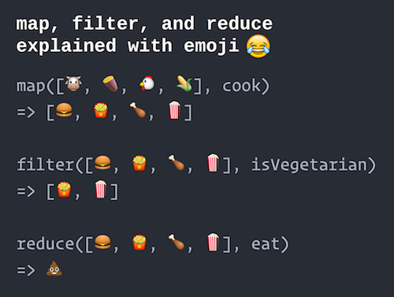

# Functional Programming in JS {#functional-programming}

Despite it's name, the JavaScript language was based more on <a href="https://en.wikipedia.org/wiki/Scheme_(programming_language)">Scheme</a> than it was on Java. Scheme is a **functional programming language**, which means it follows a programming paradigm centered on _functions_ rather than on _variables_, objects, and statements as you've done before (known as _imperative programming_). An alternative to object-oriented programming, functional programming provides a framework for thinking about how to give instructions to a computer. While JavaScript is not a fully functional language, it does support a number of functional programming features that are vital to developing effective and interactive systems. This chapter introduces these functional concepts.


## Functions ARE Variables
Normally you've considered functions as "named sequences of instructions", or groupings of lines of code that are given a name. But in a functional programming paradigm, functions are [first-class citizens](https://en.wikipedia.org/wiki/First-class_function)&mdash;that is, they are "things" (values) that can be organized and manipulated _just like variables_.

In JavaScript, **functions ARE variables**:

```js
//create a function called `sayHello`
function sayHello(name) {
    console.log("Hello, "+name);
}

//what kind of thing is `sayHello` ?
console.log(typeof sayHello);  //=> 'function'
```

Just like `let x = 3` defines a variable for a value of type `number`, or `let msg = "hello"` defines a variable for a value of type `string`, the above `sayHello` function is actually a variable for a _value_ of type `function`!

<p class="alert alert-warning">**Important**: we refer to a function by it's name _without_ the parentheses!</p>

The fact that functions **are** variables is the core realization to make when programming in a functional style. You need to be able to think about functions as **things** (nouns), rather than as **behaviors** (verbs). If you imagine that functions are "recipes", then you need to think about them as _pages from the cookbook_ (that can be bound together or handed to a friend), rather than just the sequence of actions that they tell you to perform.

And because functions are just another type of variable, they can be used **anywhere** that a "regular" variable can be used. For example, functions are values, so they can be assigned to other variables!

```js
//create a function called `sayHello`
function sayHello(name) {
    console.log("Hello, "+name);
}

//assign the `sayHello` value to a new variable `greet`
let greet = sayHello;

//call the function assigned to the `greet` variable
greet("world");  //logs "Hello world"
```

- It helps to think of functions as just a special kind of array. Just as _arrays_ have a special syntax `[]` (bracket notation) that can be used to "get" a value from the list, _functions_ have a special syntax `()` (parentheses) that can be used to "run" the function.

### Anonymous Functions {-}
Functions are values, just like arrays and objects. And just as arrays and objects can be written as literals which can be _anonymously_ passed into functions, JavaScript supports **anonymous functions**:

```js
var array = [1,2,3]; //named variable (not anonymous)
console.log(array); //pass in named var
console.log( [4,5,6] ); //pass in anonymous value
```

```js
//named function (normal)
function sayHello(person){
    console.log("Hello, "+person);
}

//an anonymous function (with no name!)
//(We can't reference this without a name, so writing an anonymous function is
//not a valid statement)
function(person) {
    console.log("Hello, "+person);
}

//anonymous function (value) assigned to variable
//equivalent to the version in the previous example
let sayHello = function(person) {
    console.log("Hello, "+person);
}
```

- You can think of this structure as equivalent to declaring and assigning an array `let myVar = [1,2,3]`... just in this case instead of taking the anonymous array (right-hand side) and giving it a name, we're taking an _anonymous function_ and giving it a name!

Thus you can define named functions in one of to ways: either by making an explicitly named function or by assigning an anonymous function to a variable:

```js
//these produce the same function
function foo(bar) {}
let foo = function(bar) {}
```

The only difference between these two constructions is one of _ordering_. When the JavaScript interpreter is initially reading and parsing the script file, it will put variable and function declarations into memory before it executes any of the file. In effect, JavaScript will seem to "move" variable and function declarations to the top of the file! This process is called [**hoisting**](https://developer.mozilla.org/en-US/docs/Glossary/Hoisting) (declarations are "hoisted" to the top of the script).
<!-- ```js
//this will work even though the function is declared after it is called!
sayHello("world");

function sayHello(name) { console.log("Hello, "+name); }
``` -->
Hoisting _only_ works for named function declarations: assigning an anonymous function to a variable will not hoist that function's definition:

<!-- ```js
sayHello("world"); //ReferenceError: sayHello is not defined

let sayHello = function(name) { console.log("Hello, "+name); }
``` -->

In practice, you should **always** declare and define functions before you use them (put them all at the top of the file!), which will reduce the impact of hoisting and allow you to use either construction.


## Object Functions
Moreover, functions are values, so they can be assigned as values of _object properties_ (since object properties are like name-spaced variables):

```js
//an object representing a dog
let dog = {
    name: 'Sparky'
    breed: 'mutt'
}

//assign an anonymous function to the `bark` property
dog.bark = function(){
    console.log('woof!');
}

//call the function
dog.bark(); //logs "woof!"
```

- Again, this is just like how you can assign an array as an object's property. With an array value you would use bracket notation to use it's "special power"; with a function value you use parentheses!

This is how we can create an equivalent of "member functions" (or methods) for individual objects: the `dog` object now has a function `bark()`!

- Similar to Java, you can refer to the _object on which a function is called_ using the keyword `this`. Note that the manner in which the `this` variable is assigned can lead to some subtle errors when using callback functions (below). For more details, see [the chapter on ES6 features](#es6). As a brief example:


```js
// An object representing a Dog
let fido = {
  name: "Fido",
  bark: function() { console.log(this.name, "woofs")}
}

// An object representing another Dog
let spot = {
  name: "Spot",
  bark: function() { console.log(this.name, "yips")}
}

console.log('***This is Fido barking:***');
fido.bark(); //=> "Fido woofs". Note, `this` will refer to the `fido` object.

console.log('***This is Spot barking***');
spot.bark(); //=> "Spot yips". Note, `this` will refer to the `spot` object.
```


## Callback Functions
Finally, functions are values, so they can be _passed as parameters to other functions_!

```js
//create a function `sayHello`
function sayHello(name){
    console.log("Hello, "+name);
}

//a function that takes ANOTHER FUNCTION as an argument
//this function will call the argument function, passing it "world"
function doWithWorld(funcToCall){
    //call the given function with an argument of "world"
    funcToCall("world");
}

doWithWorld(sayHello);  //logs "Hello world";
```

In this case, the `doWithWorld` function will _execute_ whatever function it is given, passing in a value of `"world"`.

- **Important note**: when we pass `sayHello` as an argument, we don't put any parentheses after it! Putting the parentheses after the function name _executes_ the function, causing it to perform the lines of code it defines. This will cause the expression containing the function to _resolve_ to its returned value, rather than being the function value itself. It's like passing in the baked cake rather than the recipe page.

    ```js
    function greet() {  //version with no args for clarity
        return "Hello";
    }

    //log out the function value itself
    console.log(greet);  //logs e.g., [Function: greet], the function

    console.log(greet());  //logs "Hello", which is what `sayHello()` resolves to
    ```

A function that is passed into another is commonly referred to as a **callback function**: it is an argument that the other function will "call back to" and execute when needed.

```js
function doLater(callback) {
    console.log("I'm waiting a bit...");
    console.log("Okay, time to work!");
    callback();  //"call back" and execute that function
}

function doHomework() {
    // ...
};

doLater(doHomework);
```


Functions can take more than one callback function as arguments, which can be a useful way of _composing_ behaviors.

```js
function doTogether(firstCallback, secondCallback){
    firstCallback();  //execute the first function
    secondCallback();  //execute the second function
    console.log('at the same time!');
}

function patHead() {
    console.log('pat your head');
}

function rubBelly() {
    console.log('rub your belly');
}

//pass in the callbacks to do them together
doTogether(patHead, rubBelly);
```

This idea of _passing functions are arguments to other functions_ is at the heart of functional programming, and is what gives it expressive power: we can define program behavior primarily in terms of the behaviors that are run, and less in terms of the data variables used. Moreover, callback functions are vital for supporting **interactivity**: many built-in JavaScript functions take in a callback function that specifies what should occur at some specific time (e.g., when the user clicks a button).

Often a callback function will be defined just to be passed into a single other function. This makes naming the callback somewhat redundant, and so it is more common to utilize **anonymous callback functions**:

```js
//name anonymous function by assigning to variable
let sayHello = function(name){
    console.log("Hello, "+name);
}

function doWithWorld(funcToCall){
    funcToCall("world");
}

//pass the named function by name
doWithWorld(sayHello);

//pass in anonymous version of the function
doWithWorld(function(name){
    console.log("Hello, "+name);
});
```

- In a way, we've just "copy-and-pasted" the anonymous value (which happens to be a function) into the `doWithWorld()` call&mdash;just as you would do with any other anonymous variable type.

- Look carefully at the location of the closing brace `}` and parenthesis `)` on the last line. The brace ends the definition of the anonymous function value (the first and only parameter to `doWithWorld`), and the parenthesis ends _the parameter list_ of the `doWithWorld` function. You need to include both for the syntax to be valid!

    - And since anonymous functions can be defined within other anonymous functions, it is not unusual to have lots of `})` lines in your code.

### Closures {-}
Functions are values, so not only can then be passed as parameters to other functions, they can also be _returned as results_ of other functions!

<!-- https://slides.com/joelross/arch-w17-typescript/edit #26-->
```js
//This function produces ANOTHER FUNCTION
//which greets a person with a given greeting
function makeGreeterFunc(greeting){
    //explicitly store the param as a local variable (for clarity)
    let localGreeting = greeting;

    //A new function that uses the `greeting` param
    //this is just a value!
    let aGreeterFunc = function(name){
        console.log(localGreeting+" "+name);
    }

    return aGreeterFunc; //return the value (which happens to be a function)
}

//Use the "maker" to create two new functions
let sayHello = makeGreeterFunc('Hello'); //says 'Hello' to a name
let sayHowdy = makeGreeterFunc('Howdy'); //says 'Howdy' to a name

//call the functions that were made
sayHello('world'); //"Hello world"
sayHello('Dave'); //"Hello Dave"
sayHowdy('world'); //"Howdy wold"
sayHowdy('partner'); //"Howdy partner"
```

- In this example, we've defined a function `makeGreeterFunc` that takes in some information (a greeting) as a parameter. It uses that information to create a new function `aGreeterFunc`&mdash;this function will have different behavior depending on the parameter (e.g., it can say "Hello" or "Howdy" or any other greeting given). We then return this new `aGreeterFunc` so that it can be used later (outside of the "maker" function).

    When we then call the `makeGreeterFunc()`, the result (a function) is assigned to a variable (e.g., `sayHello`). And because that result is a function, we can call it with a parameter! Thus `makeGreeterFunc` acts a bit like a "factory" for making other functions, which can then be used where needed.

The most significant part of this example is the _scoping_ of the `greeting` variable (and its `localGreeting` alias). Normally, you would think about `localGreeting` as being scoped to `makeGreeterFunc`&mdash;once the maker function is finished, then the `localGreeting` variable should be lost. However, the `greeting` variable was in scope when the `aGreeterFunc` was created, and thus _remains in scope_ (available) for that `aGreeteFunc` even after the maker function has returned!

This structure in which a function "remembers" its context (the in-scope variables around it) is called a [**closure**](https://github.com/getify/You-Dont-Know-JS/blob/master/scope%20%26%20closures/ch5.md). Even though the `localGreeting` variable was scoped outside of the `aGreeterFunc`, it has been _enclosed_ by that function so it continues to be available later. Closures are one of the most powerful yet confusing techniques in JavaScript, and are a highly effective way of saving data in variables (instead of relying on global variables or other poor programming styles). They will also be useful when dealing with some problems introduced by [Asynchronous Programming](#ajax)

## Functional Looping
Another way that functional programming and callback functions specifically are utilized is to _replace loops with function calls_. For a number of common looping patterns, this can make the code more _expressive_&mdash;more clearly indicative of what it is doing and thus easier to understand. Functional looping was introduced in `ES5`.

To understand functional looping, first consider the common for loop used to iterate through an array of objects:

```js
let array = [{...}, {...}, {...}];

for(let i=0; i<array.length; i++){
    let currentItem = array[i]; //convenience variable for current item

    //do something with current item
    console.log(currentItem);
}
```

While this loop may be familiar and fast, it does require extra work to manage the loop control variable (the `i`), which can get especially confusing when dealing with nested loops (and nested data structures are very common in JavaScript!)

As an alternative, you can consider using the Array type's [`forEach()`](https://developer.mozilla.org/en-US/docs/Web/JavaScript/Reference/Global_Objects/Array/forEach) method:

```js
let array = [{...}, {...}, {...}];

//function for what to do with each item
function printItem(currentItem){
    console.log(currentItem;)
}

//print out each item
array.forEach(printItem);
```

The `forEach()` method goes through each item in the array and executes the given _callback function_, passing that item as a parameter to the callback. In effect, it lets you specify "what to do with each element" in the array as a separate function, and then "apply" that function to each elements.

- `forEach()` is a _built-in_ method for Arrays&mdash;similar to `push()` or `indexOf()`. For reference, the "implementation" of the `forEach()` function looks something like:

    ```js
    Array.forEach = function(callback) { //define the Array's forEach method
        for(let i=0; i<this.length; i++) {
            callback(this[i], i, this);
        }
    }
    ```

    In effect, the method does the job of managing the loop and the loop control variable for you, allowing you to just focus on what you want to do for each item.

- The _callback function_ give to the `forEach()` will be executed with up to three argument (in order): (1) the _current item_ in the array, (2) the _index_ of the item in the array, and (3) the _array itself_. This means that your callback can contain up to three arguments, but since all arguments are optional in JavaScript, it can also be used with fewer&mdash;you don't need to include an argument for the index or array if you aren't utilizing them!

While it is possible to make a named callback function for `forEach()`, it is _much_ more common to use an **anonymous callback function**:

```js
//print each item in the array
array.forEach(function(item){
    console.log(item);
})
```

- This code can almost be read as: "take the `array` and `forEach` thing execute the `function` on that `item`".

- This is similar in usage to the [enhanced for loop](https://docs.oracle.com/javase/1.5.0/docs/guide/language/foreach.html) in Java.


### Map {-}
JavaScript provides a number of other functional loop methods. For example, consider the following "regular" loop:

```js
function square(n) { //a function that squares a number
    return n*n;
}

let numbers = [1,2,3,4,5];  //an initial array

let squares = []; //the transformed array
for(let i=0; i<numbers.length; i++){
    let transformed = square(numbers[i]); //call our square() function
    squares.push(transformed); //add transformed to the list
}
console.log(squares); // [1, 4, 9, 16, 25]
```

This loop represents a **mapping** operation: it takes an original array (e.g., of numbers 1 to 5) and produces a _new_ array with each of the original elements transformed in a certain way (e.g., squared). This is a common operation to apply: maybe you want to "transform" an array so that all the values are rounded or lowercase, or you want to _map_ an array of words to an array of their lengths, or you want to _map_ an array of values to an array of `<li>` HTML strings. It is possible to make all these changes using the above code pattern: create a new empty array, then loop through the original array and `push` the transformed values onto that new array.

However, JavaScript also provides a _built-in array method_ called [**`map()`**](https://developer.mozilla.org/en-US/docs/Web/JavaScript/Reference/Global_Objects/Array/map) that directly performs this kind of mapping operation on an array without needing to use a loop:

```js
function square(n) { //a function that squares a number
    return n*n;
}

let numbers = [1,2,3,4,5];  //an initial array

//map the numbers using the `square` transforming function
let squares = numbers.map(square);

console.log(squares); // [1, 4, 9, 16, 25]
```

The array's `map()` function produces a **new** array with each of the elements transformed. The `map()` function takes as an argument _a callback function_ that will do the transformation. The callback function should take as an argument the element to transform, and **return** a value (the transformed element).

- Callback functions for `map()` will be passed the same three arguments as the callback functions for `forEach()`: the element, the index, and the array.

And again, the `map()` callback function (e.g., `square()` in the above example) is more commonly written as an anonymous callback function:

```js
let numbers = [1,2,3,4,5];  //an initial array
let squares = numbers.map(function(item){
    return item*item;
});
```

**Note**: the major difference between the `.forEach` method and the `.map` method is that the `.map` method will **return** each element. If you need to create a new array, you should use `.map`. If you simply need to _do something_ for each element in an array, use `.forEach`.

### Filter {-}
A second common operation is to **filter** a list of elements, removing elements that we don't want (or more accurately: only keeping elements that we _DO_ want). For example, consider the following loop:

```js
function isEven(n) { //a function that determines if a number is even
    let remainder = n % 2; //get remainder when dividing by 2 (modulo operator)
    return remainder == 0; //true if no remainder, false otherwise
}

let numbers = [2,7,1,8,3];  //an initial array

let evens = []; //the filtered array
for(let i=0; i<numbers.length; i++){
    if(isEven(numbers[i])){
        evens.push(numbers[i]);
    }
}
console.log(evens); //[2, 8]
```

With this **filtering** loop, we are _keeping_ the values for which the `isEven()` function returns `true` (the function determines "what to let in" not "what to keep out"; a [whitelist](https://www.schneier.com/blog/archives/2011/01/whitelisting_vs.html)), which we do by appending the "good" values to a new array.

Similar to `map()`, JavaScript arrays include a _built-in method_ called [**`filter()`**](https://developer.mozilla.org/en-US/docs/Web/JavaScript/Reference/Global_Objects/Array/filter) that will directly perform this filtering:


```js
function isEven(n) { //a function that determines if a number is even
    return (n % 2) == 0; //true if no remainder, false otherwise
}

let numbers = [2,7,1,8,3];  //an initial array

let evens = numbers.filter(isEven); //the filtered array

console.log(evens); //[2, 8]
```


The array's `filter()` function produces a **new** array that contains only the elements that _do match_ a specific criteria. The `filter()` function takes as an argument _a callback function_ that will make this decision. The callback function takes in the same arguments as `forEach()` and `map()`, and should return `true` if the given element should be included in the filtered array (or `false` if it should not).

- And again, we usually use _anonymous callback functions_ for `filter()`:

    ```js
    let numbers = [2,7,1,8,3];  //an initial array
    let evens = numbers.filter(function(n) { return (n%2)==0; }); //one-liner!
    ```

    (Since JavaScript ignores whitespace, we can compact simple callbacks onto a single line. [ES6 and Beyond](#es6) describes an even more compact syntax for such functions).

Because `map()` and `filter()` are both called on and produce arrays, it is possible **chain** them together, calling subsequent methods on each returned value:

```js
let numbers = [1,2,3,4,5];  //an initial array

//get the squares of EVEN numbers only
let filtered = numbers.filter(isEven);
let squares = filtered.map(square);
console.log(squares); //[4, 16, 36]

//or in one statement, using results anonymously
let squares = numbers.filter(isEven)
                     .map(square);
console.log(squares); //[4, 16, 36]

```

This structure can potentially make it easier to understand the code's intent than using a set of nested loops or conditionals: we are taking `numbers` and then _filtering_ for the evens and _mapping_ to squares!


### Reduce {-}
The third important operation in functional programming (besides _mapping_ and _filtering_) is **reducing** an array. Reducing an array means to _aggregate_ that array's values together, transforming the array elements into a single value. For example, summing an array is a _reducing_ operation (and in fact, the most common one!): it reduces an array of numbers to a single summed value.

- You can think of `reduce()` as a _generalization_ of the `sum()` function found in many other languages&mdash;but rather than just adding (`+`) the values together, `reduce()` allows you to specify what operation to perform when aggregating (e.g., [multiplication](https://en.wikipedia.org/wiki/Factorial)).

To understand how a _reduce_ operation works, consider the following basic loop:

```js
function add(x, y) { //a function that adds two numbers
    return x+y;
}

let numbers = [1,2,3,4,5];  //an initial array

let runningTotal = 0; //an accumulated aggregate
for(let i=0; i<numbers.length; i++){
    runningTotal = add(runningTotal, numbers[i]);
}
console.log(runningTotal); //15
```

This loop **reduces** the array into an "accumulated" sum of all the numbers in the list. Inside the loop, the `add()` function is called and passed the "current total" and the "new value" to be combined into the aggregate (_in that order_). The resulting total is then reassigned as the "current total" for the next iteration.

The _built-in array method_ [**`reduce()`**](https://developer.mozilla.org/en-US/docs/Web/JavaScript/Reference/Global_Objects/Array/Reduce) does exactly this work: it takes as an argument _a callback function_ used to combine the current running total with the new value, and returns the aggregated total. Whereas the `map()` and `filter()` callback functions each usually took 1 argument (with 2 others optional), the `reduce()` callback function requires **2** arguments (with 2 others optional): the first will be the "running total" (called the **accumulator**), and the second will be the "new value" to mix into the aggregate. (While this ordering doesn't influence the summation example, it is relevant for other operations):

```js
function add(x, y) { //a function that adds two numbers
    return x+y;
}

let numbers = [1,2,3,4,5];  //an initial array

let sum = numbers.reduce(add);
console.log(sum); //15
```

The `reduce()` function (not the callback, but `reduce()` itself) has a second optional argument _after_ the callback function representing the initial starting value of the reduction. For example, if we wanted our summation function to start with `10` instead of `0`, we'd use:

```js
//sum starting from 10
let sum = numbers.reduce(add, 10);
```

Note that the syntax can be a little hard to parse if you use an anonymous callback function:

```js
//sum starting from 10
numbers.reduce(function(x, y){
    return x+y;
}, 10); //the starting value comes AFTER the callback!
```

The _accumulator_ value can be any type you want! For example, you can have the starting value be an empty object `{}` instead of a number, and have the accumulator use the current value to "update" that object (which is "accumulating" information).

To summarize, the `map()`, `filter()`, and `reduce()` operations work as follows:

<!-- should use JS specific version? Just code as text?? -->


All together, the **map**, **filter**, and **reduce** operations form the basic platform for a functional consideration of a program. Indeed, these kinds of operations are very common when discussing data manipulations: for example, the famous [MapReduce](https://en.wikipedia.org/wiki/MapReduce) model involves "mapping" each element through a complex function (on a different computer no less!), and then "reducing" the results into a single answer.


## Pure Functions
<small>This section was adapted from a [tutorial](https://drstearns.github.io/tutorials/jsfunctional/) by [Dave Stearns](https://ischool.uw.edu/people/faculty/dlsinfo).</small>

The concept of _first-class functions_ (functions are values) is central to any functional programming language. However, there is more to the functional programming paradigm than just callback functions. In a fully functional programming language, you construct programs by combining small, reusable, **pure** functions that take in some inputted data, transform it, and then return that data for future use. _Pure_ functions have the following qualities:

- They operate only on their inputs, and make no reference to other data (e.g., variables at a higher scope such as _globals_)
- They never modify their inputs&mdash;instead, they always return new data or a reference to an unmodified input
- They have no _side effects_ outside of their outputs (e.g., they never modify variables at a higher scope)
- Because of these previous rules, they always return the same outputs for the same inputs

A functional program sends its initial input state through a series of these pure functions, much like a plumbing system sends water through a series of pipes, filters, valves, splitters, heaters, coolers, and pumps. The output of the "final" function in this chain becomes the program's output.

Pure functions are almost always easier to test and reason about. Since they have no side-effects, you can simply test all possible classes of inputs and verify that you get the correct outputs. If all of your pure functions are well-tested, you can then combine them together to create highly-predictable and reliable programs. Functional programs can also be easier to read and reason about because they end up looking highly _declarative_: it reads as a series of data transformations (e.g., take the data, then filter it, then transform it, then sort it, then print it), with the output of each function becoming the input to the next.

Although some functional programming zealots would argue that all programs should be written in a functional style, it's better to think of functional programming as another tool in your toolbox that is appropriate for some jobs, and not so much for others. Object-oriented programming is often the better choice for long-running, highly-interactive client programs, while functional is a better choice for short-lived programs or systems that handle discrete transactions (like many web applications). It's also possible to combine the two styles: for example, React components can be either object-oriented or functional, and you often use some functional techniques within object-oriented components.

- Indeed, the latest versions of Java&mdash;a highly object-oriented language&mdash;[add support](https://www.ibm.com/developerworks/library/j-java8idioms1/index.html) for functional programming!

If you are interested in doing more serious functional programming in JavaScript, there are a large number of additional libraries that can help support that:

- [Lodash](https://lodash.com/) (and it's more pure variant [lodash/fp](https://github.com/lodash/lodash/wiki/FP-Guide))
- [Ramda](http://ramdajs.com/)
- [Lazy.js](http://danieltao.com/lazy.js/)

There are also many languages that were designed to be functional from the get-go, but can be compiled down into JavaScript to run on web browsers. These include [Clojure](https://clojure.org/) (via [ClojureScript](https://github.com/clojure/clojurescript)) and [Elm](http://elm-lang.org/).


## Resources {-}
<div class="list-condensed">
- [Functional Programming in JavaScript](http://reactivex.io/learnrx/) a _fantastic_ interactive tutorial for learning functional programming in JS
- [Higher Order Functions](http://eloquentjavascript.net/05_higher_order.html) a chapter from the online textbook _Eloquent JavaScript_
- [Scope & Closures](https://github.com/getify/You-Dont-Know-JS/blob/master/scope%20&%20closures/README.md#you-dont-know-js-scope--closures) an online textbook with an extremely detailed explanation of scoping in JavaScript
</div>
