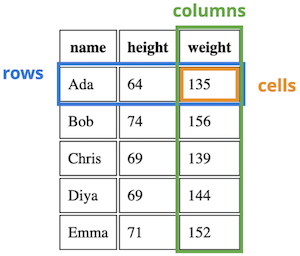
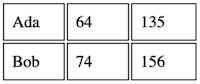

# Semantic HTML

As explained in previous chapters, the purpose of HTML markup is to **semantically** annote text. When we say that HTML is "semantic", we mean that it is used to describe the meaning, structure, or purpose of text&mdash;_not_ to describe that content's visual appearance. Using HTML only for semantics helps follow the _separation of concerns_ principle (making your code more flexible and easier to modify and maintain). It also helps to make web pages more **accessible**, as they can be better understood and navigated by assistive technology such as screenreaders.

Un-semantic HTML is HTML that doesn't actually describe the meaning of some content, but may have a visual appearance that suggests that meaning through the use of CSS. For example, an `<h1>` element is used to indicate a top-level heading, such as the title of the page. But by default, browsers will give `<h1>` elements a different visual appearance than unmarked content (usually by making it larger and bold). It is possible to achieve a similar visual effect just using CSS:

<div class="row">
<div class="column col2">
```html
<!-- HTML -->
<h1>This is a real heading!</h1>
<p class="fake-header">
  This just LOOKS like a heading.
</p>
```
</div>
<div class="column col2">
```css
/* CSS */
.fake-header {
  font-size: 2em;
  font-weight: bold;
}
```
</div>
</div>


In this example, the second line _looks_ like a heading (it's big and bold)&mdash;but the HTML says that it isn't a heading, it's just a paragraph. This can cause problems and confusion, especially for screenreaders and other systems that aren't concerned with the visual appearance. A blind user visiting this page wouldn't know that the second paragraph is supposed to act as a heading, because that isn't indicated in the HTML (just by the rendered visual appearance).

For this reason, it's vitally important that HTML markup is only used to provide accurate semantic annotation. Don't use an un-semantic element type (such as a heading) because of its default appearance, and do use elements that provide additional information about the purpose of content when possible so that screenreaders and other assistive technology will know about that.

<p class="alert alert-infO">Many of the rules in the [code style guide](#code-style-guide) are about making sure that HTML is used semantically.</p>

This cahpter discusses a number of specific HTML elements, providing details on including them in your documents and how to use them semantically to make sure your page best supports assistive technologies. It also discusses the **ARIA** standard for adding additional semantic meanings to elements to further support accessibility.

## Specific HTML Elements
There are over 100 different HTML elements, each of which provides its own semantic meaning. This chapter is not intended to be a complete reference (use [the MDN element reference](https://developer.mozilla.org/en-US/docs/Web/HTML/Element) for that!), but rather to provide specific points and requirements to use them effectively and semantically.

### Hyperlinks {-}
Hyperlinks are fundamental to HTML (it's right in the name!), so the **anchor element `<a>`** may be the most important. The `<a>` element denotes a hyperlink: text that when _activated_ (e.g., clicked or selected) will cause the browser to _navigate_ to a different URL than the current one. Clicking on a hyperlink is called _following_ the link.

As discussed in [HTML Fundamentals](#html-fundamentals), the `<a>` element most always has an `href` attribute that indicates where the text of the element goes to:

```html
<!-- a external hyperlink to `https://ischool.uw.edu` -->
<a href="https://ischool.uw.edu">iSchool homepage</a>
```

The value of the `href` attribute can be any valid URL (including ones that use protocols other than `https`). Most a hyperlink will have one of two types of URLs:

1. **external hyperlinks** are hyperlinks that navigate to a _different domain_. For example, a link to Google or the iSchool homepage (such as the above example) from this book would be an external hyperlink, because the book's pages aren't on the same domain. External hyperlinks are usually written as full URLs, including the protocol, since they include the other domain they link.

2. **internal hyperlinks** are hyperlinks that navigate to other web pages in the _same domain_. For example, links to other chapters in this book are internal hyperlinks. The URLs for these hyperlinks are just specified as just the _path_ portion of the other URLs; the domain and protocol are assumed to be the same and so ommitted as redundant. For example:

    ```html
    <!-- An internal hyperlink to a different `.html` file in the same domain -->
    <a href="/client-side-development.html">Chapter 2: Client-Side Development</a>
    ```

    Internal hyperlinks may use _absolute paths_ as in the above example. The URL path is then determined from the "root folder" of the server. Such URLs will still resolve even if the link is in a page that is nested inside of one or more folders on the server. It is also possible for internal hyperlinks to use _relative paths_, in which case the target of the hyperlink is relative to the URL of the _current page_ (which is usually rendering the file that includes the link):

    ```html
    <!-- An internal hyperlink to a file in a different folder on the same domain.
         Note that the relative URL cam include moving up a folder. -->
    <a href="../assignments/exercise-01.html">Exercise 01</a>
    ```

    And as noted in [HTML Fundamentals](#attributes), a hyperlink's URL can also include the _fragment_ (the part after the `#`) to create a **bookmark link** to an element with a particular `id` attribute on a page:

    ```html
    <a href="index.html#nav">Link to element on `index.html` with `id="nav"`</a>
    <a href="#title">Link to element on current page with `id="title"`</a>
    ```

In order to make a hyperlink open in a new tab or window (browser-dependent), provide a **`target="_blank"`** attribute. The `"_blank"` value is a special keyword that tells the browser to open the link in a new context.

Finally, it is important to note that activating a hyperlink (such as by clicking on it) _sends a new HTTP request_ to the server, who then responds with the new page for the browser to render. This means that even if you have a hyperlink to the same page (with the exception of bookmark links), it will still cause the page to "reload":

```html
<!-- in index.html -->

<a href="index.html">A link to this same URL will cause the page to reload</a>
```

Reloading a page means that all of the assets (images, etc) may be re-downloaded, and any state information in JavaScript will be lost. Be careful about when you trigger page reloads.

<p class="alert alert-info">HTTP is a [**stateless**](https://developer.mozilla.org/en-US/docs/Web/HTTP/Overview#http_is_stateless_but_not_sessionless) protocol. That means that every single HTTP request&mdash;every page load&mdash;is considered to be independent and have no inherent relationship. Visiting or loading a page once will have no impact on future page loads; ever visit is a "first and last time". Servers and browsers can and often do include extra logic to help track _sessions_ to make it seem like page loads are related (e.g., so that items in an online shopping cart stay around), but this is extra work separate from the page encoding itself. In client-side development its best to act as if each page load were a unique one-time occurrence, unless informed otherwise by the server.</p>

Hyperlinks are for _navigation_&mdash;activating a hyperlink directs the user to a different URL. The `<a>` element is _not_ used for clickable elements on a page that do not perform navigation (such as submitting a form or expanding a dropdown). Clickable non-navigation should be annotated as **`<button>`** elements. Similarly, do not use a `<button>` for navigation&mdash;that should instead be a hyperlink `<a>`! If you want a hyperlink to look like a button, you can use CSS to style it in that way&mdash;[Bootstrap](#utility-classes) provides support for doing this easily for example.


#### Accessible Hyperlinks {-}
Assistive technologies such as screenreaders are able to quickly jump between hyperlinks on a page&mdash;this helps users understand what navigation elements are available and to quickly get around without needing to listen to extra content. For this reason, in order to make a hyperlink accessible, _the text content of a link should indicate where it goes_ even when taken out of context:

```html
<!-- Do this -->
<a href="/assignments">see assignments here</a>

<!-- Don't do this -->
see assignments <a href="/assignments">here</a>
```

In the second example, the link only consists of the word "here", meaning that when a screenreader lists all of the navigational elements, it will just list the word "here" without any context for the user to understand what is there! This will also help sighted users, who are more easily able to see and understand the links in context.

Similarly, you'll want to make sure that "similar" link text that refers to different locations are made unique:

```html
<!-- Don't do this; screenreaders can't distinguish between the links -->
For the first <a href="exercise-01.html">exercise</a> you'll practice HTML, for
the second <a href="exercise-02.html">exercise</a> you'll practice CSS.
```

Using ARIA attributes such as `aria-label` (see below) can also help ensure that hyperlink text is accessible by providing screen-reading specific context if you struggle to make the prose itself self-contained.


### Inline Textual Elements {-}
//historically individual words of a sentence can be typo-graphically formatted to be marked as distinct by making them either boldface or italicized. But these are _appearance_/formatting properties only&mdash;they don't provide any semantic information about the text. So while HTML does includes elements `<b>` for italics and `<i>` for italics, these are historical artifacts and _should not be used_. For example, the `<b>` causes the browser to render text as bold, but doesn't do anything to indicate _why_ that text is bold. A sighted user may be able to infer something about the boldness from context, but a screenreader will able to make no such guesses from such un-semenatic elements.

HTML instead includes a wide number of [inline textual elements](https://developer.mozilla.org/en-US/docs/Web/HTML/Element#inline_text_semantics) that you can use to semantically set apart text. By default these may cause the text to render in boldface or italics (and that can be further customized with CSS), while also providing additional semantic support for the text to make it more accessible to assistive technologies.

Some of the more useful or interesting inline semantic elements are described below, along with links to their documentation in MDN for further information:

- [`<em>`](https://developer.mozilla.org/en-US/docs/Web/HTML/Element/em) marks text as _emphasized_, which by default is italicized.
- [`<strong>`](https://developer.mozilla.org/en-US/docs/Web/HTML/Element/strong) marks text as **strongly** important, which by default is boldface. This is distinct from `<em>` emphasis, as it's not just stressed by particularly important.
- [`<code>`](https://developer.mozilla.org/en-US/docs/Web/HTML/Element/strong) marks text as computer code, which by default is in `monospace`. The `<pre>` element can be used to manage pre-formatted text to help with larger code blocks.
- [`<del>`](https://developer.mozilla.org/en-US/docs/Web/HTML/Element/del) marks text as deleted, which by default is <span style="text-decoration:line-through">strike-through</span>.
- [`<u>`](https://developer.mozilla.org/en-US/docs/Web/HTML/Element/del) marks text as having a non-textual annotation, such as an underline or "energy lines" or some other decoration. While by default such text renders with an underline, the meaning of this element is to annote that element has _having_ something like an underline (even if that underlining is provided by the tag!) Overall, it is best to avoid this element as mostly un-semantic (similar to how you avoid `<i>` and `<b>`), and just use the CSS `text-decoration` property to create underlines instead.
- [`<cite>`](https://developer.mozilla.org/en-US/docs/Web/HTML/Element/cite) marks text as being the title of a cited creative work&mdash;like the title of a book or movie. Note that this doesn't mark what you may think of as a "citation" in an essay&mdash;it isn't the inline `(Brown, 1999)` from MLA-style, or an item in a biblography&mdash;it just marks the title of a work. By default this renders text italicized.
- [`<abbr>`](https://developer.mozilla.org/en-US/docs/Web/HTML/Element/abbr) marks text as being an abbreviation or acronym. In particular, if you give the element a `title` attribute that is the expanded meaning of the acronym, the user will be able to hover over that element and see a pop-up of the meaning:

    ```html
    <abbr title="Hypertext Markup Language">HTML</abbr>
    ```

    This helps with providing definitions outside the flow of the text&mdash;though when presenting information its best to include those definition as part of the sentence!

- [`<time>`](https://developer.mozilla.org/en-US/docs/Web/HTML/Element/time) represents a time or date. Providing the `datetime` attribute will can encode the time in machine-readable format, which can help with search engine optimization or other systems:

    ```html
    <time datetime="2023-12-23">New Year's Eve</time>
    ```

Importantly, although many of these elements provide some default styling, you should only use them for _semantic purposes_. Don't use the `<em>` element just because you want text to be italic: instead you could use another semantic element (or a `<span>`, see below) and then use CSS to style that element: the `font-style` property can make content italic, the `font-weight` property can make it bold, the `text-decoration` property can add underlines, etc.

<p class="alert alert-warning">The `<i>` (italics) and `<b>` (bold) elements were originally part of HTML as purely styling  elements, without semantic meanings (and thus should not be used). Modern HTML does assign semantic meaning to these elements: `<i>` is used for content that is "set apart" (but for a reason covered by another element), and `<b>` is used for content that "deserves attention" (but for a reason not covered by another element). Because the meaning of these elements is vague, its often best to just not use them to avoid confusion. If you want to make some text italic, think about why: is it because it is being emphasized (so should be `<em>`) or because it is a term that needs to be defined or a work that is being cited? There is almost always a better, more informative element that you can use to annotate content.</p>

<!-- line breaks -- leave in the style guide? -->

### Images and Media {-}
All though webpages are primarily a textual medium, they often contain significant amounts of purely _visual_ information. This includes media such as images or video, but also visual labels such as icons (e.g., a "search" button labeled with a magnifying class or a [hamburger button](https://en.wikipedia.org/wiki/Hamburger_button)). These features can be created through multiple elements, though specific care is needed to ensure that they are accessible and can be _perceived_ by screnreaders.

The most common form of visual media in the web are images, created with the **``** element. As noted in [HTML Fundamentals](#html-fundamentals), the `src` attribute specifies the path to the location of the image file that will be displayed. Most commonly, this will be a _relative path_ to a file served from the same domain (e.g., `src="imgs/my_pic.jpg"`). But it also possible to use an absolute path to an image location on another domain (e.g., `src="http://pictures.com/cat_pic.jpg"`)&mdash;this is known as [hotlinking](https://simple.wikipedia.org/wiki/Hotlinking) an image. Hotlinking is often considered bad practice&mdash;not only does it for another domain to provide download bandwidth for content on your site, but it also means that the file being served may change without your knowledge, causing your site to accidentally include undesired content.

In order to make images accessible, always include an `alt` attribute that gives **alt**ernate text for when the image cannot be displayed (e.g., on screen readers, but also if the image fails to load):

```html

```

This element will be read by screen readers as "a cute puppy, image". Note that the "alt-text" should _not_ include introductory text such as _"a picture of"_, as screen readers will already report that something is an image! The WAI (Web Accessibility Initiative) provides further [guidance on writing effective alt text](https://www.w3.org/WAI/tutorials/images/tips/).

For more complex images (such as charts or infographics), you can additionally provide a _hyperlink_ to a longer description by using the `longdesc` attribute. This attribute takes a value that is a URI (relative or absolute; what you would put in the `href` attribute of a hyperlink) referring to where the description can be found. Screen readers will prompt the user with the option to then navigate to this long description.

```html
 <!-- link to other page with text description -->
```

Of course, providing descriptive text for images can be useful for _all_ users (so they know what they are looking at)!  You can semantically add a caption to an image by placing the image inside a [`<figure>`](https://developer.mozilla.org/en-US/docs/Web/HTML/Element/figure) element, and then using a `<figcaption>` element for the caption:

```html
<figure>
  
  <figcaption>
    A caption for the above figure. It provides the same information,
    but in a text format.
  </figcaption>
</figure>
```

The `<figure>` and `<figcaption>` element are good examples of semantic elements that are used together: a `<figcaption>` can only be used inside of a `<figure>` (and must be the first or last child of that element!). If you wish to adjust the appearance or placement of the caption, you would use CSS.

It is also possible to embed video or audio elements into a webpage by using the [**`<video>`**](https://developer.mozilla.org/en-US/docs/Web/HTML/Element/video) and [**`<audio>`**](https://developer.mozilla.org/en-US/docs/Web/HTML/Element/audio) elements respectively. These elements expect a "source", specified either with the `src` attribute or `<source>` child element (used to have multiple simultaneous sources):

```html
<!-- basic example of <video> element, adapted from MDN -->
<video controls width="400">
  <source src="media/videos/cat-video.mp4" type="video/mp4" />
  <!-- text to show if video isn't supported -->
  Video not supported. <a href="/media/videos/cat-video.mp4">download the video</a>
</video>
```

Both `<video>` and `<audio>` support a large number of additional attributes (such as `controls` in the above example) that are used to customize the presentation, controls, and playback. Full discussion of all these options is outside the scope of this text; see the documentation for more details and examples.

Note that video controls in particular [may not be fully accessible to screen readers](https://developer.mozilla.org/en-US/docs/Learn/Accessibility/Multimedia) depending on the browser. At the very least, you should [add captions and subtitles](https://developer.mozilla.org/en-US/docs/Web/Media/Audio_and_video_delivery/Adding_captions_and_subtitles_to_HTML5_video) to videos (by providing `<track>` child elements) in to make sure all users can access them.

Finally, the [**`<canvas>`**](https://developer.mozilla.org/en-US/docs/Web/API/Canvas_API) element is used for programmatically generating graphical images (2d or 3d) using JavaScript, It is the HTML basis for many graphical interactions or web games&mdash;though most of the actual work is done in JavaScript and other languages.


### Headings {-}
[**Heading**](https://developer.mozilla.org/en-US/docs/Web/HTML/Element/Heading_Elements) elements (`<h1>`, `<h2>`, through `<h6>`) are used to provide structure to a web page, allowing users and screenreaders to easily navigate and move through different parts of the content. `<h#>` elements are block-level elements that are by default larger and bolder than normal text (with smaller headings rendered as smaller). However, _do not_ use heading elements only to change the formatting of text&mdash;use CSS for that!

<p class="alert alert-warning">Be careful not to confuse a head**ing** (`<h1>`) element with the `<head>` element (used for meta-data), or wth the `<header>` sectioning element described below!</p>

Heading elements are used by browsers and screenreaders to automatically construct a "table of contents" for the page. Thus you should think of them similar to chapter or section titles&mdash;how you would label parts of an "outline" of the page. Each web page should only have a single `<h1>`, representing the "title" of the page. Different sections may be marked by `<h2>` section titles, while subsections would be marked by `<h3>` subsection titles and so on. A page may have many `<h2>` or `<h3>` elements, each marking a "level" in the outline. For example, the sections of this chapter are annotated with `<h#>` headings:

```html
<h1>Semantic HTML</h1>
<h2>Specific HTML Elements</h2>
<h3>Hyperlinks</h3>
<h3>Inline Textual Elements</h3>
<h3>Images and Media</h3>
...
<h2>ARIA for Accessibility</h2>
```

It's possible that a page won't have any sections or subsections, and thus may not have any `<h2>` or smaller elements.

Because screenreaders and other systems will use headings to automatically generate a "table of contents" (which helps screenreaders to quickly navigate the page), it's important that headings are both meaningful and hierarchical. They should be _meaningful_ in that they describe what content is in the section they start, similar to a book section title. They should be _hierarchical_ in that they don't skip levels: every `<h3>` has an `<h2>` above it&mdash;you can't have a sub-section that isn't in a section!

See also [Sectioning Elements](#sectioning-elements) below for more about structual organization of page content.


### Non-Semantic Elements {-}
While the purpose of HTML is to provide semantic information about content, there are some elements that have no specific meaning or appearance of their own. The [**`<div>`**](https://developer.mozilla.org/en-US/docs/Web/HTML/Element/div) (division) element is use to "group" other content together, providing a shared parent or container for that content. It is a block element that has no additional semantic or apperance impact on its own; it is just used to organize content within the tree of HTML elements.

```html
<!-- these three paragraphs will all have the same
     "parent" which can be styled on its own -->
<div>
  <p>Lorem ipsum dolor</p>
  <p>sit amet consectetur</p>
  <p>Adipisicing elit</p>
</div>

<!-- these paragraphs are in a different "group" -->
<div>
  <p>Lorem ipsum dolor</p>
  <p>sit amet consectetur</p>
</div>
```

This is particularly for organizing content and for applying styling with CSS:

```html
<!-- A collection of "cards" on a page -->
<div class="card-group">
  <div class="card">
    <div class="card-header">Featured</div>
    <div class="card-body">
      <h2>Card 1</h2>
      <p>An information card</p>
    </div>
  </div>

  <div class="card">
    <div class="card-body">
      <h2>Card 2</h2>
      <p>Another information card</p>
    </div>
  </div>
</div>
```

In the above example, `<div>` elements are given different CSS classes in order to style them differently: the elements with the `card` class may be styled to look like a ["card"](https://m2.material.io/components/cards) of content, while the elements with `card-header` may be styled to look like the headers of those cards. As in this example, it is very common to have multiple nested `<div>` elements (a `<div>` inside of a `<div>` inside of a `<div>`)&mdash;indeed, `<div>` is possibly the most common HTML element used in the web!

Remember that a `<div>` provides no semantic information; any styling changes that are applied through it will only be perceivable by sighted users! Thus it is always good to consider whether another block element&mdash;such as a paragraph, a heading, or a sectioning element&mdash;may be more appropriate (and they may not be).

Similarly, a **`<span>`** element is like a `<div>` (it has no semantic or appearance impact on its own), but is an _inline_ element so goes inside of text of text content to mark short passages:

```html
<p>Baa baa <span class="dark">black</span> sheep,
   have you any wool?</p>
```

A `<span>` can be used to apply styling to inline content, such as to make a certain work a different color. But because there is usually a reason for such styling changes, it is almost always better to use an appropriate semantic textual element instead. For example, if the word is important, use an `<em>` instead. You can think of `<span>` as the element to use when inline styling is needed but no other element is appropriate.


### Sectioning Elements {-}
The `<h#>` heading elements are part of the original HTML specification, and so will be supported by _all_ screen reader systems. However, HTML 5 introduced additional elements that can be used to help organize web page content in order to make its structure more explicit. These are often referred to as [**sectioning elements**](https://developer.mozilla.org/en-US/docs/Web/HTML/Element#content_sectioning) These are all _block-level_ elements that have no appearance impact on their own, but do provide semantic information about the organization of their content. You can think of these as specialized `<div>` elements&mdash;they group elements together, but also provide some meaning as to why they are grouped!

These are often referred to as [semantic elements](https://www.w3schools.com/html/html5_semantic_elements.asp) or "sectioning elements". These are all **block-level** elements that produce no visual effects on their own, but provide semantic structuring to web content. You can think of them as specialized `<div>` elements.

Common sectioning elements are described below.

<!-- #### `<section>` {-} -->

- A [**`<section>`**](https://developer.mozilla.org/en-US/docs/Web/HTML/Element/section) represents a specific section of content. In particular, a "section" is a portion of content that would be identified by a heading (e.g., an `<h2>` or an `<h3>`)&mdash;a section should almost always contain a heading element as a child. Thus this element can be used to semantically group all of the content of that section (that falls below that heading). If a group of content would not have a heading, it probably isn't a `<section>` (and would liekly just be represented by a `<div>`).

  ```html
  <section>
    <h2>HTML</h2>
    <p>...</p>
    <section>
      <h3>Introduction</h3>
      <p>....</p>
    </section>
    <section>
      <h3>Syntax</h3>
      <p>....</p>
    </section>
  </section>
  ```

  Note that as in the above example, `<section>` elements can contain other `<section>` elements ("subsections"), each with an appropriate heading.

  Remember that a `<section>` has no default appearance, though you can use CSS to customize the elements. They are used to provide organizational semantics that can be used by screenreaders and other systems.

  The `<section>` is the most generic of the sectioning elements; other sectioning elements cna be seen as "more specific" types of sections.

- A [**`<header>`**](https://developer.mozilla.org/en-US/docs/Web/HTML/Element/header) represents introductory content, such as heading elements, titles, or banner images. It may also include common page elements such as navigation or search bars.

  <div class="alert alert-warning">Be careful not to confuse a `<header>` with a head**ing** (`<h1>`) element or the `<head>` element. A _<code>&lt;head**er**&gt;</code>_ is a sectioning element for introductory content that is shown on the page and can contain multiple child elements. The `<head>` is an element that is NOT part of the `<body>` (so is not shown in the web page), and contains _metadata_ about that page.</div>

  A page almost always should contain a `<header>` element that has introductory content for that page, such as the `<h1>` and banner images. This usages implies the `role="banner"` landmark role (see [ARIA for Accessibility](#aria-for-accessibility) below). In addition, specific `<section>` elements may include a `<header>` to contain the introductory content for that section.

  ```html
  <body>
    <!-- this is is the header ("banner") for the entire page -->
    <header>
      <h1>Page Title</h1>
    </header>
    <section>
      <!-- this is the header for this section -->
      <header>
        <h2>About Section<h2>
      </header>
    </section>
  </body>
  ```

  While it's possible to provide a `<header>` for every section (and every `<section>` _should_ have a heading), in practice a `<section>` with limited introductory content&mdash;such as just a single heading element&mdash;won't have a separate `<header>` defined since it doesn't provide a lot of additional information about the page structure. It can be useful but is not required.

- A [**`<footer>`**](https://developer.mozilla.org/en-US/docs/Web/HTML/Element/footer) usually contains information about the author or source of the page's content, including copyright information. This element implies the `role="contentinfo"` landmark role (see [ARIA for Accessibility](#aria-for-accessibility) below).

  A `<footer>` still contains visible page content, so it goes inside of the `<body>`! Typically pages will have a single `<footer>` element&mdash;this is placed at the bottom of the page as the last element of the `<body>`, but not always (using this sectioning element can help with page navigation if the `<footer>` is elsewhere!) The `<footer>` contains page-visible information about the content, such as the author and copyright information. It does _not_ contain the "conclusion" section of a page (that would be a normal `<section>`)! Author information is often placed within an [`<address>`](https://developer.mozilla.org/en-US/docs/Web/HTML/Element/address) element, which represents contact information.

  ```html
  <footer>
    Created by <address><a href="mailto:joel@uw.edu">joel@uw.edu</a></address>.
    &copy; 2024
  </footer>
  ```

  Individual `<section>` elements can also have their own `<footer>`, but this isn't common since sections rarely have different author information than the rest of the page. It is more common for an `<article>` element to have its own `<footer>`.

- The [**`<main>`**](https://developer.mozilla.org/en-US/docs/Web/HTML/Element/main) element represents the "main" or central content of the document. A web page can only have a single `<main>` element. This element implies the `role="main"` landmark role (see [ARIA for Accessibility](#aria-for-accessibility) below).

  Most all pages will have a `<main>` element. It usually comes _after_ the `<header>` (but not inside&mdash;in fact, `<main>` _cannot_ be a descendant of `<header>`). The `<main>` element will then contain any `<section>` elements of the page, and be followed by the `<footer>`:

  ```html
  <body>
    <header>
      introductory content
    </header>

    <main>
      ...main content
      <section>
        ...section content
      </section>
      ... more content (including more sections)
    </main>

    <footer>
      author and copyright information
    </footer>
  </body>
  ```

  The above is a typical structure for an HTML document.


- A [**`<nav>`**](https://developer.mozilla.org/en-US/docs/Web/HTML/Element/nav) represents the part of a page that provides navigation links, such as a navigation bar or table of contents. Not all links need to be in a `<nav>`; this element represents a section of the webpage that are purely navigational (think of it as a specialized `<section>`). This element implies the `role="navigation"` landmark role (see [ARIA for Accessibility](#aria-for-accessibility) below). A `<nav>` element will often be found in the `<header>` (for the nav bar at the top of the page), though that is not required&mdash;a page may have multiple `<nav>` sections.

- An [**`<article>`**](https://developer.mozilla.org/en-US/docs/Web/HTML/Element/article) is similar to a `<section>`, but represents standalone content that could be published independently&mdash;such as a news article or a blog post. If a section would likely be published as its own document, then it may be an `<article>`. Note that a `<section>` may group together multiple `<article>` elements (such as a blog roll), and an `<article>` might contain more than one `<section>`. This mirrors how a newspaper is structured (e.g., with a "Sports Section" that contains articles, which may themselves have different sections).

Overall, using semantic sectioning elements can help make the content by clearly structured, as well as organize the content for screenreaders and make it more accessible for users to navigate the page. Most every page should have a `<header>`, `<main>`, and `<footer>`; pages with more content will be broken up into `<section>` elements; and sites with multiple pages will organization navigation through a `<nav>`.


<!-- ### Lists {-}
//does this need to be here, since I'm not trying to be comprehensive?

//types of lists
  //ul, ol, dl

//note that lists can only contain list items (which may contain other lists)
//lists can also be used for inline content with CSS, though this may be less common -->


### Tables {-}
The [**`<table>`**](https://developer.mozilla.org/en-US/docs/Web/HTML/Element/table) element represents tabular data, such as for a data table like you might find in a spreadsheet program. Tables are one of the more complex structures in HTML, requiring several different elements and attributes. This section provides a brief example of making simple and accessible tables; for more examples and guidance see [MDN's documentation for the `<table>` element](https://developer.mozilla.org/en-US/docs/Web/HTML/Element/table) as well as the [MDN's Learn HTML tables guide](https://developer.mozilla.org/en-US/docs/Learn/HTML/Tables).

In HTML, a table is made up of **rows**, each of which contains a number of **cells**. Corresponding cells across rows imply a **column**, though such columns are not explicitly noted in HTML.



Tables are encoded in HTML by using the `<table>` element. A `<table>` contains multiple **`<tr>`** (**t**able **r**ow) elements representing the rows of the data. Each `<tr>` row contains multiple **`<td>`** (**t**able **d**atum) elements representing the individual data cells.

<div class="row">
<div class="column col2">
```html
<table> <!-- whole table -->
  <tr> <!-- a row -->
    <td>Ada</td> <!-- a cell -->
    <td>64</td>
    <td>135</td>
  </tr>
  <tr>
    <td>Bob</td>
    <td>74</td>
    <td>156</td>
  </tr>
</table>
```
</div>
<div class="column col2">



</div>
</div>

A **`<th>`** (**t**able **h**eader) element represents a _cell_ that is in the "header" row or column, can is used in place of a `<td>` (it is also a cell, just a specialized kind of cell). For example, the first row a table might contain `<th>` element instead of `<td>` elements because those cells are the headings for their respective columns. By default, `<th>` elements will render their content in bold type. A `<th>` element expects a `scope` attribute indicating whether it is a header for a `"row"` or for a `"col"` (column). While the `scope` may be redundant for simple tables, it is best practice to include it to ensure that assistive technologies like screenreaders best support presenting and navigating the table.

```html
<table>
  <tr>
    <th scope="col">name</th> <!-- header cell -->
    <th scope="col">height</th>
    <th scope="col">weight</th>
  </tr>
  <tr>
    <td>Ada</td>
    <td>64</td>
    <td>135</td>
  </tr>
</table>
```

Tables can also be made more accessible by including _table sectioning_ elements (similar in concept to the sectioning elements `<header>`, `<main>`, and `<footer>`). The **`<thead>`** element groups rows that are the head of the table with information about the columns (usually filled with `<th>` cells); the **`<tbody>`** element groups rows that include the main body of the table, and the **`<tfoot>`** element groups rows that are at the bottom of the table with information about the columns (e.g., summary data). These elements have no appearance impact, but do help with organizing and presenting and organizing the table. They are also the closest you can get to using a `<div>` to style different sections of the table!

```html
<table>
  <thead> <!-- the "header" section -->
    <tr>
      <th>name</th>
      <th>height</th>
      <th>weight</th>
    </tr>
  </thead>
  <tbody> <!-- the "main" section -->
    <tr>
      <td>Ada</td>
      <td>64</td>
      <td>135</td>
    </tr>
  </tbody>
</table>
```

Cell elenents (`<td>` or `<tr>`) can be made to stretch across multiple rows or columns by specifying the `colspan` and `rowspan` attributes. If one cell stretches across multiple columns or rows, then you omit the `<td>` cells that it is replacing. Note that spanning rows or columns is not common in tabular data (since a datum won't span multiple features or multiple observations), and can make it difficult for people using screenreaders to understand the structure of the data. Better practice is to organize the data so that it doesn't need to do such spanning.

<!-- could add example here... -->

As with any other elements, tables are primarily styled using CSS; HTML attribute should only be used for the _structure_ of the table. Note that CSS rules will usually apply to the _cells_ (`<td>`, `<th>`) in a table, and not to the rows or sections&mdash;many properties are unintutively _not_ inherited from rows, and so need to be applied directly to the cells. There are also some specific CSS properties that apply only to table elements, such as `border-collapse` and `border-spacing` (which are used to style the spacing between cells).

<p class="alert alert-warning">Never use a `<table>` element to structure documents and position content. The `<table>` element should **only** be used for content that is semantically a table (e.g., a data table). If you want to lay out content on your page in columns or a grid, use CSS properties such as a [flexbox](#flexbox) or grid. Remember that HTML is for semantic annotation, not for appearance!</p>

### Forms {-}
In web pages, a **form** is a part of a web page which enables a user to _interact_ with the page by providing information. Users are able to enter _input_ data (in the form of written text, boxes selected, etc) which is then _submitted_ to the web server. Forms are a common part of web pages that you've likely used every day&mdash;and it's possible some of your interactions have been through forms without realizing it! Similar to tables, forms are complex sturctures in HTML; this section describes how to create basic forms and how to make them _accessible_. For more examples and guidance see [MDN's guide to web forms](https://developer.mozilla.org/en-US/docs/Learn/Forms).

Web forms are defined by using the [**`<form>`**](https://developer.mozilla.org/en-US/docs/Web/HTML/Element/form) element. This block element annotes a part of the page that will accept data inputted by the user (though `<input>` elements, described below), and specifies what should be done with that data when the form is submitted.

When a form is submitted (such as by the user clicking a `submit`-type `<button>`), the browser collects the data the user has entered and sends that data to a server through an HTTP request&mdash;similar to the request sent when a user clicks on a hyperlink (this means that submitting a form loads a new page!) Where and how that data is sent depends on two attributes on the `<form>` element: the `action` and the `method`.

```html
<!-- a very simple form -->
<form action="result.html" method="GET">
  <!-- labeling text for the input -->
  <label for="greetInput">Provide a greeting:</label>

  <!-- Where the user provides input data -->
  <input type="text" id="greetInput" name="greeting">

  <!-- Submit button -->
  <button type="submit">Submit</button>
</form>
```

The `action` attribute specifies the URL where the user data will be sent to when the form is submitted. Most commonly this will be a URL on the same domain as the current page, and so only a relative path is provided. So in the above example, the submitted form data will be sent to the server to the `result.html` URL; the server will handle that submitted data and then return a response for that URL (in effect loading that page). Note that servers may do all kinds of things with the submitted data including _redirecting_ the users, so that the page that loads for the user won't necessarily be the same one as specified in the `action.`

The `method` attribute indicates which [HTTP Method](https://developer.mozilla.org/en-US/docs/Web/HTTP/Methods) the resulting HTTP request will use. Valid options are `"GET"` (for `GET` requests&mdash;used when the request is only retrieving data from the server) or `"POST"` (for `POST` requests&mdash;used when the request is adding or updating the data stored by the server). Forms that send `GET` requests will transmit the user-entered data as **query parameters** (one for each `<input>`) appended to the `action` URL&mdash;for example, submitting the above form with the user-entered message `"Hello"` would send an HTTP request to `result.html?greeting=Hello`. Forms that send `POST` requests will include the user data in the HTTP request's body (where it can be accessed by the server).

<p class="alert alert-info">React apps and similar systems often handle form data on the client-side; thus the `action` and `method` attributes are _omitted_ since they aren't actually used. You can prevent a form from sending a new HTTP request using the `event.preventDefault()` method in JavaScript; see [DOM Manipulation](#dom) for more details.</p>


#### `<input>` elements {-}
Users provide data for forms to send through [**`<input>`**](https://developer.mozilla.org/en-US/docs/Web/HTML/Element/input) elements. An `<input>` provides an interactive control, such as a text area or a box to check. `<input>` elements are inline, _empty_ elements&mdash;similar to an ``, they have no text content of their own.

```html
<!-- example input elements -->
<label for="usernameInput">Username:</label>
<input type="text" id="usernameInput" name="username">

<label for="passwordInput">Password:</label>
<input type="password" id="passwordInput" name="password">
```

There are many different kinds of `<input>` elements, specified with the `type` attribute, including:

- `text`: a single-line text field for users to type into. This is the default `type` for an `<input>`.
- `password`: like a `text` input, but whatever the user types is obscured (e.g., shown as dots or stars) so that others can't see it.
- `checkbox`: A box that the user can check or uncheck. Note that there is no text associated with the input; you need to use a `<label>` to tell the user what they're checking!
- `radio`: A button that the user can select out of a set of (the "circle" checkbox). It is called a "radio button" because like with a radio you can only select a single channel. Radio buttons are noted as a group by giving them all the same `name` attribute.
- `number`: A field in which the user can enter a numeric value
- `date`: An input where the user can select a calendar date. Most browsers will provide a calendar drop-down interface, while also allowing users to type in the date. A `time` input works similarly, but for selecting the time of day, and a `datetime-local` input will let users select both at once.
- `file`: An input where the user can choose a file from their operating system. By default this looks like a button, which when clicked will provide an operating-system dependent interface for choosing the file.
- `hidden`: An input that is not shown to the user, though its data values will still be submitted along with the form. `hidden` inputs are used to data values that are not directly specified or modified by the user, but may be dynamically generated by the web page or system (e.g., through JavaScript).

Each `<input>` element may support additional attributes depending on its type. For example, a `number` input supports `min` and `max` attributes that can limit which numbers are allowed. Such attributes can also be used for built-in client-side [form validation](https://developer.mozilla.org/en-US/docs/Learn/Forms/Form_validation), informing users if the values they've enetred are invalid.

While `<input>` is the most common element for collecting user input in a `<form>`, there are others as well. A [**`<textarea>`**](https://developer.mozilla.org/en-US/docs/Web/HTML/Element/textarea) provide a larger text box where users can write and format multiple lines of text. A [**`<select>`**](https://developer.mozilla.org/en-US/docs/Web/HTML/Element/select) element provides a drop-down menu; each item in the menu is specified through a child `<option>` element:

```html
<!-- A simple select dropdown -->
<select name="animal">
  <option value="">Choose an Animal</option>
  <option value="lion">Lion</option>
  <option value="tiger">Tiger</option>
  <option value="bear">Bear</option>
</select>
```

See the documentation for more options when using these elements. Collectively, `<input>`, `<select>`, and similar are referred to as _form control elements_.


As in the above examples, all form controls and inputs support and expect a `name` attribute. This attributes provide an identifier for the input in order to distinguish it from others in the form (the form itself doesn't know what descriptive text is around or labeling the inputs). Note that the `name` is distinct from the `id` attribute&mdash;a `name` is used to identify the _user-entered value_ within the form's data, while the `id` is used to identify the `<input>` element itself (regardless of what data has been entered). Because `id` attributes are used with `<label>` elements for accessibility, most `<input>` elements will have both attributes&mdash;they may even use the same identifier making it look redundant, but the attributes do serve different purposes.

All inputs also support a `value` attribute. This attribute stores whatever value the user has inputted or selected. You can use it to provide a "default" value for an input that the user can replace.

```html
<!-- example inputs with different names and default values -->
<label for="firstnameInput">First Name:</label>
<input type="text" id="firstnameInput" name="firstname" value="Joel">

<label for="passwordInput">Last Name:</label>
<input type="text" id="lastnameInput" name="lastname" value="Ross">
```

Text-like inputs also support a `placeholder` attribute, which provides initial text that will be shown to the user but is _not_ a default value (the value is blank `""`).

Checkboxes, radio buttons, and select dropdowns also use the `value` attribute to distinguish between options the user has selected:

```html
<!-- a set of radio buttons -->
<label for="smallRadio">Small</label>
<input type="radio" id="smallRadio" name="size" value="small">
<label for="mediumRadio">Medium</label>
<input type="radio" id="mediumRadio" name="size" value="medium">
<label for="largeRadio">Large</label>
<input type="radio" id="largeRadio" name="size" value="large">
```

When the form is submitted, the data the user has entered is encoded with the `name` attribute of each input as the identifier or "key", and the `value` attribute as the value. This can be seen in the query parameter's of a `GET` request's target URL. For example, without any changes by the user, the above `firstname` and `lastname` inputs in the above example would produce a query parameter list that looks like: `?firstname=Joel;lastname=Ross`&mdash;the keys (before the `=`) are the `name` attributes, and the values (after the `=`) are the `value` attributes. As such the `name` attributes are often named and structured to produce an data identifiers that are easy for a server to consume.

In addition to `<input>` and related elements, a `<form>` will often contain [**`<button>`**](https://developer.mozilla.org/en-US/docs/Web/HTML/Element/button) elements. In particular a `<button type="submit">` will submit its parent form when clicked. It is best practice to have an explicit submit button (including for things like search forms) and not just rely on the user hitting "enter"&mdash;this makes the form more accessible.


#### Labels and Accessibility {-}
As complex structures in HTML that are also key to user interaction, you need to take particular care to ensure that forms are _accessible_.

One of the most important steps to making a form accessible is to provide labels for all form controls and inputs. Labels are specified by using the [**`<label>`**](https://developer.mozilla.org/en-US/docs/Web/HTML/Element/label) element (which you can see used in previous examples). The text content inside a `<label>` element is the text that the user sees that describes the input (which are often instructions for what data the user enters). You explicitly associate a `<label>` with a particular input using the `<label>`'s' **`for`** attribute&mdash;this attribute takes a value that is the input element's `id` (the `id` is used to uniquely identify an element on the page):

```html
<!-- this label is a description for the element with the `nameInput` id -->
<label for="nameInput">Name:</label>
<input type="text" id="nameInput" name="name">
```

By default, when a user clicks on the `<label>` text, the associated form control element will gain **focus** (be selected, with the cursor moved there and ready to receive input). This makes it easier for users to select the relevant input, and is particularly helpful for smaller input elements such as checkboxes that may be harder for a user to target (because of [Fitts' Law](https://en.wikipedia.org/wiki/Fitts%27s_law)).


All form controls should be labeled to support screenreaders and other assistive technology. If you don't want any descriptive text for sighted users (due to other visual context clues), you can use CSS to visually hide the `<label>`, but it should always be included.

It is also possible to implicitly associate a `<label>` and an `<input>` by making the `<input>` a _child element_ of the `<label>`. This can be useful for dynamically generated content when you may not be able to specify an `id` for the `<input>` (e.g., a form where the user can dynamically add more textboxes). However, explicit association with the `for` attribute is better supported by assistive technology so should be used whenever possible.

```html
<!-- implicitly labeling an input, used only when `id` cannot be specified -->
<label>
  Name:
  <input type="text" name="name">
</label>
```

Keeping forms short and simple (with as few inputs as possible) is good for both accessibility and overall usability&mdash;generally users prefer small forms. For more complex forms, you can also group inputs by putting them together inside of a [**`<fieldset>`**](https://developer.mozilla.org/en-US/docs/Web/HTML/Element/fieldset) element. This is particularly helpful for radio buttons. The `<legend>` element is used to give a "title" to a `<fieldset>`.

```html
<fieldset>
<legend>Programming Language</legend>
  <div>
    <input type="radio" name="language" id="htmlInput" value="html">
    <label for="htmlInput">HTML</label>
  </div>
  <div>
    <input type="radio" name="language" id="cssInput" value="css">
    <label for="cssInput">CSS</label>
  </div>
</fieldset>
```

For more guidance on making accessible forms, see [WAI's Forms Tutorial](https://www.w3.org/WAI/tutorials/forms/).


## ARIA for Accessibility
As noted in [Client-Side-Development]{#web-accessibility}, making web pages accessible involves conforming to the W3c's [Web Content Accessibility Guidelines (WCAG)](https://www.w3.org/WAI/intro/wcag), which was developed by the [**Web Accessibility Initiative (WAI)**](https://www.w3.org/WAI/) (a part of the W3c). The WAI has also authored an additional web standard for supporting accessibility. This standard is called the [**A**ccessible **R**ich **I**nternet **A**pplications Suite](https://w3c.github.io/aria/), or **ARIA**. ARIA specifies an _extension_ to HTML, defining additional HTML attributes that can be included in elements in order to provide additional support for screen readers and other assistive technology. These attributes help screen readers navigate through a page (for people who can't just visually scroll), as well as providing a mechanism by which "rich" interactive web apps (such as those you will create with JavaScript) can communicate their behavior to screen readers.

This section describe some of the most common ARIA-defined attributes that you may use in assuring that web pages are accessible to all users. You will notice that many ARIA attributes are made redundant by semantic HTML usage&mdash;HTML as a standard has evolved to better support accessibility since the ARIA standard was created. That said, there are still places that HTML falls short, and so ARIA needs to step in.

### ARIA Labeling {-}
A fundamental step in making web pages accessible is to ensure they are **perceivable** to screen readers. This means that content cannot _just_ be presented visually. The most common example is including `alt` attributes for `` elements, which allows those visual elements to be perceived and understood by assistive technology.

But the `alt` attribute is only supported by the `` element, even though other element types may also be used for purely visual information (e.g., a `<div>` that is styled to contain a certain backgound image, or an `<svg>` containing graphics). ARIA allow you to provide "alternate text" for these other element by using the **`aria-label`** attribute, whcih specifies what text should be read _in place of the normal content_.

```html
<div class="green-rect" aria-label="a giant green rectangle"></div>
```

Note that `aria-label` is only needed for element that are purely visual (with no textual content); you don't need to put an `aria-label` on every `<div>` or on any `<p>`. If the element contains text content&mdash;even if that text is nested within multiple child elements&mdash;it probably doesn't need an `aria-label`.

For longer (multiple sentence) descriptions, you can alternatively include the **`aria-describedby`** attribute with a reference to the `id` of a different element _on the same page_ that contains the textual description. `aria-describedby` takes as a value a fragment reference (similar to a bookmark hyperlink) to the element containing the description.

  ```html
  <div class="green-rect" aria-describedby="#rectDetail"></div>
  <p id="rectDetail">The above rectangle is giant and green.</p>
  ```

The descriptive text can be anywhere else on the page; it's fine to have a visual element separated from its description by multiple other elements. As with bookmark links, notice that the `aria-describedby` value starts with the `#` fragment symbol, but the target element's `id` does not. Additionally, note that while `aria-label` attributes _replaces_ its elements content, the `aria-describedby` attribute will be read _after_ the element's content, as it provides more information (also compare this to the similar [`aria-labelledby`](https://developer.mozilla.org/en-US/docs/Web/Accessibility/ARIA/Attributes/aria-labelledby) attribute).

<p class="alert alert-warning">Overall, the best way to make purely visual information accessible is to _not have purely visual information_ in the first place! A pages content should always be supportive of non-visual users and browsers: include textual descriptions and captions for images, use text labels instead of icons for buttons, etc. This is the best way to support universal design.</p>

While `alt` attributes and `aria-label` will let you make visual elements perceivable, there are some images (or other elements) that are purely decorative: company logos, icons that accompany text descriptions on buttons, etc. You can make this content more accessible and cause a screen reader to "skip" reading these decorative elements by using another ARIA attribute **`aria-hidden="true"`**. An element with this attribute will still appear on the rendered page, it just will be ignored by screen readers. (This attribute is an exception to the general rule that boolean attributes don't take values).

```html
<!-- a search button with an icon -->
<!-- the icon img will not be read, but the button text will be -->
<button>
  
  Search
</button>
```

Note that elements that are hidden through CSS (e.g., using `display:none`) are already removed from what is read by a screen reader so do not need the additional ARIA attribute.

### ARIA Roles and Landmarks {-}
The ARIA specification defines a [**`role`**](https://www.w3.org/TR/wai-aria/roles) attribute that details the _semantic purpose_ of an elements for screen readers in case that purpose is only clear through visual styling.

For example, A page may have a `<div>` or an `<svg>` that has been styled to look and act like button; the ARIA attribute helps screen readers understand that this element can be pressed to cause an action:

```html
<div class="btn" role="button">Submit</div>
```

From the screenreader's perspective, this element acts like a `<button>`, even if it's actually a different element type for some reason.

There are a [large number of different ARIA roles](https://developer.mozilla.org/en-US/docs/Web/Accessibility/ARIA/Roles) of different roles, including roles for structure and for interactive widgets such as a popup `dialog`, a `switch`, or a `menu`. Some of these, such as `button` in the above example, are redundant with semantic elements that were added after the ARIA standard was created. It best to always use elements that best reflect their semantic purpose instead of falling back to ARIA roles. If an element is going to be clicked to cause an action, you should use a `<button>` instead of `role="button"`&mdash;then just style it to look how you want with CSS.

In addition the ARIA `role` attribute can be used to indicate [**landmark regions**](https://www.w3.org/WAI/ARIA/apg/practices/landmark-regions/). A landmark role indicates specific locations in the document, and allows a screen reader to easily "jump" to that section of content. This helps ensure that the page is **navigable**. Landmark roles include:

- [`banner`](https://w3c.github.io/aria/#banner): content that is related to the website as a whole, rather than to the specific page itself (named after the "banner" often found at the top of a page). The `<header>` sectioning element implies this role.
- [`main`](https://w3c.github.io/aria/#main): the "main" content. This is useful for allowing the screen reader to jump to the meat of the page, past e.g., the banner and navigation sections. The `<main>` sectioning element implies this role.
- [`contentinfo`](https://w3c.github.io/aria/#contentinfo): a section that contains information about the webpage, such as author contact info and copyright information. This is usually found at the bottom of the page. The `<dooter>` sectioning element implies this role.
- [`navigation`](https://w3c.github.io/aria/#navigation): a section of links for moving around the page, such as a navigation bar. This allows screen readers to jump to the "quick links" and move around the page as rapidly as possible. Note though that listening to all of the links read can be time consuming, so allowing the user to jump to the rest of the content is also important (using a technique called a ["skip link"](https://webaim.org/techniques/skipnav/)). The `<nav>` sectioning element implies this role.

As noted, these landmark roles are also implied by [sectioning elements](#sectioning-elements); you do not need to also include a `role` on these elements, and it is best practice to use the explicit elements themselves rather than the landmark roles!

<p class="alert alert-success">Considering your content in terms of these roles can be a good design trick for figuring out how to organize your page in a way that will be understandable and accessible to all users!</p>


### ARIA and Interactivity {-}
ARIA also provides accessibility support for _interactive_ web pages, where the displayed content may change as the page is being used, by providing attributes that explicitly note the _state_ of the web application.

For example, consider a page with a [hamburger menu](https://en.wikipedia.org/wiki/Hamburger_button)) or similar dropdown or "slide-out" content. Assistive technologies need to inform the users about whether or not the hamburger menu is expanded or whether the sliding content is visible. This can be managed through [ARIA state attributes](https://w3c.github.io/aria/#states_and_properties) such as `aria-expanded`:

```html
<!-- an example hamburger menu with ARIA attributes -->
<button aria-expanded="false" aria-controls="menuContent" aria-label="Expand Menu">
  
</button>

<ul id="menuContent" class="collapsed">
  <li>Link 1</li>
  <li>Link 2</li>
  ...
</ul>
```

In the above example, the `<button>` element controls whether or not the `<ul>` is expanded or not&mdash;in the current HTML, the `<ul>` is collapsed (hidden) through a CSS class. By using JavaScript (see [DOM Manipulation](#dom)), clicking the button can cause the CSS styling of the `<ul>` to change so that it is no longer collapsed and is instead visible.

The ARIA attribute `aria-expanded` is placed on the the button to indicate to assistive technologies that this button is (a) an interactive control for part of the page, and (b) that it's current state is that it is _not_ collapsed. When the button is pressed, the JavaScript would also change the `aria-expanded` attribute to have a value of `"true"`, now indicating to screen readers that the menu is open. The `aria-controls` references the `id` of the element which the button is adjusting (telling screen readers what element has been modified and controlled).

Different interactive widgets and patterns may require other ARIA attributes to best support assistive technologies. When looking at examples of such widgets (e.g., those provided by [Bootstrap](https://getbootstrap.com/)), be sure to check for appropriate ARIA attributes and consult [ARIA documentation](https://developer.mozilla.org/en-US/docs/Web/Accessibility/ARIA) for best practices.

<!--
//`aria-live` for parts of the page that will fill with content later -->


<p class="alert alert-danger">The WAI strongly states that [_No ARIA is better than Bad ARIA_](https://www.w3.org/WAI/ARIA/apg/practices/read-me-first/). Misusing ARIA attributes can grossly misinform users of assistive technologies, making it harder for them to understand the page&mdash;instead of semantics being unclear, they may be wrong. Good semantic HTML usage will go far in making web pages accessible; ARIA can and should be used only to fill in explicit gaps where the semantic HTML falls short.</p>


## Resources {-}
Most details on specific HTML elements can be found in the resources noted in previous chapters (e.g., [MDN](https://developer.mozilla.org/en-US/docs/Web/HTML)). Some additional resources for writing _accessible_ HTML are listed below.

<div class="list-condensed">
- [Teach Access Tutorial](https://teachaccess.github.io/tutorial/) for creating accessible web pages. Provides lost of examples and details. Be sure and check out the [code checklist](https://teachaccess.github.io/tutorial/#/12) and the [design checklist](https://teachaccess.github.io/tutorial/#/19).
- [UW Accessibility Checklist](http://www.washington.edu/accessibility/checklist/) a thorough and detailed list of considerations for developing accessible systems put together by UW. See also their [complete list of tools and resources](http://www.washington.edu/accessibility/web/tools-and-resources/).
- [Using ARIA (w3c)](https://w3c.github.io/using-aria/) official guidance for using the ARIA specification
- [ARIA Resources (MDN)](https://developer.mozilla.org/en-US/docs/Web/Accessibility/ARIA)
- [WAVE Accessibility Evaluation Service](http://wave.webaim.org/)
</div>
