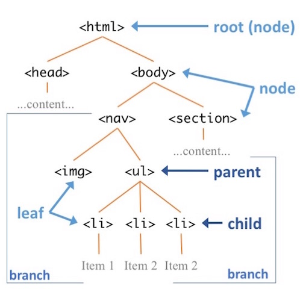

# HTML Fundamentals

A webpage on the internet is simply a set of files that the browser _renders_ (shows) in a particular way, allowing you to interact with it. The most basic way to control how a browser displays content (e.g., words, images, etc) is by _encoding_ that content in HTML.

**HTML** (**H**yper**T**ext **M**arkup **L**anguage) is a language that is used to give meaning to otherwise plain text, which the browser can then use to determine how to display that text. HTML is not a programming language but rather a _markup language_): it adds additional details to information (like notes in the margin of a book), but doesn't contain any logic. HTML is a "hypertext" markup language because it was [originally intended](https://en.wikipedia.org/wiki/HTML#Development) to mark up a document with [hyperlinks](https://en.wikipedia.org/wiki/Hyperlink), or links to other documents. In modern usage, HTML describes the **semantic meaning** of content: it marks what content is the a _heading_, what content is a _paragraph_, what content is a _definition_, what content is an _image_, what content is a _hyperlink_, and so forth.

- HTML serves a similar function to [Markdown](https://info201.github.io/markdown.html), but is much more expressive and powerful.

This chapter provides an overview and explanation of HTML's syntax (how to use it to annotate content). HTML's syntax is very simple, and generally only takes someone a few days to learn&mdash;though using it effectively can require more practice.

## HTML Elements
HTML content is normally written in `.html` files. By using the `.html` extension, your editor, computer, and browser should automatically know that this file will contain content marked up in HTML.

<p class="alert alert-info">As mentioned in Chapter 2, most web servers will by default serve a file named **`index.html`**, and so that filename is traditionally used for a website's home page.</p>

As with all programming languages, `.html` files are really just plain text files with a special extension, so can be created in any text editor. However, using a coding editor such as [VS Code](##visual-studio-code) provides [additional helpful features](https://code.visualstudio.com/docs/languages/html) that can speed up your development process.

HTML files contain the **content** of your web page: the text that you want to show on the page. This content is then annotated (marked up) by surrounding it with **tags**:


The **opening/start tag** comes before the content and tell the computer "I'm about to give you content with some meaning", while the **closing/end tag** comes after the content to tell the computer "I'm done giving content with that meaning." For example, the ```<h1>``` tag represents a [top-level heading](https://developer.mozilla.org/en-US/docs/Web/HTML/Element/Heading_Elements) (equivalent to one `#` in Markdown), and so the open tag says "here's the start of the heading" and the closing tag says "that's the end of the heading".

Tags are written with a less-than symbol **```<```**, then the name of the tag (often a single letter), then a greater-than symbol **```>```**. An _end tag_ is written just like a _start tag_, but includes a forward slash `/` immediately after the less-than symbol&mdash;this indicates that the tag is closing the annotation.

- HTML tag names are not case sensitive, but you should always write them in all lowercase.

- Line breaks and white space around tags (including indentation) is ignored. Tags may thus be written on their own line, or _inline_ with the content. These two uses of the `<p>` tag (which marks a _paragraph_ of content) are equivalent:

    ```html
    <p>
       The itsy bitsy spider went up the water spout.
    </p>

    <p>The itsy bitsy spider went up the water spout.</p>
    ```

Taken together, the tags and the content they _contain_ are called an **HTML Element**. A website is made of a bunch of these elements.

### Some Example Tags {-}
The HTML standard defines [lots of different elements](https://developer.mozilla.org/en-US/docs/Web/HTML/Element), each of which marks a different meaning for the content. Common elements include:

<div class="list-condensed">
- `<h1>`: a 1st-level heading
- `<h2>`: a 2nd-level heading (and so on, down to `<h6>`)
- `<p>`: a paragraph of text
- `<a>`: an "anchor", or a hyperlink
- ``: an image
- `<button>`: a button
- `<em>`: emphasized content. Note that this doesn't mean _italic_ (which is not semantic), but _emphasized_ (which is semantic). The same as `_text_` in Markdown.
- `<strong>`: important, strongly stated content. The same as `**text**` in Markdown
- `<ul>`: an unordered list (and `<ol>` is an ordered list)
- `<li>`: a list item (an item in a list)
- `<table>`: a data table
- `<form>`: a form for the user to fill out
- `<svg>`: a [Scalable Vector Graphic](https://en.wikipedia.org/wiki/Scalable_Vector_Graphics) (a "coded" image)
- `<circle>`: a circle (in an `<svg>` element)
- `<div>`: a division (section) of content. Also acts as an empty _block_ element (followed by a line break)
- `<span>`: a span (section) of content. Also acts as an empty _inline_ element (not followed by a line break)
</div>

### Comments {-}
As with every programming language, HTML includes a way to add comments to your code. It does this by using a tag with special syntax:

```html
<!-- this is a comment -->
<p>this is is not a comment</p>
```

Because that syntax is somewhat awkward to type, most source-code editors will let you comment-out the currently highlighted text by pressing `cmd + /` (or `ctrl + /` on Windows). If you're using a code editor, try placing your cursor on a line and using that keyboard command to comment and un-comment the line.

Comments can appear anywhere in the file. Just as in other languages, they are ignored by any program reading the file (with a few interesting exceptions), but they do remain in the page and are visible when you [view the page source](http://webdesign.about.com/od/chrome/a/view-source-chrome.htm).

### Attributes {-}
The start tag of an element may also contain one or more **attributes**. These are similar to attributes in object-oriented programming: they specify _properties_, options, or otherwise add additional meaning to an element. Like named parameters in R or HTTP query parameters, attributes are written in the format `attributeName=value` (no spaces are allowed around the `=`); values of attributes are almost always strings, and so are written in quotes. Multiple attributes are separated by spaces:

```html
<tag attributeA="value" attributeB="value">
   content
</tag>
```

For example, a hyperlink anchor (`<a>`) uses a `href` ("**h**ypertext **ref**erence") attribute to specify where the content should link to:

```html
<a href="https://ischool.uw.edu">iSchool homepage</a>
```

- In a hyperlink, the _content_ of the tag is the displayed text, and the _attribute_ specifies the link's URL. Contrast this to the same link in Markdown:

    ```markdown
    [iSchool homepage](https://ischool.uw.edu)
    ```

Similarly, an image (``) uses the `src` (**s**ou**rc**e) attribute to specify what picture it is showing. The `alt` attribute contains alternate text to use if the browser can't show images&mdash;such as with screen readers (for the visible impaired) and search engine indexers.

```html

```

- Note that because an `` has no textual content, it is an _empty element_ (see below).

There are also a number of [global attributes](http://www.w3schools.com/tags/ref_standardattributes.asp) that can be used on any element. For example:

- Every HTML element can include an **`id`** attribute, which is used to give them a unique identifier so that we can refer to them later (e.g., from CSS or JavaScript). `id` attributes are named like variable names, and must be **unique** on the page.

    ```html
    <h1 id="title">My Web Page</h1>
    ```

    The `id` attribute is most commonly used used to create ["bookmark hyperlinks"](https://www.w3.org/TR/html4/struct/links.html#h-12.2.3), which are hyperlinks to a particular location on a page (i.e., that cause the page to scroll down). You do this by including the `id` as the **fragment** of the URI to link to (e.g., after the `#` in the URI).

    ```html
    <a href="index.html#nav">Link to element on `index.html` with `id="nav"`</a>
    <a href="#footnote">Link to element on current page with `id="footnote"`</a>
    ```

    Note that the title attribute does NOT contain the `#` symbol, but the URI to link to does.

- The `lang` attribute is used to indicate the language in which the element's content is written. Programs reading this file might use that to properly index the content, correctly pronounce it via a screen reader, or even translate it into another language:

    ```html
    <p lang="sp">No me gusta</p>
    ```

    Specify the `lang` attribute for the `<html>` element (see below) to define the default language of the page; that way you don't need to mark the language of every element. **Always include this attribute**.

    ```html
    <html lang="en">
    ```

### Empty Elements {-}
A few HTML elements don't require a closing tag because they _can't_ contain any content. These tags are often used for inserting media into a web page, such as with the `` tag. With an `` tag, you can specify the path to the image file in the `src` attribute, but the image element itself can't contain additional text or other content. Since it can't contain any content, we leave off the end tag entirely:

```html

```

Older versions of HTML (and current related languages like [XML](https://en.wikipedia.org/wiki/XML)) required you to include forward slash `/` just before the greater-than symbol. This "end" slash indicated that the element was complete and expected no further content:

```html

```

This is no longer required in HTML5, so feel free to omit that forward slash (though some purists, or those working with XML, will still include it).


## Nesting Elements
Web pages are made up of multiple (hundreds! thousands!) of HTML elements. Moreover, HTML elements can be **nested**: that is, the content of an HTML element can contain _other_ HTML tags (and thus other HTML elements):


The semantic meaning indicated by an element applies to _all_ its content: thus all the text in the above example is a top-level heading, and the content "(with emphasis)" is emphasized in addition.

Because elements can contain elements which can _themselves_ contain elements, an HTML document ends up being structured as a <a href="https://en.wikipedia.org/wiki/Tree_(data_structure)">**"tree"**</a> of elements:



In an HTML document, the "root" element of the tree is always an **`<html>`** element. Inside this we put a `<body>` element to contain the document's "body" (that is, the shown content):

```html
<html lang="en">
  <body>
    <h1>Hello world!</h1>
    <p>This is <em>conteeeeent</em>!</p>
  <body>
</html>
```

This model of HTML as a tree of "nodes"&mdash;along with an API (programming interface) for manipulating them&mdash; is known as the [**Document Object Model (DOM)**](https://en.wikipedia.org/wiki/Document_Object_Model). See [Chapter: DOM]() for details.

<p class="alert alert-warning">**Caution!** HTML elements have to be "closed" correctly, or the semantic meaning may be incorrect! If you forget to close the `<h1>` tag, then _all_ of the following content will be considered part of the heading! Remember to close your inner tags _before_ you close the outer ones. [Validating](http://validator.w3.org/) your HTML can help with this.</p>

### Block vs. Inline Elements {-}
All HTML elements fall into one of two categories:

- **Block elements** form a visible "block" on a page&mdash;in particular, they will be on a new line from the previous content, and any content after it will also be on a new line. These tend to be structural elements for a page: headings (`<h1>`), paragraphs (`<p>`), lists (`<ul>`), etc.

    ```html
    <div>Block element</div>
    <div>Block element</div>
    ```

    

- **Inline elements** are contained "in the line" of content. These will _not_ have a line break after them. Inline elements are used to modify the content rather than set it apart, such as giving it emphasis (`<em>`) or declaring that it to be a hyperlink (`<a>`).

    ```html
    <span>Inline element</span>
    <span>Other inline element</span>
    ```

    

Inline elements go inside of block elements, and it's common to put block elements inside of the other block elements (e.g., an `<li>` inside of a `<ul>`, or a `<p>` inside of a `<div>`). However, it is invalid to to nest a block element inside of an inline element---the content won't make sense, and probably won't look right.

<p class="alert alert-warning">Some elements have further restrictions on nesting. For example, a `<ul>` (unordered list) is _only_ allowed to contain `<li>` elements&mdash;anything else is invalid markup.</p>


## Web Page Structure
Now that you understand how to specify HTML elements, you can begin making real web pages! However, there are a few more tags you need to know and include for a valid, modern web page.

### Doctype Declaration {-}
All HTML files start with a [document type declaration](https://en.wikipedia.org/wiki/Document_type_declaration), commonly referred to as the "Doctype." This tells the rendering program (e.g., the browser) what format and syntax your document is using. Since you're writing pages with HTML 5, you can declare it as follows:

```html
<!DOCTYPE html>
<html lang="en">
    ...
</html>
```

`<!DOCTYPE>` isn't technically an HTML tag (it's actually XML). While modern browsers will perform a "best guess" as to the Doctype, it is best practice to specify it explicitly. Always include the DOCTYPE at the start of your HTML files!

### The `<head>` Section {-}
In addition to the `<body>` element that defines the displayed content, you should also include a `<head>` element that acts as the document "header" (the `<head>` is nested inside the `<html>` at the same level as the `<body>`). The content of the `<head>` element is _not_ shown on the web page&mdash;instead it provides extra (meta) information _about_ the document being rendered.

There are a couple of common elements you should include in the `<head>`:

- A **`<title>`**, which specifies the "title" of the webpage:

    ```html
    <title>My Page Title</title>
    ```

    Browsers will show the page title in the tab at the top of the browser window, and use that as the default bookmark name if you bookmark the page. But the title is _also_ used by search indexers and screen readers for the blind, since it often provides a strong signal about what the page's subject. Thus your title should be informative and reflective of the content.

- A `<meta>` tag that specifies the character encoding of the page:

    ```html
    <meta charset="UTF-8">
    ```

    The `<meta>` tag itself represents "metadata" (information about the page's data), and uses an attribute and value to specify that information. The most important `<meta>` tag is for the character set, which tells the browser how to convert binary bits from the server into letters. Nearly all editors these days will save files in the `UTF-8` character set, which supports the mixing of different scripts (Latin, Cyrillic, Chinese, Arabic, etc) in the same file.

- You can also use the `<meta>` tag to include more information about the author, description, and keywords for your page:

    ```html
    <meta name="author" content="your name">
    <meta name="description" content="description of your page">
    <meta name="keywords" content="list,of,keywords,separate,by,commas">
    ```

    Note that the `name` attribute is used to specify the "variable name" for that piece of metadata, while the `content` attribute is used to specify the "value" of that metadata. `<meta>` elements are _empty elements_ and have no content of their own.

    Again, these are not visible in the browser window (because they are in the `<head>`!), but will be used by search engines to index your page.

    - _At the very least, always include author information for the pages you create!_

- We will discuss additional elements for the `<head>` section throughout the text, such as using `<link>` to include CSS and using `<script>` to include JavaScript.

## Web Page Template
Putting this all together produces the following "template" for making a web page:

```html
<!DOCTYPE html>
<html lang="en">
<head>
   <meta charset="UTF-8">
   <meta name="author" content="your name">
   <meta name="description" content="description of your page">
   <title>My Page Title</title>
</head>
<body>
   ...
   Content goes here!
   ...
</body>
</html>
```

You can use this to start off every web page you ever create from now on!


## Resources {-}

<div class="list-condensed">
- [Getting Starting with HTML](https://developer.mozilla.org/en-US/docs/Learn/HTML/Introduction_to_HTML)
- [General HTML 5 Reference](https://developer.mozilla.org/en-US/docs/Web/HTML/Element)
- [Alphabetical HTML Tag Reference](http://www.w3schools.com/tags/default.asp)
- [Dive into HTML5](http://diveintohtml5.info/) - Free book on HTML
- [W3C HTML Validation Service](https://validator.w3.org/nu/)
</div>

Also remember you can [view the HTML page source](https://www.thoughtco.com/view-html-source-in-chrome-3466725) of _any_ webpage you visit. Use that to explore how others have developed pages and to learn new tricks and techniques!
