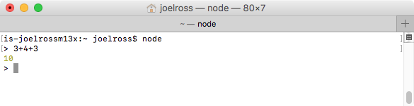
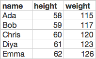

# JavaScript Fundamentals {#javascript}

HTML and CSS are _markup languages_, used to annotate websites to describe their meaning and appearance. But they are not "full" (i.e., [Turing Complete](https://en.wikipedia.org/wiki/Turing_completeness)) programming languages&mdash;they don't have variables, control structures, or other features required for the computer to execute an _algorithm_. So to make _interactive_ websites or complex web applications, you need a complete programming language. And the language used by browsers is **JavaScript**. This chapter introduces the fundamentals of the JavaScript language as used in web development, focusing on variables, data types, and basic control structures. Functions are introduced, but addressed in more detail in the next chapter.

<p class="alert alert-warning">Note, this course assumes you already are already familiar with introductory programming in a imperative language such as Java. It focuses on how JavaScript differs from languages such as Java, rather than foundational programming concepts. If you need review on those topics, you can check out a [basic programming tutorial](https://en.wikiversity.org/wiki/Introduction_to_Programming) or review your notes from a previous programming course.</p>

## Programming with JavaScript
JavaScript is a **high-level, general-purpose programming language**, allowing you to declare instructions for the computer in an almost-human readable way (similar to Java). JavaScript is an _imperative_ language, so you write algorithms as step-by-step instructions (lines of code) using JavaScript's syntax, and the computer will interpret these instructions in order to execute the algorithm. Browsers are able to download scripts written in JavaScript, executing them line-by-line and using those instructions to manipulate what content is displayed.

Indeed, JavaScript is an **interpreted language**, in that the computer (specifically a _JavaScript Interpreter_) translates the high-level language into machine language _on the fly at runtime_. The interpreter will read and execute one line of code at a time, executing that line before it even begins to consider the next. This is in contrast with _compiled languages_ like C or Java that have the computer do the translation in one pass (at compile-time), and then only execute the program after the whole thing is converted to machine language.

- This on-the-fly translation means that interpreted languages like JavaScript are usually slower than compiled languages, but not enough that we'll notice (web browsers include _highly_ optimized interpreters). The bigger drawback is that without the compile step, program errors appear at runtime rather than compile time, making them more difficult to catch and fix. As such, JavaScript developers make heavy use of various [linting](https://en.wikipedia.org/wiki/Lint_%28software%29) tools (which flag common problems that can lead to runtime errors), as well as [automated testing](https://facebook.github.io/jest/) systems to check against a variety of inputs.

    Many JavaScript editors do this kind of error checking&mdash;for example, VS Code provides syntax error checking out of the box, with more [detailed linting](https://code.visualstudio.com/docs/languages/javascript#_linters) available through extensions. See [this article](https://code.visualstudio.com/docs/languages/javascript) for more code features that support programming in JavaScript, including IntelliSense and type checking.

Although JavaScript was designed for and is most commonly used within web browsers (which contain their own JavaScript Interpreters), it can also be executed on the command line by using [Node.js](https://nodejs.org/en/), allowing JavaScript to be a fully general language. Both techniques are described in this chapter.


### History and Versions {-}
The JavaScript language was developed by [Brendan Eich](https://en.wikipedia.org/wiki/Brendan_Eich) (the co-founder of Mozilla) in 1995 while he was working for Netscape. The original prototype of the language was created in 10 days... a fact which may help explain some of the quirks in the language.

- Despite the names, _JavaScript_ and the _Java_ language have nothing to do with one another (and are in fact totally separate programming languages used in drastically different contexts). JavaScript was named after Java as a marketing ploy to cash in on the popularity of the latter. It is the programming equivalent of the [Transmorphers](https://www.rottentomatoes.com/m/transmorphers_2007/) movie.

- The JavaScript language is officially an implementation of [ECMAScript](https://en.wikipedia.org/wiki/ECMAScript) (named for the European Computer Manufacturers Association) specification. Hence versions of JavaScript are labeled with the prefix "ES". For example, this chapter describes `ES5` (JavaScript 5) syntax.

Like HTML and CSS, the JavaScript language continues to be developed and refined through new versions. Each new version of JavaScript includes additional syntax shorts, specialized keywords, and additional core functions, but otherwise are compatible with previous code. The main limitation on utilizing new JavaScript features is whether the _interpreters_ found in web browsers are able to support them.

This course primarily utilizes syntax and features for `ES5`, which was introduced in 2009 and today is supported by [all modern browsers](http://caniuse.com/#feat=es5) (i.e., IE 10 or later). Later chapters will describe features of `ES6` (also called `ES2015`), which was introduced in 2015 and works on [many browsers](http://kangax.github.io/compat-table/es6/) (e.g., Microsoft Edge but not IE 11). `ES7` was finalized in 2016 but is still not [reliably supported](http://kangax.github.io/compat-table/esnext/).

- Note that Microsoft no longer supports earlier versions of IE, but [a small percentage](https://www.netmarketshare.com/browser-market-share.aspx?qprid=2&qpcustomd=0) of desktops still run Windows XP with IE 8. If you must support these browsers, you can often use a "transpiler" like [Babel](https://babeljs.io/) to translate modern JavaScript source code into an earlier version.


## Running JavaScript
There are two primary ways of executing code written in JavaScript:

### In the Browser {-}
JavaScript scripts are most commonly executed in a web browser as part of the browser rendering a web page. Since browsers render HTML content (in `.html` files), JavaScript scripts are included in that HTML by using a `<script>` tag and specifying the _relative_ path to the a file containing the code (usually a **`.js`** file) to execute. When the browser renders the HTML (reading top to bottom) and gets to that tag, it will download and execute the specified script file using the JavaScript interpreter:

```html
<!-- execute the script.js file -->
<script src="path/to/my/script.js"></script>
```

- Notice that the `<script>` element is _not_ empty! It is possible to include JavaScript code directly inside the tag, but this is considered bad practice (keep concerns separated!) and should only be used for quick tests.

The `<script>` tag can be included anywhere in an HTML page. Most commonly it is either placed in the `<head>` in order for the script to be executed _before_ the page content loads, or at the very end of the `<body>` in order for the script to be executed _after_ the page content loads (and thus allows the JavaScript to immediately interact with the loaded HTML elements). We will (begin by) most commonly be putting `<script>` tags at the end of the `<body>`:

```html
<!DOCTYPE html>
<html>
<head>
  <!-- include here to run before the page appears -->
  <script src="js/script.js"></script>
</head>
<body>
   ... content ...

   <!-- include here to run "after" html appears -->
   <!-- we will usually do this -->
   <script src="js/script.js"></script>
</body>
<html>
```

- Most browsers also support adding a `defer` attribute to the `<script>` element that tells the browser to defer downloading and running the script until the page is fully loaded and rendered to the screen. With this attribute, you can put the `<script>` element in the `<head>` without any issues. However, this attribute is not supported in IE 9 or earlier; it is thus still best practice to put the `<script>` element at the end of the body.

While JavaScript most commonly is used to manipulate the web page content and is thus pretty obvious to the user, it _also_ can produce "terminal-like" output&mdash;including printed text and **error messages**. This output can be viewed through the **JavaScript Console** included as a _developer tool_ in the Chrome browser (other browsers include similar tools):


<p class="alert alert-warning">**Important:** You should ___always___ have the JavaScript Console open when developing JavaScript code, since this is where any error messages will appear!</p>


### On the Command-line with Node.js {-}
It is also possible to execute JavaScript code on the command line using [Node.js](https://nodejs.org/en/). Node is a **command line runtime environment**&mdash;that is, a JavaScript interpreter that can be run on the command line.

With Node installed on your machine, you can use the **`node`** terminal command to start an _interactive Node session_. This will allow you to type JavaScript code directly in the terminal, and your computer will interpret and execute each line of code:



You can enter one line of code at a time at the prompt (`>`). This is a nice way to experiment with the JavaScript language or to quickly run and test some code.

- You can exit this session by typing the `quit()` command, or hitting `ctrl-z` (followed by Enter on Windows).

- Note that the JavaScript console in the Chrome Developer tools provides the same interactive functionality.

It is also possible to run entire scripts (`.js` files) from the command line by using the `Node` command and specifying the script file you wish to execute:

```bash
node my-script.js
```

This allows you author entire programs in JavaScript (e.g., writing the code using VS Code), and then executing them from the command line. This process is more common when doing _server-side_ web development (such as implementing a web server using Node), but we will still use it for practice and testing.


## Writing Scripts
Unlike Java or C, JavaScript has no `main()` method that "starts" the program.

Instead, a JavaScript script (a `.js` file) contains a sequence of **statements** (instructions) that the interpreter executes _in order, one at a time, top to bottom_&mdash;just as if you had typed them into an interactive session one after another. Each line can declare a variable or function, which will then be available to the next statement to use or call. Thus with a JavaScript program, you should think of the _sequence_ of steps you want to be performed, and write lines of code in that order.

- In a way, you can think of the entire file as the "body" of a `main()` method... except that this body will contain further function declarations.

For example:

```js
/* script.js */
/* This is the ENTIRE contents of the file! */
console.log("Hello world!");  //this is executed first
console.log("I'm doing JavaScript!");  //this is executed second
```

The above example code demonstrates the [**`console.log()`**](https://developer.mozilla.org/en-US/docs/Web/API/Console/log) function, which is JavaScript's equivalent to Java's `System.out.println()`&mdash;the output will be shown in the JavaScript console (in the Developer Tools). Thus we talk about "logging out" values in JavaScript, instead of "printing" values in Java.

- The `console.log()` function is technically a `log()` method belonging being called on a _global_ `console` object. Globals and objects will be discussed in more detail below.

<div style="float:right;margin-left:1em;">

</div>

As in Java, each statement should end with a semicolon (**`;`**) marking the end of that statement. But unlike Java, JavaScript can be forgiving if you forget a semicolon. The JavaScript interpreter tries to be "helpful" and will often assume that statements end at the end of a line if the next line "looks like" a new statement. However, it occasionally screws up in horrible ways&mdash;and so best practice as a developer is to **always include the semicolons**.

### Strict Mode {-}
`ES5` includes the ability for JavaScript to be interpreted in [**strict mode**](https://developer.mozilla.org/en-US/docs/Web/JavaScript/Reference/Strict_mode). Strict mode is more "strict" about how the interpreter understands the syntax: it is less likely to assume that certain programmer mistakes were intentional (and so try to run the code anyway). For example, in _strict mode_ the interpreter will produce an _Error_ if you try and use a variable that has not yet been defined, while without strict mode the code will just use an `undefined` value. Thus working in strict mode can help catch a lot of silly mistakes.

You declare that a script or function should be executed in strict mode by putting an _interpreter declaration_ at the top:

```js
'use strict';
```

- This is not a String (or even JavaScript code!), but rather a _declaration_ to the interpreter about how that interpreter should behave.

<p class="alert alert-warning">**ALWAYS USE STRICT MODE!** It will help avoid typo-based bugs, as well as enable your code to run more efficiently.</p>


## Variables
Variables in JavaScript are **dynamically typed**. This means that variables are _not_ declared as a particular type (e.g., `int` or `String`), but instead take on the data type (`Number`, `String`, etc.) of the _value_ currently assigned to that variable. As we don't specify the data type, JavaScript variables are declared using the `let` keyword:

```js
let message = 'Hello World';  //a String
console.log(typeof message);  //=> `string`

let shoeSize = 7;  //a Number
console.log(typeof shoeSize);  //=> 'number'
```

- The `typeof` operator will return the data type of a variable. It is not widely used outside of debugging.

- As in Java, JavaScript variables should be given descriptive names using [camelCase](https://en.wikipedia.org/wiki/Camel_case).

<p class="alert alert-info">**Pro Tip:** Even though variables in JavaScript loosely typed, the data type of a value is still important! In order to help keep track of the type of each variable in JavaScript, include the type in the variable name. For example: `textString`, `wordsArray`, `totalNum`, `itemStr`, etc..</p>

Declared variables have a default value of `undefined`&mdash;a value representing that the variable has no value. This is somewhat similar to `null` in Java (though JavaScript _also_ as an `null` value that is not commonly used):

```js
//create a variable (not assigned)
let hoursSlept;
console.log(hoursSlept);  //=> undefined
```

Note that the `let` keyword is in fact new syntax introduced with `ES6`: older versions of JavaScript used the `var` keyword instead (and you will see `var` in most existing examples and tutorials). The difference is that variables declared with `let` are **"block scoped"**, meaning they are only available within the _block_ (the `{}`) in which they are defined. This is the same way variables are scoped in Java. Variables declared with `var`, on the other hand, are "functionally scoped" so are available anywhere within the _function_ in which they are defined. This means that you could declare a variable within an `if` block, and that variable would continue to be available outside that block! Thus `let` allows for cleaner, more efficient code, and with less bugs.

- `let` is the one `ES6` feature supported by IE 11, meaning it can be used with [most current browsers](http://caniuse.com/#search=let). However, if you do need to support an older browser (e.g., IE 10, Safari 9.3, Android 4.4), you should transpile your code or stick to using `var`

Along with `let`, JavaScript variables can also be declared using the `const` keyword to indicate that they are _constant_ (similar to what the `final` keyword does in Java). A `const` variable is block scoped, but can only be assigned once:

```js
const ISCHOOL_URL = 'https://ischool.uw.edu'; //declare constant
ISCHOOL_URL = 'https://example.com'; //TypeError: Assignment to constant variable.
```


### Basic Data Types {-}
JavaScript supports many of the same basic data types as Java and other languages:

- [**Numbers**](https://developer.mozilla.org/en-US/docs/Web/JavaScript/Reference/Global_Objects/Number) are used to represent numeric data (JavaScript does not distinguish between integers and floats). Numbers support the same _mathematical_ and operators as Java. Common mathematical functions can be accessed through in the built-in [`Math`](https://developer.mozilla.org/en-US/docs/Web/JavaScript/Reference/Global_Objects/Math) global (similar to Java's `Math` class).

    ```js
    let x = 5;
    typeof x;  //'number'
    let y = x/4;
    typeof y;  //'number'

    //numbers use floating point division
    console.log( x/4 );  //1.25

    //use the Math.floor() function to do integer division
    console.log( Math.floor(x/4) );  //1

    //other common Math functions available as well
    console.log( Math.sqrt(x) );  //2.23606797749979
    ```

- [**Strings**](https://developer.mozilla.org/en-US/docs/Web/JavaScript/Reference/Global_Objects/String) can be written in either single quotes (**`'`**) or double quotes (**`"`**), but most [style guidelines](https://google.github.io/styleguide/jsguide.html) recommend single quotes&mdash;just be consistent! Strings can be concatenated as in Java:

    ```js
    let name = 'Joel';
    let greeting = 'Hello, my name is '+name; //concatenation
    ```

    Strings also support many [methods](https://www.w3schools.com/jsref/jsref_obj_string.asp) for working with them. As with Java, JavaScript strings are _immutable_, so most string methods return a new, altered string.

    ```js
    let message = 'Hello World';
    let shouted = message.toUpperCase();
    console.log(shouted);  //=> 'HELLO WORLD'
    ```

- **Booleans** (`true` and `false`) in JavaScript work the same way as in Java, can be produced using the same _relational operators_ (e.g., `<`, `>=`, `!=`), and support the same _logical operators_ (e.g., `&&`, `||`, and `!`):

    ```js
    //conjunction (and)
    boolOne && boolTwo

    //disjunction (or)
    boolOne || boolTwo

    //negation (not)
    !boolOne //not
    ```

    See [Type Coercion](#type-coercion) and [Control Structures](#control-structures) below for more on working with Booleans in JavaScript.

### Arrays {-}
JavaScript also supports **arrays**, which are _ordered, one-dimensional sequences of values_. As in Java, JavaScript Arrays are written as literals inside square brackets **`[]`**. Individual elements can be accessed by (0-based) _index_ using **bracket notation**.

```js
//an array of names
let names = ['John', 'Paul', 'George', 'Ringo'];

//an array of numbers (can contain "duplicate" values)
let numbers = [1, 2, 2, 3, 5, 8];

//arrays can contain different types (including other arrays!)
let things = ['raindrops', 2.5, true, [3, 4, 3]];

//arrays can be empty (contain no elements)
let empty = [];

//access using bracket notation
console.log( names[1] );  // "Paul"
console.log( things[3][2] );  // 3

numbers[0] = '340';  //assign new value at index 0
console.log( numbers );  // [340, 2, 2, 3, 5, 8]
```

Note that it is possible to assign a value to _any_ index in the array, even if that index is "out of bounds". This will _grow_ the array (increase its length) to include that index&mdash;intermediate indices will be given values of `undefined`. The _length_ of the array (accessed via the `.length` attribute) will always be the index of the "last" element + 1, even if there are fewer defined values within the array.

```js
let letters = ['a', 'b', 'c'];
console.log(letters.length);  // 3
letters[5] = 'f';  //grows the array
console.log(letters);  // [ 'a', 'b', 'c', , , 'f' ]
                       //blank spaces are undefined
console.log(letters.length);  // 6
```

Arrays also support a variety of [methods](https://www.w3schools.com/jsref/jsref_obj_array.asp) that can be used to easily modify their elements, similar to the `ArrayList` class in Java:

```js
//Make a new array
let array = ['i','n','f','o'];

//add item to end of the array
array.push('340');
console.log(array); //=> ['i','n','f','o','340']

//combine elements into a string
let str = array.join('-');
console.log(str); //=> "i-n-f-o-340"

//get index of an element (first occurrence)
let oIndex = array.indexOf('o'); //=> 3

//remove 1 element starting at oIndex
array.splice(oIndex, 1);
console.log(array); //=> ['i','n','f','340']
```

### Objects {-}
The most generic and useful data type in JavaScript is the Object data type. An **Object** is a lot like an array in that it is in that it is a (one-dimensional) sequence of values that are all stored in a single variable. However, rather than using _integers_ as the index for each element, an Object uses _Strings_. Thus Objects are _unordered_ sequences of **key-value pairs**, where the keys (called **"properties"**) are arbitrary Strings and the values are any data type&mdash;each property can be used to _look up_ (reference) the value associated with it.

- This is a lot like a real-world dictionary or encyclopedia, in which the words (keys) are used to look up the definitions (values). A phone book works the same way (the names are the keys, the phone numbers are the values). A JavaScript Object provides a _mapping_ from properties to values.

- JavaScript Objects are similar data structures to Java _HashMaps_, Python _dictionaries_, R _lists_, or even an HTML `<dl>` descriptive list! More generally, these are known as _associative arrays_ (they are arrays that "associate" a key and a value). As with other associative arrays, JavaScript Objects are implemented as [hash tables](https://en.wikipedia.org/wiki/Hash_table), making data access very fast.

Objects are written as literals inside curly braces **`{}`**. Property-value pairs are written with a _colon_ (**`:`**) between the property name and the value, and each element (pair) in the Object is separated by a  _comma_ (**`,`**). Note that the property names do _not_ need to be written in quotes if they are a single word (the quotes are implied&mdash;properties are always Strings):

```js
//an object of ages (explicit Strings for keys)
//The `ages` object has a `sarah` property (with a value of 42)
let ages = {'sarah':42, 'amit':35, 'zhang':13};

//different properties can have the same values
//property names with non-letter characters must be in quotes
let meals = {breakfast:'coffee', lunch: 'coffee', 'afternoon tea': 'coffee'}

//values can be of different types (including arrays or other objects!)
let typeExamples = {number:12, string:'dog', array:[1,2,3]};

//objects can be empty (contains no properties)
let empty = {}
```

_Important note:_ Objects are an **unordered** collection of key-value pairs! Because you reference a value by its _property name_ and not by its position (as you do in an array), the exact ordering of those elements doesn't matter&mdash;the interpreter just goes immediately to the value associated with the property. This almost means that when you log out an Object, the order in which the properties are printed may not match the order in which you specified them in the literal.

- If you `console.log()` an object, you will usually see a nicely format version of that object. However, if you try to convert that object to a _string_ (e.g., via concatenation: `let output = "my object: "+myObject`), you will instead be presented with the "string version" of that object: `[object Object]`. This is not an array, but the String version of an object (similar to the hash you get when you try and print a Java array directly). You can instead use the fact that `console.log` accepts _multiple parameters_ to output an object with a leading string:

    ```js
    let myObject = {a:1, b:2}

    //convert object to string, won't log nicely
    console.log("My object: " + myObject); //=> My object: [object Object]

    //log the object directly
    console.log("My object ", myObject); //=> My object {a: 1, b: 2}
    ```

Despite the name, JavaScript Objects have nothing to do with Object-Oriented Programing. However, they can be used to represent "things" in the same way as a Java object, with each property acting like an "attribute" (instance variable):

```js
//an object representing a Person (spacing is for readability; white-space is ignored)
let person = {
  firstName: 'Alice',
  lastName: 'Smith',
  age: 40,
  pets: ['rover', 'fluffy', 'mittens'],  //value is an array
  favorites: {   //value is another object
    music: 'jazz',
    food: 'pizza',
    numbers: [12, 42]  //value is an array
  }
}
```


#### Accessing Objects {-}
Similar to arrays, Object values can be access via **bracket notation**, specifying the _property name_ as the index. If an object does not explicitly have a property value, accessing that key produces `undefined` (the property's value is `undefined`).

```js
let favorites = {music: 'jazz', food: 'pizza', numbers: [12, 42]};

//access variable
console.log( favorites['music'] ); //'jazz'

//assign variable
favorites['food'] = 'cake';  //property name is a string
console.log( favorites['food'] ); //'cake'

//access undefined key
console.log( favorites['language'] ); //undefined
favorites['language'] = 'javascript'; //assign new key and value

//access nested values
console.log( favorites['numbers'][0] ); //12

//use a variable as the "key"
let userInputtedTopic = 'food'; //pretend this value is supplied dynamically
console.log(favorites[userInputtedTopic]);  //'cake'
```

_Additionally_, Object values can also be accessed via **dot notation**, as if the properties were _public attributes_ of a class instance. This is often simpler to write and to read: remember to read the **`.`** as an `'s`!

```js
let favorites = {music: 'jazz', food: 'pizza', numbers: [12, 42]};

//access variable
console.log( favorites.music ); //'jazz'

//assign variable
favorites.food = 'cake';
console.log( favorites.food ); //'cake'

//access undefined key
console.log( favorites.language ); //undefined
favorites.language = 'javascript'; //assign new key and value

//access nested values
console.log( favorites.numbers[0] ); //12
```

- The only advantage to using _bracket notation_ is that you can specify property names as variables or the results of an expression. But overall, the recommendation is to use _dot notation_ unless the property you wish to access is dynamically determined.

It is possible to get an _array_ of an object's keys calling the `Object.keys()` method and passing in the object you wish to get the keys of. Note that an equivalent function for values is not supported by most browsers; a better approach is to iterate through the keys to identify all the values.

```js
let ages = {sarah:42, amit:35, zhang:13};
let keys = Object.keys(ages);  // [ 'sarah', 'amit', 'zhang' ]
```

#### Arrays of Objects {-}
As noted above, both arrays and objects can have values of any type&mdash;including other arrays or objects! The ability to nest objects inside of objects is incredibly powerful, and allows us to define arbitrarily complex information structurings (schemas). Indeed, most data in computer programs&mdash;as well as public information available on the web&mdash;is structured as a set of nested maps like this (though possibly with some level of abstraction).

One of the most common forms of nesting you'll see is to have an **array of objects** where each object has _the same properties_ (but different values). For example:

```js
//an arbitrary list of people's names, heights, and weights
let people = [
    {name: 'Ada', height: 58, 'weight': 115},
    {name: 'Bob', height: 59, 'weight': 117},
    {name: 'Chris', height: 60, 'weight': 120},
    {name: 'Diya', height: 61, 'weight': 123},
    {name: 'Emma', height: 62, 'weight': 126}
]
```

This structure can be seen as a list of **records** (the objects), each of which have a number of different **features** (the key-value pairs). This list of feature records is in fact a common way of understanding a **data table** like you would create as an Excel spreadsheet:



Each object (record) acts as a "row" in the table, and each property (feature) acts as a "column". As long as all of the objects share the same keys, this array of objects _is_ a table!


### Type Coercion {-}
As mentioned above, variables in JavaScript are _dynamically typed_, and thus have a data type of the value **currently** assigned to that variable. JavaScript variables are able to "change type" by having a different type of data assignment to them:

```js
let myVariable = 'hello'; //value is a String
myVariable = 42; //value is now a Number
```

Unlike some other dynamically typed variables, JavaScript will not throw errors if you try to apply operators (such as `+` or `<`) to different types. Instead, the interpreter will try to be "helpful" and **coerce** (convert) a value from one data type into another. While this process is similar to how Java will automatically cast data types into Strings (e.g., `"hello"+4`), JavaScript's type coercion can produce a few quirks:

```js
let x = '40' + 2;
console.log(x);  //=> '402'; the 2 is coerced to a String
let y = '40' - 4;
console.log(y);  //=> 36; can't subtract strings so '40' is coerced to a Number!
```

JavaScript will also attempt to coerce values when checking for equality with `==`:

```js
let num = 10
let str = '10'

console.log(num == str) //true, the values can be coerced into one another
```

In this case, the interpreter will coerce the Number `10` into the String `'10'` (since numbers can always be made into Strings), and since those Strings are the same, determines that the variables are equal.

In general this type of automatic coercion can lead to subtle bugs. Thus you should instead always use the **`===`** operator (and it's partner `!==`), which checks both value _and_ type for equality:

```js
let num = 10
let str = '10'

console.log(num === str) //false, the values have different types
```

JavaScript will do its best to coerce any value when compared. Often this means converting values to Strings, but it will also commonly convert values into _booleans_ to compare them. So for example:

```js
//compare an empty String to the number 0
console.log( '' == 0 ); //true; both can be coerced to a `false` value
```

This is because both the empty string `''` and `0` are considered [**"falsey"**](https://developer.mozilla.org/en-US/docs/Glossary/Falsy) values (values that can be coerced to `false`). Other falsy values include `undefined`, `null`, and `NaN` (not a number). All other values will be coerced to `true`.

<p class="alert">For more examples of the horror of JavaScript coercion, see [this video](https://www.destroyallsoftware.com/talks/wat) (about 1:20 in).</p>

## Control Structures
JavaScript control structures have a similar syntax to those in Java or C. For example, a JavaScript **`if` statement** is written as:

```js
if(condition){
  //statements
}
else if(alternativeCondition) {
  //statements
}
else {
  //statements
}
```

The **`condition`** can be any expression that evaluates to a Boolean value. But since any value can be _coerced_ into Booleans, you can put any value you want inside the `if` condition. This is actually really useful&mdash;since `undefined` is a falsy value, you can use this coercion to check if a variable has been assigned or not:

```js
//check if a `person` variable has a `name` property
if(person.name){
    console.log('Person does have a name!');
}
```

In the above example, the condition will only coerce to `true` if `person.name` is defined (_not_ `undefined`) and is not empty. If somehow the variable has not been assigned (e.g., the user didn't fill out the form completely), then the condition will not be true.

- While using `person.name !== undefined` is an equivalent expression, it is more idiomatic to utilize the coercion and have plain variable as the conditional expression.

Additionally, JavaScript provides a [ternary conditional operator](https://en.wikipedia.org/wiki/%3F:) that lets you write a simple `if` statement as a single expression:

```js
let x; //declare variable
if(condition) {
    x = 'foo';
} else {
    x = 'bar';
}

//can be condensed into:
let x = condition ? 'foo' : 'bar';
```

- This expression is read as "_if_ `condition` _then_ resolve to `'foo'` _else_ resolve to `bar`". Each part (the condition, the "if true" result, and the "if false" result) can be any expression, though you should keep them simple to avoid confusion.

JavaScript also supports **`while`** loop (for indefinite iteration) and **`for`** loops (for definite iteration) similar to Java. The only difference is that because JavaScript variables are dynamically typed, the _loop control variables_ are not declared with a type:

```js
//an example for loop. The `i` is not declared as an int
for(let i=0; i<array.length; i++){
  console.log(array[i]);
}
```

JavaScript _does_ have a `for ... in` syntax. However, it doesn't work as you would expect for arrays (it iterates over "enumerable properties" rather than the specific indices), and so should **not** be used with arrays. `ES6` also introduces a `for ... of` syntax for iterating over arrays, but this is not supported by all browsers and so is not recommended. Instead, the current best practice is to use the above `for` loop, or better yet the `forEach()` method described in the next chapter.

- If you need to iterate over the keys of an object, use the `Object.keys()` method to get an array to loop through!


## Functions
And of course, JavaScript includes **functions** (named sequences of statements used to _abstract_ code). JavaScript functions are written using the following syntax:

```js
//A function named `makeFullName` that takes two arguments
//and returns the "full name" made from them
function makeFullName(firstName, lastName) {
  //Function body: perform tasks in here
  let fullName = firsName + " " + lastName;

  // Return: what you want the function to output
  return fullName;
}

// Call the makeFullName function with the values "Alice" and "Kim"
// Assign the result to `myName`
let myName = makeFullName("Alice", "Kim")  // "Alice Kim"
```

- Functions are defined by using the **`function`** keyword (placed before the name of the function) instead of Java's `public static`, don't declare a return type (since the language is dynamically typed), and don't indicate types for the parameters. Otherwise, JavaScript functions have identical syntax to Java functions.

- If a function lacks a `return` value, then that function returns the value `undefined`.

As in other languages, function arguments in JavaScript are implicitly declared _local_ variables. However, in JavaScript **all arguments are optional**. Any argument that is _not_ passed a specific value will be `undefined`. Any passed in value that does not have a variable declared for its position will not be assigned to a variable.

```js
function sayHello(name) {
    return "Hello, "+name;
}

//expected: argument is assigned a value
sayHello("Joel");  //"Hello, Joel"

//argument not assigned a value (left undefined)
sayHello();  //"Hello, undefined"

//extra arguments (values) are not assigned to variables, so are ignored
sayHello("Joel", "y'all");  //"Hello, Joel"
```

- If a function has an argument, that doesn't mean it got a value. If a function lacks an argument, that doesn't mean it wasn't given a value!

In addition to this basic structure, JavaScript functions are frequently used for _functional programming_, as described in the next chapter.


## Resources {-}
As the language used for web programming, JavaScript may have more freely available online learning resources than any other language! Some of my favorites include:

<div class="list-condensed">
- [A Re-Introduction to JavaScript](https://developer.mozilla.org/en-US/docs/Web/JavaScript/A_re-introduction_to_JavaScript) a focused tutorial on the primary language features
- [You Don't Know JS](https://github.com/getify/You-Dont-Know-JS) a free textbook covering all aspects of the JavaScript language. Very readable and thorough, with lots of good examples.
- [JavaScript for Cats](http://jsforcats.com/) a gentler introduction for "Scaredy-Cats"
- [MDN JavaScript Reference](https://developer.mozilla.org/en-US/docs/Web/JavaScript) a complete documentation of JavaScript, including tutorials
- [w3Schools JavaScript Reference](https://www.w3schools.com/js/) a slightly more friendly reference for the language
- [Google's JavaScript Style Guide](https://google.github.io/styleguide/jsguide.html)
</div>
