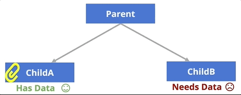

# Interactive React
This chapter discussed how websites built using the React library can be made interactive, with Components that render different content in response to user actions. Specifically, it details how to idiomatically handle _events_, store dynamic information in a Component's _state_ using _hooks_, as well as perform some specific common interactions (such as using forms and downloading data).


## Handling Events in React
You can handle user interaction in React in the same way you would [using the DOM or jQuery](#listening-for-events): you register an _event listener_ and specify a _callback function_ to execute when that event occurs.

In React, you register event listeners by specifying a React-specific attribute on an element. The attribute is generally named with the word **`on`** followed by the name of the event you want to respond to in _camelCase_ format. For example, `onClick` registers a listener for `click` events, `onMouseOver` for `mouseover` events, and so on. You can see the full list of supported event handling attributes in the documentation for [synthetic events](https://reactjs.org/docs/events.html#supported-events). The attribute should be assigned a value that is a reference to a _callback function_ (specified as an inline expression).

```jsx
//A component representing a button that logs a message when clicked
function MyButton() {
    //A function to call when clicked. The name is conventional, but arbitrary.
    //The callback will be passed the DOM event (just like with DOM callbacks)
    const handleClick = function(event) {
        console.log("clicky clicky");
    }

    //make a button with an `onClick` attribute!
    //this "registers" the listener and sets the callback
    return <button onClick={handleClick}>Click me!</button>;
}
```

This component renders a `<button>` in the DOM with a registered click event. Clicking on that DOM element will cause the `handleClick` function to be executed.

For readability, the above example specifies the callback function as a separate function (defined inside of the component&mdash;so yes, a function created inside of a function)! Note that it is more common to define nested callbacks using arrow functions:

```js
const handleClick = (event) => {
    console.log('clicky clicky');
}
```

You can also specify a callback function inline in the JSX, though this can quickly get messy and hard to read with complex event handling, so is not recommended.

```jsx
function MyButton() {
    return <button onClick={(evt) => console.log("clicky clicky")}/>
}
```

Importantly, you can only register events on React elements (HTML elements like `<button>`, that are named with lowercase letters), not on Components. If you tried to specify a `<MyButton onClick={callback}>`, you would be passing a _prop_ that just happened to be called `onClick`, but otherwise has no special meaning!

<p class="alert alert-warning">Although functionally similar, React event handling attributes are **NOT** the same as HTML event handles&mdash;React's `onClick` is different from HTML's `onclick`. The React attributes are specialized to work within the React event system. In the end, they're similar to a JSX-based syntactic shortcut for using `addEventListener()`, so we aren't actually mixing concerns more!</p>


## State and Hooks
The previous section describes how to respond to user-generated events, but in order for the page to be interactive you need to be able to manipulate its rendered content when that event occurs.
For example, you could click on a button and show how many times it was pressed, select a table column to sort the data by that feature, or select a component in order to show an entirely different "page" of content (see [Chapter 19](#client-side-routing)).

To achieve these effects, a component will need to keep track of its state or situation&mdash;the number on the counter, how the table is sorted, or which "page" is being shown. In React, a component's **state** represents internal, dynamic information about how that Component should be rendered. The state contains data that _changes over time_ (and _only_ such information&mdash;if the value won't change for that instance of a component, it shouldn't be part of the state!). Moreover, whenever the state is changed, a React component will automatically "rerender"&mdash;the component will be "rerun" and the new, updated DOM elements returned will be displayed on the screen (replacing the previously rendered version). In short: changing the state will "refresh" the component!

<!-- new stuff: Hooks! -->
State can be specified for a function component by using a _state hook_. [**Hooks**](https://reactjs.org/docs/hooks-intro.html) are
functions provided by React that let you "hook into" the framework's rendering and displaying processes. The state hook in particular lets you hook into the state of a component, specifying what values should be "tracked" and should cause the component to rerender.

- Hooks were introduced with React v16.8 (October 2018), and thus are the "new" current way of handling state. For details on older techniques (which require using _class components_), see [_State in Class Components_](#state-in-class-components).

- Fun fact: hooks are basically an example of [_mixins_](https://en.wikipedia.org/wiki/Mixin), which are an object-oriented technique for including/injecting data or behavior in a class without needing to inherit that behavior from a parent class.

The [**state hook**](https://reactjs.org/docs/hooks-state.html) is a function provided by React called **`useState()`**. This function will need to be imported from the React library (note that it is a _named export_ so should be imported as such):

```js
//import the state hook function
import React, { useState } from 'react';
```

The `useState()` function is then called within the component function (usually at the top of the function so that the resulting variables will be available to use):

```jsx
function CountingButton() {
    //Define a `count` state variable, initially 0
    const [count, setCount] = useState(0);

    //an event handling callback
    const handleClick = (event) => {
        setCount(count+1); //update the state to be a new value
    }

    return (
        { /* a button with the event handler that displays the state variable */}
        <button onClick={handleClick}>You clicked me {count} times</button>
    );
}
```

Calling the `useState()` function creates a "state variable"&mdash;a value that will be tracked and stored between calls to render/rerender the component. You can almost think of a state variable as like an "instance variable" for the function (and indeed, state is stored in object instance variables).

- The `useState()` function is passed the initial starting value for the state variable. In above example, the `count` state variable will be initialized as `0`.

- The `useState()` function returns an _array of two values_: the first is the current value of the state (e.g., what it was initialized as), and the second is a function used to modify that particular state variable (a "setter" or mutator). By convention, you use [array destructuring](#destructuring) to assign these two values to two separate variables in a single operation. Thus the above line calling `useState()` can be read as a shorthand for:

    ```js
    const hookArray = useState(0); //the function returns an array of 2 values
    const count = hookArray[0]; //assign the 1st elem (a value) to `count`
    const setCount = hookArray[1]; //assign the 2nd elem (a function) to `setCount`
    ```

    Importantly, there is nothing magical about the names of the variables that the `useState()` result is assigned to. It could just as well have been written:

    ```js
    const [countVariable, functionToUpdateCount] = useState(0)
    ```

    Because the function is a "setter" it's usually named as such (`setVARIABLE`), but this is not required. It's just a function; you can name it whatever you want.

Because the current state value is assigned to a regular variable (e.g., `count` in the above example), you can use it anywhere you would use a variable&mdash;such as in an inline expression to display the value. Note that if the value isn't actually used in the rendered DOM in any way (directly or indirectly), it probably shouldn't be part of the state!

### Updating State {-}
It's not possible to change the value of a state variable directly (e.g,. you can't do `count = count +1`)&mdash;that's why the variable is declared as `const`! Instead, you need to use the "set state" function that was created (e.g., `setCount()` in the above example). This function will take as an argument the new value to assign to the state variable (overwriting the previous value).

When the set state function is called, not only will it change the value of the state variable, but it will also "rerender" the component&mdash;it will cause the component function to be called again, returning a new set of DOM elements to be shown on the screen. These DOM elements will replace the previously rendered version of the component; React merges these changes into the page's DOM in a highly efficiency manner, changing only the elements that have actually updated&mdash;this is what makes React so effective for large scale systems.

- This is one of the trickier parts to remember in React: when you call a set state function, it will cause your component function to "re-run"&mdash;which means that any logic will execute for a second time (though now the "current" value of the state variable will be updated, rather than the initial value passed into `useState`).

<p class="alert alert-danger">Never call a set state function directly from inside of your component function; only in callbacks (such as for event handling). Calling `setCount()` directly would cause an infinite recursive loop. Component functions must remain "pure" with no side effects.</p>

Moreover, set state functions are [_asynchronous_](https://reactjs.org/docs/state-and-lifecycle.html#state-updates-may-be-asynchronous). Calling the function only sends a "request" to update the state; it doesn't happen immediately. This is because React will "batch" multiple requests to update the state of components (and so to rerender them) together&mdash;that way if your app needs to make lots of small changes at the same time, React only needs to regenerate the DOM once, providing a significant performance boost.

```jsx
//An Component with a callback that doesn't handle asynchronous state changes
function CounterWithError(props) {
    const [count, setCount] = useState(3) //initial value of 3

    const handleClick = (event) => {
        setCount(4); //change `count` to 4
        console.log(count); //will output "3"; state has not changed yet!
    }
}
```

In this example, because `setCount()` is asynchronous, you can't immediately access the updated state variable after calling the function. You instead need to wait for the component to "rerender"&mdash;when the component's DOM is regenerated, it will use the updated value. If you want to see that value, log it out right before you return the DOM (not inside of the click event handler).

It is possible to have multiple state variables, each declared with a different all to `useState()`:

```jsx
//Example from React documentation
function ExampleWithManyStates() {
    //Declare multiple state variables!
    const [age, setAge] = useState(42);
    const [fruit, setFruit] = useState('banana');
    const [todos, setTodos] = useState([{ text: 'Learn Hooks' }]);
}
```

While it's possible for a single state variable to contain complex values (objects and arrays, as in the `todos` variable above), it's often cleaner to use multiple different state variables&mdash;that way React needs to change as little data as possible when you wish to update a variable.

Importantly, you need to pass a _new value_ into the set state function in order for it to actually update the state and rerender the component. Just changing a value inside of an existing object won't work:

```js
function TodoListWithError() {
    //a state value that is an array of objects
    const [todos, setTodos] = useState([{ text: 'Learn Hooks' }]);

    const handleClick = (event) => {
        todos[0].text = "Fix bugs"; //modify the object but don't make a new one
        setTodos(todos) //This won't work!
    }
}
```

In the above example, changing a property of the `todos` array-of-objects doesn't actually change the value. This when you call `setTodos(todos)`, React thinks that nothing has updated (it doesn't do a deep inspection of the object) so doesn't update anything. Instead, you'll need to create a _new copy_ of the array or object, and then pass that new value into the set state function:

```jsx
function TodoList() {
    //a state value that is an array of objects
    const [todos, setTodos] = useState([{ text: 'Learn Hooks' }]);

    const handleClick = (event) => {
        //create a copy of the array using the `map()` function
        const todosCopy = todos.map((todoObject, index) => {
            if(index == 0) { //transform objects if needed
                todoObject.text = "Fix bugs"
            }
            return todoObject; //return object to go into new array
        })
        setTodos(todosCopy) //This works!
    }
}
```

This is because React wants to encourage data to remain **immutable** (you don't change it, you just make a altered copy) and for functions to avoid **side effects** (where they change something outside of themselves) in order to help maintain consistency of your data.

- The `.map()` function is usually the easiest way to copy an array, though other techniques exist as well. If you wish to copy an _object_, you can do this easily using the _spread operator_ to create a new object using the properties of the first:

    ```js
    //an original object
    const original = {a: 1, b: 2};

    //Create a copy, taking the property of `original` and assigning them into
    //a fresh object
    const copy = { ...original } //using the spread operator
    console.log(copy) //{a: 1, b: 2}
    console.log(copy == original) //false, different objects
    ```

    (The [`Object.assign()` function](https://developer.mozilla.org/en-US/docs/Web/JavaScript/Reference/Global_Objects/Object/assign)) is also used to do a similar operation, but the spread operator is easier to read)


### State vs. Props {-}
Importantly, a Component's _state_ is different from its _props_. Although state and props make look similar, they have very different roles. Many developers get the two confused&mdash;to the point that React has an [FAQ](https://reactjs.org/docs/faq-state.html#what-is-the-difference-between-state-and-props) entry about the difference!

The key difference between props and state is:

> `props` are for information that doesn't change from the Component's perspective, including "initial" data. `state` is for information that will change, usually due to user interaction.

Props are the "inputs" into a component, the values that someone else tells the Component it should. That is why the are passed in as arguments! _Props are immutable_&mdash;from the component's perspective; they cannot be changed once set (though a parent could create a _different_ version of the component with different props).

State is "internal" to the Component, and is (only) for values that change over time. If the value doesn't change over the life of the Component (e.g., in response to a user event), it shouldn't be part of the state! To quote from [the documentation](https://reactjs.org/docs/thinking-in-react.html):

> State is reserved only for interactivity, that is, data that changes over time.

For example, a `SortableTable` component might be used to render a list of data. But as the data in the list would come from elsewhere (e.g., the overall `App`) and wouldn't be changed _by the table_, it would be passed in as a `prop`. However, the _order_ in which that data is displayed might change&mdash;thus you could save an `orderBy` value in the state, and then use that to organize what elements are returned by the component function. The data itself doesn't change, but how it is rendered does!

<!-- Add example? Can do sorting by column-name easily? :/ -->

It is possible to use the props to initialize a state variable (since props are the "initial values" for the Component), though the props would not be changed later:

```jsx
//A component representing a count
function Counter(props) {
    const [count, setCount] = useState(props.startAt)
}

let counter = <Counter startAt={5} />
```

In this case the state variable keeps track of the count, though the prop specifies an initial number. The `count` variable will change in the future, but the `props.startAt` value will not.

It's important that you _only_ use state to track values that will change over the life of the Component. If you're not sure if a value should be part of the state, consider the following:

1. Is the value passed in from a parent via props? If so, it probably isn't state.
2. Does the value remain unchanged over time? If so, it definitely isn't state.
3. Can you compute it based on any other state or props in your component? If so, it definitely isn't state.

The last of these rules is important. In general, you should keep the state as _minimal as possible_&mdash;meaning you want to have as little data as possible in the state. This is to help avoid duplicating information (which can get out of sync), as well as to speed up how React will "re-render" Components when the state changes.

<p class="alert alert alert-warning">One of the most difficult parts of architecting a React application is figuring out what information should be stored in the props or state (and in which components). We suggest you practice using simple examples, and think carefully about it as you build more robust applications.</p>


### Lifting Up State {-}
In React, a component state is purely _internal_ to that component&mdash;neither the component's parent element nor its children have access to (or are even aware of) that state. State represents only information about that particular component (and that particular _instance_ of the component).

Sometimes a child component (i.e., a component instantiated as part of the returned DOM) needs some data that is stored in the state&mdash;for example, a `BlogPost` component might need a data value that is stored in the `Blog`'s `comments` state variable. Components can make information available to their children by passing that data to them as a _prop_:

```jsx
function Blog(props) {
    const [posts, setPosts] = useState([...]) //initialize the state

    return (
        <div>
            <h2>Most Recent Post</h2>

            {/* pass in values from state as a prop */}
            <BlogPost postText={posts[0]} />
        </div>
    )
}
```

In this example, the `BlogPost` would be passed the individual "post text" data as a normal prop, without being aware that the data was actually stored in the `Blog`'s state. When that data changes (e.g., when a new post is added), the component function will be called again and the `BlogPost` component will be re-instantiated with a new value for its prop&mdash;again, without any knowledge that there was a change. From the perspective of the `BlogPost`, there has only ever been a single `postText` value (the `BlogPost` with a different text is actually a different `BlogPost` object!).

While passing state data to a child (as a prop) is easy, communicating state data to a _parent_ or _sibling_ is more complicated. For example, you may want to have a `SearchForm` component that is able to search for data, but want to then have a sibling `ResultsList` component that is able to display the rendered results:

```jsx
<App>
  <SearchForm /> {/* has the data */}
  <ResultsList /> {/* needs the data */}
</App>
```

When confronted with this problem, the best practice in React is to **lift the state up** to the the _closest common ancestor_. This means that instead of having the data be stored in the state of one of the children, you instead store the data in the state of the _parent_. The parent can then pass that information down to the children (as props) for them to use. This way the data always flows "down" the tree.

```{r results='asis', echo=FALSE, include=identical(knitr:::pandoc_to(), 'html')}
# only in html
cat('')
```

But with the state stored in the parent, the children elements (e.g., the `SearchForm`) may still need a way to interact with that parent and tell it to change its state. To do this, you can have the parent define a function that changes its state, and then pass the child that _callback function_ as a `prop`. The child will then be able to execute that callback prop, thereby telling the parent to do something (such as update its state!)

- It's like the parents write down their instructions, and then hand them to the child to do later!

In the following example, the parent component (`VotingApp`) stores state data about how many times each button has been pressed, passing a callback function (`countClick`) to its child Components (`CandidateButton`). The `CandidateButton` will then execute that callback when it is clicked. Executing this function causes the `VotingApp` to update its state and re-render the buttons, which show updated text based on the props given to them (namely: who is winning!).

```jsx
function VotingApp(props) {
    //initialize the state counts, one for each color
    //using a single state value so that there is only one "update" function
    const [counts, setCounts] = useState({red: 0, blue: 0})

    //a function to update the state
    //expects a "color" for which button was clicked
    const handleCount = function(color) {
        console.log(color + " got a vote!");

        const newCounts = { ...counts } //make a duplicate of the object
        newCounts[color]++; //update the local copy

        setCounts(newCounts) //update the state with the changed copy
    }

    //render based on current state
    let winner = "tie";
    if(counts.red > counts.blue) winner = "red"
    else if(counts.blue > counts.red) winner = "blue"
    return (
        <div>
            <p>Current winner is: {winner}</p>
            {/* Pass the callback to each button as a prop */}
            <CandidateButton color="red" winner={winner} callback={handleCount} />
            <CandidateButton color="blue" winner={winner} callback={handleCount} />
        </div>
    );
}

function CandidateButton() {
    const handleClick = () => {
        //On click, execute the given callback function (passing in own name)
        props.callback(props.color)
    }

    //render based on current props
    let label = "I am not winning";
    if(props.winner === props.color)
        label = "I am winning!"

    return (
        <button className={props.color} onClick={handleClick}>
            {label}
        </button>
    );
}
```

As with many React systems, there are a lot of moving parts that fit together. To understand how this example works, try "tracing" the code that occurs when the `CountingApp` is first rendered, and then what happens when a button is clicked. Remember that calling `setCounts()` causes the component to be re-rendered (the function is re-run)!

Finally, notice in particular that the `CandidateButton` class knows nothing about its parent or indeed any information about how it is used (or even if there are other `CandidateButton` instances). Instead, it simply renders itself based on its props, and executes whatever `callback` function it was given whenever it is clicked (without carrying about what that function does). Having lots of "simple" components like this is the best way to design React apps.

In summary, in order to make an interactive React application, perform the following steps:

1. Start with a "static" (non-interactive) version, with appropriate Components
2. Identify variables that will change so need to be stored in the state
3. Define state variables in the "lowest" common ancestor for Components that need it
4. Pass state information to child Components as `props`
5. Pass _callback functions_ as `props` to child Components so they can modify the state.


## Specific Interactions
This section provides some details on specific types of interactions commonly used in React apps but require further details and explanation.

### Working with Forms {-}
One of the most common reasons to track state in a React app is when developing [forms](https://reactjs.org/docs/forms.html) that the user can fill out to submit information. Forms are a common structure to use when getting user input&mdash;whether it's a "search form" for browsing a data set, or a "login form" for allowing a user access to personalized data.

In normal HTML, form elements such as **`<input>`** keep track of their own "state". For example, whatever the user has typed into a text input will be stored in that input's `value` property:

```js
//Select the <input type="text"> element
let textInput = document.querySelector('input[type="text"]');

//Event that occurs whenever the input is changed
textInput.addEventListener('change', (event) => {
    let input = event.target;
    console.log(input.value); //access that elements "state"
});
```

You will often want React to be able to respond to user data entered into a form&mdash;either because you want to send an AJAX request based on that data, or because you want to perform **form validation** and confirm that the user has entered appropriate input (e.g., that the password is at least 6 characters long). But storing the user input in the `<input>` element's state can cause problem for React: React components won't know that they should "rerender" when that changes, and updating a React component might cause the entire DOM tree to re-render (producing a new `<input>` element with a different `value` state).

Thus the recommended practice for working with forms in React is to use [**controlled Components**](https://reactjs.org/docs/forms.html#controlled-components). In this case, you define a component that will track the state of what the user has typed into the `<input>`, and then will render an `<input>` with an appropriate `value` property. Rather than letting the `<input>` control its own state, the React component controls the state and then dictates to the `<input>` element what value it should be showing. It's like React is snatching the data from the `<input>` and then claiming credit for it.

```jsx
function MyInput(props) {
    const [inputValue, setInputValue] = useState('')//initialize as empty string

    //respond to input changes
    const handleChange = (event) => {
        //get the value that the <input> now has
        let newValue = event.target.value

        //update the state to use that new value, rendering the component
        setInputValue(newValue);
    }

    return (
        <div>
            {/* The input will be rendered with the React-controlled value */}
            <input type="text" onChange={handleChange} value={inputValue} />
            <p>You typed: {inputValue}</p>
        </div>
    );
}
```

The above is an example of a basic controlled Component. When the user enters a different value into the `<input>` element, the `handleChange()` callback is executed. This grabs that updated value and saves it in the component's `inputValue` state variable. Updating that state variable also causes the component to re-render, which recreates a brand new version of the `<input>` element, but now with the React-controlled value for its `value` attribute. This way whatever value the user has entered will always be part of a React Component's state, and so can be manipulated and interacted with in the same manner.

- And of course, a controlled form might render multiple `<input>` elements, tracking the values of each one in a separate variable in the state. This also allows the inputs to easily interact with each other, such if you want to confirm that a password was entered correctly twice.

- Robust form validation is actually quite tricky in React (especially when compared to other frameworks such as Angular). Using an external library such as [Formik](https://jaredpalmer.com/formik) can help with developing forms and handling all the edge cases.


### Fetching Data via AJAX {-}
One of the most common use of lifecycle callback functions is when accessing data asynchronously, such as when fetching data via an AJAX request (such a described in [Chapter 14](#ajax)). This section provides details about how to asynchronously load data within the React framework.

First, remember that React code is _transpiled_ using Webpack. As such, some APIs&mdash;including `fetch()` are not "built-in" to React like they are with a modern browser. As discussed in [Chapter 14](#fetching-data), in order to support these "other" browsers, you will need to load a _polyfill_. You can do that with React by installing the `whatwg-fetch` library, and then `import`ing that polyfill in your React code:

```bash
# On command line, install the polyfill
npm install whatwg-fetch
```

```js
//In your JavaScript, import the polyfill (loading it "globally")
//This will make the `fetch()` function available
import 'whatwg-fetch';
```

Remember that `fetch()` downloads data _asynchronously_. Thus if you want to download some data to display, it may take a while to arrive. You don't want React to have to "wait" for the data (since React is designed to be _fast_). Thus the best practice is to send the `fetch()` request for data, and `then` when the data has been downloaded, call the a set state function to update the component with the downloaded data. (The component can initialize its state as an "empty array" of data).

Fetching data from the internet is considered a [**side effect**](https://en.wikipedia.org/wiki/Side_effect_(computer_science)) in React. Function components are supposed to do one thing (as well-designed "pure" functions): they return the DOM that will be rendered on the screen. But downloading data modifies something outside of that framework, in that it modifies network status/information and even the status of the remote server! Thus calling `fetch()` from directly inside the component function would be considered bad programming style, and can cause problems and bugs when the component is rendered. For example, if the fetched data returns too quickly or too slowly, you may try and set the state variable of (and thus rerender) a component that isn't yet attached to the DOM, causing React to crash. And if the state does update and reruns the component, that would cause it to download the data yet again, potentially causing an infinite loop!

In order to perform side effect operations in React, you need to use another kind of hook called an [**effect hook**](https://reactjs.org/docs/hooks-effect.html), provided by the React function **`useEffect()`**. An effect hook lets you hook into the lifecycle of a component, specifying some code (a function) that should be run _after_ the component finishes rendering. Any code that will produce a side effect (such as downloading data, manipulating the DOM outside of React rendering, or setting up subscriptions to a data source) should be run through an effect hook. That's why they're called _effect_ hooks: because they define a side effect to the component rendering.

An example of using the event hook to download data is below, followed by an explanation of the syntax.

```jsx
//import the hooks used
import React, { useState, useEffect } from 'react';

function MyComponent() {
    //store the data in a state variable, initialized as an empty array
    const [data, setData] = useState([]);

    //specify the effect hook function
    useEffect(() => {
        fetch(dataUri) //send AJAX request
          .then((res) => res.json())
          .then((data) => {
            let processedData = data.filter(...).map(...) //do desired processing
            setData(processedData) //change the state and re-render
          })
    }, []) //empty array is the second argument to the `useEffect()` function.
           //It says to only run this effect on first render

    //Map the data values into DOM elements
    //Note that this works even before data is loaded (when the array is empty!)
    let dataItems = data.map((item) => {
        return <li key={item.id}>{item.value}</li>; //return DOM version of datum
    })

    //render the data items (e.g., as a list)
    return <ul>{dataItems}</ul>;
  }
}
```

Calling the `useEffect()` function specifies a callback function that will be run _after_ the component renders. Things to notice about how this function is used:

- As with the state hook, the effect hook function `useEffect` must be imported (as a named import).

- The `useEffect()` function takes as an argument the callback function to run after the component renders. This is usually specified as an arrow function, though you could of course give it a named function. Note that the callback takes no arguments.

- Inside the `useEffect()` callback goes the normal `fetch()` call. Notice that the downloaded data is then assigned to the component's state variable by calling the set state function (named `setData()` in this example).

    While technically it means the component is rendering twice (once without data, then once with), React can batch these requests together so that if the data downloads fast enough, the user will not notice. This is also a good reason to [conditionally](https://reactjs.org/docs/conditional-rendering.html) include DOM elements like spinners when rendering data.

- By default, the effect callback will be executed after _each_ time the component renders. That means that if the component needed to re-render (because a prop changed for example), then the data would be downloaded a second time! To avoid this, you can pass the `useEffect()` function an optional second argument. This argument should be an array of values that the effect "depends on"&mdash;the effect will only be re-run if one of these variables changes between renders:

    ```js
    //an effect that only re-runs if the `count` variable changes
    useEffect(() => {
        //...
    }, [count])
    ```

    By passing an empty array as a second argument, you tell the effect that it should only re-run if one of those (non-existent) variables updates&mdash;and since there are no variables listed, it will never run a second time!

- The `useEffect()` function does not need to return any values. In fact, the only value it can return is a "cleanup" callback function, which React will run whenever the component is removed from the DOM:

    ```js
    useEffect(() => {
        //...
        return function cleanup() { //function name is arbitrary
            console.log("component has been removed!")
        }
    })
    ```

    This is only necessary for side effects that require cleanup, such as subscribing to a data source or handling some user authentication behaviors. It is not needed for basic `fetch()` calls.

<p class="alert alert-info">There are a number of other hooks available in React as well. Check the [documentation](https://reactjs.org/docs/hooks-reference.html) for details. Note that in general, you should only look into a hook if you're hitting an architectural problem (e.g., you have a lot of repeated code)&mdash;otherwise stick with the basic structure of props and state!</p>


<!-- External libraries (e.g., react-strap) should go somewhere... maybe a third React chapter? -->


## Resources {-}

<div class="list-condensed">
- [Handling Events](https://reactjs.org/docs/handling-events.html)
- [Using the State Hook](https://reactjs.org/docs/hooks-state.html)
- [props vs state (blog)](https://github.com/uberVU/react-guide/blob/master/props-vs-state.md)
- [FAQ: Component State](https://reactjs.org/docs/faq-state.html)
- [Lifting State Up](https://reactjs.org/docs/lifting-state-up.html)
- [React Forms](https://reactjs.org/docs/forms.html)
- [Thinking in React Hooks](https://wattenberger.com/blog/react-hooks)
</div>
