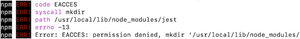

# Getting Setup {#software-setup}

This course will cover and use a wide variety of tools and techniques common to modern web development, including different software programs that are used to write, manage, and execute the code for your web application. This chapter explains how to install and use some of the software you will need to build these applications.

<p class="alert alert-info">Note that iSchool lab machines should have all appropriate software already installed and ready to use.</p>

In summary, you'll need to install and set up the following software on your machine (more information below on each of these). Feel free to use alternative software, but these are the suggested programs for the course (i.e., the ones which we will provide support for):

- A modern web browser such as [**Google Chrome**](https://www.google.com/chrome/browser/desktop/index.html)
- [**Visual Studio Code**](https://code.visualstudio.com/) as a code editor for writing code
- [**Node.js**](https://nodejs.org/en/), a JavaScript engine
  - [**`npm`**](https://www.npmjs.com/), a JavaScript package manager that comes with Node.js
- A Bash terminal (e.g., the [**Git Bash**](https://git-scm.com/downloads) for Windows; **Terminal** is already installed on Macs).
- [**`git`**](https://git-scm.com/downloads) as a version control system (for Windows users; already installed on Macs)

## Web Browser

The first thing you'll need is a web browser for viewing the web pages you make! I recommend you install and use [**Chrome**](https://www.google.com/chrome/browser/desktop/index.html), which comes with an effective set of built-in [developer tools](https://developers.google.com/web/tools/chrome-devtools/) that will be especially useful in this class. I recommend Chrome primarily for historical reasons (and because it is the browser used by the author&mdash;and I had to pick one!).

You can access the Chrome Developer tools by selecting **View > Developer > Developer Tools** from Chrome's main menu (`cmd + option + i` on a Mac, `ctrl + shift + i` on Windows). You will pretty much always want to have these tools open when doing web development, especially when including interactivity via JavaScript.

Other modern browsers such as [**Firefox**](https://www.mozilla.org/en-US/firefox/new/) or [**Microsoft Edge**](https://www.microsoft.com/en-us/windows/microsoft-edge) will also function perfectly well in this course and include their own versions of the required development tools. Note that different browsers may and will render code in different ways, which will be discussed extensively throughout the course.

I strongly suggest that you don't use Safari, as it has a number of user interface and rendering issues that make it difficult to develop with for this course.


## Code Editor

In order to write web code, you need somewhere to write it. There are a variety of code editors and IDEs (Integrated Development Environments) that are specialized for web development, providing syntax highlighting, code completion, and other useful functionality. There are lots of different code editors out there, all of which have slightly different appearances and features; you only need to download and use one of the following programs. I strongly recommend **Visual Studio Code** as a default, but feel free to try out different ones to find something you like (and then evangelize about it to your friends!)

### Visual Studio Code {-}

[Visual Studio Code](https://code.visualstudio.com/) (or VS Code; not to be confused with Visual Studio) is a free, open-source editor developed by Microsoft&mdash;yes, really. It focuses on web programming and JavaScript, though also supports many other languages and provides a number of [community-built extensions](https://code.visualstudio.com/docs/editor/extension-gallery) for adding even more features. It is one of the most common editors for programming and web development in particular. VS Code is actually a stand-alone web application, so it's written in the same HTML, CSS, and JavaScript you'll learn in this course!

To install VS Code, follow the above link and Click the "Download" button to download the installer (e.g, `.dmg` or `.exe`) file, then double-click on that to install the application.

VS Code is highly customizable with very many features. For more information about using VS Code, see [the documentation](https://code.visualstudio.com/docs), which includes [videos](https://code.visualstudio.com/docs/getstarted/introvideos) if you find them useful. The documentation for programming in [HTML](https://code.visualstudio.com/docs/languages/html), [CSS](https://code.visualstudio.com/docs/languages/css), and especially [JavaScript](https://code.visualstudio.com/docs/languages/javascript) also contain lots of tips and tricks.

You can open a file in VS Code by using the `File > Open...` command. Because web development often involves working with lots of different files at once, it's often more effective to open an entire _folder_ at once using `File > Open Folder...`. This will list all of the files in that folder in a sidebar, and you can double-click on each file to open it up in its own tab. You can also manage files from the sidebar: moving them, making folders, or renaming them through the context (right-click) menu.

Note that when VS code files are open in tabs, they will show an "x" on the right of the tab to close it. But if the file has been _modified_, that "x" will instead be a filled-in circle, indicating that there are unsaved changed to the file. Watch out for this: its a good way to catch if you forgot to save your work (and thats why your changes aren't showing up!)

One more trick to using VS Code effectively is to get comfortable with the [Command Palette](https://code.visualstudio.com/docs/getstarted/userinterface#_command-palette). If you hit `cmd + shift + p`, VS Code will open a small dialog where you can search for whatever you want the editor to do. For example, if you type in `markdown` you can get list of commands related to Markdown files (including the ability to open up a preview). The `Format Code` option is also particularly useful for fixing spacing issues in your code.

<p class="alert alert-warning">While VS Code is relatively unobtrusive when compared to otehr IDEs, be very careful about using its auto-complete or AI-based features. Often the editor will try and help or "fix" your code by adding in wrong solutions, which then cause further unexpected problems later. Make sure that any code that is written into your files are lines that you understand and can debug!</p>

### Other Editors
While we suggest using VSCode for this course, other editors are also acceptable and may be of interest to you. Note that these

- [Sublime Text](https://www.sublimetext.com/3) is an older but popular text editor with excellent defaults and a variety of available extensions (though you'll need to manage and install extensions to achieve the functionality offered by other editors out of the box). While the software can be used for free, every 20 or so saves it will prompt you to purchase the full version. This is a great option to write a plain text file.

- [WebStorm](https://www.jetbrains.com/webstorm/) is a full-featured IDE from JetBrains (the makers of IntelliJ for Java). While it can offer some useful features, it is also likely to produce a lot of "cruft" or guide your coding in particular ways. I recommend you only use it after you have mastered the basics (such as by finishing this course!) so that you understand the choices it is making.

- [Atom](https://atom.io/) was a text editor built by the folks at GitHub, though it has since been [retired](https://github.blog/2022-06-08-sunsetting-atom/). It was very similar to VS Code in terms of features, but has a somewhat different interface and community. It had a similar _command-palette_ to VS Code. The document you are reading was authored in Atom, which is why it remains on this list. The [Pulsar](https://pulsar-edit.dev/) project is a fork of the Atom editor.


## Bash (Command Line)

Many of the software tools used in professional web development are used on the **command line**: a text-based interface for controlling your computer. While the command line is harder to learn and figure out, it is particularly effective for doing web development. Command line automation is powerful and efficient enough to handle the dozens of repeated tasks across hundreds of different source files (split across multiple computers) commonly found in web programming. You will need to be comfortable using the command line in order to utilize the software for this course.

While there are multiple different **command shells** (command line interfaces), this course uses the <a href="https://en.wikipedia.org/wiki/Bash_(Unix_shell)">Bash</a> shell, which provides a particular common set of commands common to Mac and Linux machines. What you install depends on your operating system:

- On a Mac you'll want to use the built-in app called **Terminal**. You can open it by searching via Spotlight (hit Cmd (`⌘`) and Spacebar together, type in "terminal", then select the app to open it), or by finding it in the Applications/Utilities folder.

    As of macOS Catalina, Macs use **zsh** as the default command shell with Terminal. This works mostly the same as Bash (supporting generally the same command). It is also possible to [switch between the two shells](https://www.howtogeek.com/444596/how-to-change-the-default-shell-to-bash-in-macos-catalina/) if needed.

- On Windows, you can use the [**Git Bash**](https://git-scm.com/downloads) shell, which you should install along with `git` (see below). Open this program to open the command shell.

    Note that Windows does come with its own command shell, called the _Command Prompt_ (previously the _DOS Prompt_), but it has a different set of commands and features. _Powershell_ is a more powerful version of the Command Prompt if you really want to get into the Windows Management Framework. But Bash is more common in open-source programming like we'll be doing, and so we will be focusing on that set of commands.

    <div class="alert alert-warning">Some software used in this course will not work with the Command Prompt or Powershell; you will need to have and use a Bash-type shell installed.</div>

<p class="alert alert-danger">This course expects you to already be familiar with basic command line usage. For review, see e.g., [The Command Line](https://info201.github.io/command-line.html) in the _INFO 201_ course reader.</p>

## Node and `npm`

[**Node.js**](https://nodejs.org/en/) (commonly just "Node") is a a command line runtime environment for the JavaScript programming language&mdash;that is, a program that is used to _interpret_ and _execute_ programming instructions written in JavaScript. Although client-side development usually involves running JavaScript in the browser (see [Chapter: JavaScript](#JavaScript)), Node provides a platform for installing and running a wide variety of "helper" programs that are frequently used in web development.

The _easiest_ way to install Node is to use the installer from [Nodejs.org](https://nodejs.org/en/). I recommend getting the latest version for this course. Download the installer and execute it to set up Node on your machine.

If you want more control over your machine and Node versions, you can alternatively install Node using [**`nvm`**](https://github.com/nvm-sh/nvm), the Node Version Manager. This is a command line program that manages installing the Node command line program, but also makes it easy to update or adjust your Node installation. See [the installation instructions](https://github.com/nvm-sh/nvm#installing-and-updating) for details.

You can test that Node is installed and working by opening your command shell and running

```bash
node --version
```

Be sure and check that you have a recent enough version! At time of this writing, you should have Node v18 or later.

Installing Node also installs an additional command line program called [**`npm`**](https://www.npmjs.com/). `npm` is a **package manager**, or a program used to "manage" other programs&mdash;think of it as a command line "app store" for developer tools and libraries. `npm` is the most common way of installing and running a large number of tools used in professional web development. As of September 2022, the `npm` "registry" included more than 2.1 million different packages.

You will need to have at least `v5.6` of `npm` installed. Installing the latest Node should give you the latest `npm` as well, but you can also upgrade `npm` using the command **`npm install npm@latest -g`**. See below for an explanation of this command.


### Installing software with npm {-}

You can use the `npm` program to download and install command line programs by name:

```bash
# syntax to globally install package with npm
npm install -g PACKAGE-NAME
```

For example, you could install the [_Jest_](https://jestjs.io/) testing application (a program for running automated tests) used in this course using:

```bash
# globally install the Jest package
npm install -g jest
```

Importantly, note the included **`-g`** option. This tells `npm` that the package should be installed **globally**, making it available across the entire computer, rather than just from a particular folder. Because you want to be able to use a command line program like Jest from any folder (e.g., for any project), command line utilities are always installed globally with the `-g` option.

Installing an application globally often requires **administrator permissions**. If you try to install something without admin permission, you'll get an error saying _permission denied_:

<p class="alert alert-danger"></p>

In order to install programs globally, you will need to use the **`sudo`** (**s**uper**u**ser **do**) command to run the install as an administrator. You do this by putting `sudo` in front of the command you want to run, for example:

```bash
# as an administrator, globally install the Jest package
sudo npm install -g jest
```

You will be prompted for your computer's password, make sure to fill that in (even though you won't see any typing occur).

Note that you should only use sudo when absolutely necessary (e.g., when you hit this error); don't run every command as an administrator!

After an application is installed through `npm`, you can run that program from the command line by typing its name followed by any arguments. For example, you can have the Jest program print its version:

```bash
# get the version of the installed Jest application
jest --version
```

The latest version of `npm` also comes with an additional program called [**`npx`**](https://medium.com/@maybekatz/introducing-npx-an-npm-package-runner-55f7d4bd282b). This application lets you "download and run" an application without installing it separately. For example, you could download and run Jest to see it's version; note that you don't ever need to call `npm install` for jest when using `npx`:

```bash
# download and run the Jest application without installing it separately
npx jest --version
```

### Managing local packages {-}
It is also possible to install packages _locally_ by omitting the `-g` argument. For example:

```bash
npm install lodash
```

This command will download the [`lodash`](https://lodash.com/) code library (a set of useful JavaScript functions). This package will be placed into a new folder _in the current project directory_ called **`node_modules/`**, and can be imported and used in the current directory's code. (It's called a _local install_ because the package is only available to the "local" project). You will need to install local packages once per project.

<p class="alert alert-warning">Because node packages can be very large, and projects can have lots of them, you want to be sure to **not** commit the `node_modules/` folder to version control. Make sure that the folder is listed in your `.gitignore` file!</p>

As projects become large, it is common for them to build up many _dependencies_: packages that must be installed in order for the program to work. In other words, there needs to be a certain set of packages in the project's `node_modules/` folder. `npm` is able to keep track of these dependencies by recording them in a specialized file called `package.json` that can be placed inside the project directory. A **`package.json`** file is a text file containing a [JSON](https://en.wikipedia.org/wiki/JSON) list of information about your project. For example:

```json
{
  "name": "example",
  "version": "1.0.0",
  "private": true,
  "description": "A project with an example package.json",
  "main": "index.js",
  "scripts": {
    "test": "jest"
  },
  "author": "Joel Ross",
  "license": "ISC",
  "dependencies": {
    "lodash": "^4.17.4",
    "moment": "^2.18.1"
	},
  "devDependencies": {
    "html-validator": "^2.2.2"
  }
}
```

(You can create one of these files by using the command `npm init` in the current project directory, and then following the instructions to fill in the fields).

Notice that there are two packages listed under `"dependencies"`: `lodash` and `moment` (the `^4.17.4` indicates which version of `lodash`&mdash;one that is at least `4.17.4`).  You can use `npm` to automatically install all of the packages listed under `"dependencies"` (as well as under `"devDependencies"`) in the `package.json` file using the command:

```bash
npm install
```

Using **`npm install`** without any arguments means "install all of the requirements that have been recorded for this project". This is a good first step _any time_ you download a project or checkout a repository from GitHub!

You can run the `npm install` command as many times as you wish: if the package has already been installed (into the `node_modules/` folder), it won't be downloaded again. Only "missing" packages&mdash;such as those recently added to the `package.json` file&mdash;will be installed.

Because all local packages are saved in the `node_modules/` folder, that folder is a common target when troubleshooting package installation issues. For example, if package does not seem to be importing correctly, a common step is to delete the `node_modules` folder and then try again!

Note that while the `package.json` file lists the desired dependencies for a project, the **`package-lock.json`** file lists the specific versions of dependencies (and the dependencies of the dependencies!) that have actually been installed. This is to make sure that if a package received a minor update (e.g., from 4.17.18 to 4.17.19) that has a bug, you won't accidentally install that version and break your project. The `package-lock.json` file is automatically generated every time you install or re-install a local package. Changes to this file are a good way to check if you've accidentally installed a different version of a dependency.


When installing specific packages (e.g., with `npm install package-name`), `npm` automatically adds them to the dependencies list in the `package.json`. You can also make this recording explicit with the `--save` option:

```bash
# explicitly save dependency in package.json
npm install --save lodash
```

This means that every time you want to "add" a packagae to your project, you just need to install it once and it will automatically be saved in the `package.json` file (so that it can be installed alongside the rest of the dependencies with `npm install`).

Similarly, the `--save-dev` option will instead save the package in the `"devDependencies"` list, which are dependencies needed only for development (writing the program's code) and not for execution (running the program). Whether you are in "development" or "production" mode depends on the configuration of your Node environment; by default everything is in development mode so there is no distinction between the two lists.

<!-- If you want to use a _globally_ installed package in your local project (e.g., have it be a dependency but not have to download and install it again), you can use `npm link` to "include" the global package locally. For example, the below will allow you to use a globally installed version of `lodash` so you don't have to download a copy for the project:

```bash
npm link lodash
```

Be sure to `link` any global packages _before_ you run `npm install` so you don't download any packages from `package.json` that you already have! -->

You can uninstall packages using `npm uninstall`, or can remove packages from the dependencies lists simply by editing the `package.json` file (e.g., with VS Code).


To sum up, you will use three commands with `npm` to install packages:

1. `npm install -g PACKAGE-NAME` to _globally_ install command line programs.
2. `npm install` to _locally_ install all of the dependencies for a project you check out.
3. `npm install PACKAGE-NAME` to _locally_ install a new code package and record it in the `package.json` file.

<p class="alert alert-info">While `npm` is the most popular package manager (and the one used in this course), there are others as well. For example, [**Yarn**](https://yarnpkg.com/en/) is a package manager created by Facebook that is [compatible](https://yarnpkg.com/en/docs/migrating-from-npm) with `npm` and is quickly growing in popularity. Note that you will generally need to use one package manager or other; don't try to mix them in a single project!</p>


## Git and GitHub
Professional web development involves many different people working on many different files. **`git`** is a collaborative version control system that provides a set of commands that allow you to manage changes to written code, particularly when collaborating with other programmers.

<p class="alert alert-danger">This course expects you to already be familiar with using Git and GitHub. For review, see
[Git and GitHub](https://info201.github.io/git-basics.html), [Git Branches](https://info201.github.io/git-branches.html), and [Git Collaboration](https://info201.github.io/git-collaboration.html)
in the _INFO 201_ course reader. Note that students in the INFO 340 course will use `git` and GitHub to turn in programming assignments.</p>

For this course, you will need to [download](https://git-scm.com/downloads) and install the `git` software program in order to use it. If you are on a Mac, `git` should already be installed. If you are using a Windows machine, then installing `git` will also install the Git Bash command shell.

Note that `git` is a command line application: you can test that it is installed by running the command:

```bash
git --version
```

Some coding editors such as VS Code have also integrated `git` commands and information, so that you can see e.g., what files have been modified since the last commit (new files are colored green in the file list sidebar; new files are colored yellow). Note however that this course focuses on the command line use of `git` in order to best understand what commands are being run to manage code versions.

While `git` is the software used to manage versions of code, [**GitHub**](https://github.com/) is a website that is used to store copies online copies of computer code that are being managed with `git`.

In order to use GitHub, you'll need to have a [free GitHub account](https://github.com/join). You should register a username that is identifiable as you (e.g., based on your name or your UW NetID). This will make it easier for others to determine out who contributed what code, rather than needing to gudess who 'LeetDesigner2099' is. This can be the start of a professional account you may use for the rest of your career!

<div class="alert alert-info">
In order to push and pull to GitHub from the command line, you'll need to set up a [Personal Access Token (PAT)](https://docs.github.com/en/github/authenticating-to-github/keeping-your-account-and-data-secure/creating-a-personal-access-token) for GitHub. This is like a specialized password whose access you can control, rather than using your "full account" password.

If you don't have a working token (or it's been a long time since you used one), you'll need to create it. To create the PAT, go to your account settings on GitHub, click on Developer Settings option, and then choose to modify Personal access tokens (you'll end up at <https://github.com/settings/apps>). To make a new token":
- Click the **Generate new token** button; choose **Generate new token (classic)**.
- On the next page, give your token a name (e.g., "INFO 340 command line", or just "command line access").
- Specify any expiration date that is after the end of the course; I set it to expire a year from when I create it to make sure that I refresh it periodically.
- Under _Select Scopes_, make sure you click the checkbox next to **repo** in order to give the token access to repositories; you do not need to provide any additional access for this course.
- Then click the _Generate Token_ button at the bottom.

Your token will look like a random string of characters starting with `ghp`. This string is the "password" you can use when cloning or pushing from GitHub on the command line. Store it in a safe place (a password manager is good), though after you use it once `git` should cache it so you won't need to remember it every time. In order to cache your token, clone a code repo (using `git clone`). When prompted, put in your GitHub user name, and when when prompted for a password, _put in the token string_!

If you've used a token before, you may need to remove your old "saved" password from your computer and replace it with the new token&mdash;see [these instructions](https://docs.github.com/en/get-started/getting-started-with-git/caching-your-github-credentials-in-git) for how to do that for your operating system (on a Mac in particular you may need to [update your credentials in Keychain](https://docs.github.com/en/github/getting-started-with-github/updating-credentials-from-the-macos-keychain))
</div>

<!-- Could add more on using git/github here, including branching and publishing? -->


## Resources {-}
Links to the recommended software are collected here for easy access:

<div class="list-condensed">
- [Chrome](https://www.google.com/chrome/browser/desktop/index.html)
- [Visual Studio Code](https://code.visualstudio.com/)
- [Node.js (and npm)](https://nodejs.org/)
    - [npm documentation](https://docs.npmjs.com/getting-started/what-is-npm)
- [git (and Git Bash)](https://git-scm.com/downloads)
	- [GitHub](https://github.com/join) (sign up)
</div>
